# service.ts — AI component doc

> AI-facing sidecar for `service.ts`. Created 2026-07-08. Keep this in sync with the code on every change.

## Purpose
Domain layer of the entity library (reusable characters/objects/places that can be tagged into a
prompt as `[[e1]]`). Every method takes `userId` first and scopes every query by it — ownership is the
type signature, not a decoration.

## What it does (for an AI reader)
- Responsibilities: CRUD + soft delete for entities, photo attachment (upload / library / generated),
  primary-image election, the Soul Studio **derived-description invariant**, and loading entities for
  prompt substitution.
- Public API / exports: `createEntityService({ db, storage })` → `{ create, list, get, update, remove,
  addImage, loadForMentions, referenceImageUrl }`; `EntityService` (type); `EntityNotFoundError`,
  `EntityImageInvalidError`, `GenerationNotAttachableError`.
- Inputs → Outputs: `(userId, …)` + contracts DTOs → `Entity` / `EntityList` (rows → wire DTO, ms
  timestamps → ISO strings, `soul` JSON → parsed `Soul | null`).
- Side effects: SQLite reads/writes (`entity`, `entity_image`, and a **read-only** peek at
  `generation`); storage writes (`saveDataUri`), reads (`readAsDataUri`) and deletes (`remove`).

## Dependencies
- Imports / depends on: `drizzle-orm`, `@opencreate/contracts` (`composeSoul`, `soulSchema`,
  `PORTRAIT_SHEET_VIEWS`), `../../db/schema` (`entity`, `entityImage`, `generation`),
  `../../storage/local` (`StorageProvider`), `./mentions` (types).
- Used by: `modules/entities/routes.ts`, `modules/entities/portraits.ts`,
  `modules/generations/service.ts` (mention resolution + reference images), `app.ts`.

## Diagram

```mermaid
flowchart TD
  IN[userId + input] --> RO[requireOwned — scoped by userId, alive only]
  RO --> C{soul present?}
  C -- yes --> D[kind := 'character'; description := composeSoul&#40;soul&#41;; client description IGNORED]
  C -- no --> P[description := client prose]
  D --> W[(entity)]
  P --> W
  RO --> AI{addImage source}
  AI -- upload/library --> SD[storage.saveDataUri&#40;bytes&#41;]
  AI -- generated --> G[read generation row: mine? succeeded? image?] --> CP[storage.readAsDataUri → saveDataUri — copy INSIDE our storage]
  SD --> R[(entity_image)]
  CP --> R
  R --> RP[view already present? REPLACE that row + delete its file]
  RP --> PR[primary := first photo, or the replaced primary, or the 'front' view]
```

## Key decisions / gotchas
- **THE SOUL INVARIANT (ADR ai-soul-studio).** `soul != null` ⟹ `description` is **derived**: the
  service writes `composeSoul(soul)` on create *and* update and **ignores** any client-sent
  description, and forces `kind = 'character'`. There is no override flag, because a constructor cannot
  round-trip prose — the moment two writers can touch that string, reopening the constructor either
  destroys the user's hand-edit or lies about what the model will see. `soul.notes` is the escape hatch.
- **A corrupt soul reads as `null`, never as a 500.** `parseSoul` uses `soulSchema.safeParse` inside a
  try/catch: one hand-edited or half-migrated row must not take down the user's whole library.
- **The `generated` attach reads the `generation` table DIRECTLY** rather than injecting the generation
  service — that would close a dependency cycle, since the generation service already depends on *this*
  service for `[[e1]]` mentions. Four default-deny checks (mine · succeeded · type `image` · asset
  present), all raising the SAME `GenerationNotAttachableError`: distinguishing them would confirm that
  a given generation id exists on someone else's account.
- **Attaching COPIES inside our own storage** (`readAsDataUri` → `saveDataUri`). The API never fetches a
  client-supplied URL (no SSRF surface), and the entity owns its photo outright — a generation the user
  deletes from the gallery tomorrow must not take the character's face with it.
- **A view is a SLOT, not an append.** Attaching a view the entity already has replaces that row (a
  re-roll) and deletes the orphaned file; if the replaced image was the primary, the new one inherits it.
  Otherwise "re-roll the profile" would grow a four-view sheet to five images with no way to say which
  profile is current.
- **Primary election**: the first photo, *or* the photo that replaced the primary, *or* the `front`
  view (the sheet's hero shot — the one every later view conditions on).
- **DTO image order** is by view (in `PORTRAIT_SHEET_VIEWS` order), then plain uploads by `createdAt`.
  The order comes from the view, never from insertion time, so a re-roll does not move a portrait to the
  end of the sheet.
- Ownership is checked **before** any bytes are written — reversing that would put an attacker's payload
  on our disk before we discover they own nothing.
- `EntityNotFoundError` is raised for *both* "does not exist" and "not yours". Distinguishing them tells
  an attacker that someone else's entity id exists, which is the fact we are protecting.

## Commits
- _no commit yet_
