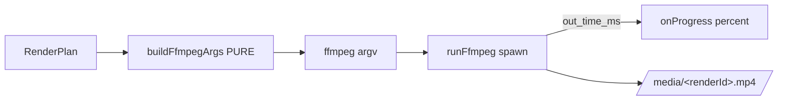

# render.ts — AI component doc

> AI-facing sidecar for `render.ts`. Created 2026-07-09. Keep this in sync with the code on every change.

## Purpose
The CinemaStudio ffmpeg render pipeline: turns a film's ordered timeline into one mp4. Split so the
hard part (the filtergraph) is a PURE, tested function and the spawn is a thin runner. A render spends
our CPU, not a provider invoice — no ledger. ADR: `docs/wiki/decisions/cinema-studio.md` §2.

## What it does (for an AI reader)
- Responsibilities: build the exact ffmpeg argv from a resolved plan; run ffmpeg with progress; bound
  concurrency.
- Public API / exports:
  - `FFMPEG_PATH` (from ffmpeg-static; null if unavailable), `canvasFor(aspect)`, `resolveFontPath()`.
  - Types `RenderSegment` (file|null, kind video/image/title, durationSec, trimStartSec, crossfade,
    transitionSec, title), `RenderAudio`, `RenderPlan`, `RenderRunResult`.
  - `buildFfmpegArgs(plan): string[]` — PURE. Inputs (video `-i`, image `-loop 1 -t`, title `lavfi
    color`), per-segment normalize (scale→pad→setsar→fps→yuv420p) + optional `drawtext` title,
    left-fold over boundaries into `[outv]` via `xfade` (crossfade) or `concat` (hard cut), audio
    `adelay`+`volume`+`amix`+`atrim` → `[outa]`, then libx264/aac/faststart/`-progress pipe:1`.
  - `totalDurationMs(shots)` (accounts for crossfade overlap), `escapeDrawtext(text)`.
  - `runFfmpeg(args, totalMs, onProgress, ffmpegPath?, spawnFn?)` — spawns, parses `out_time_ms`
    → percent, resolves `{ok}`/`{ok:false,error}` (never throws). `spawnFn` injectable for tests.
  - `createSemaphore(max)` — counting semaphore bounding concurrent renders.
- Inputs → Outputs: `RenderPlan` → argv → mp4 at `plan.outputPath`.
- Side effects (runner only): spawns ffmpeg, writes the output file, reads stdout/stderr.

## Dependencies
- Imports / depends on: `node:child_process` (spawn), `node:fs` (existsSync), `ffmpeg-static`,
  `@opencreate/contracts` (AspectRatio, Shot, ShotTitle types).
- Used by: `modules/films/service.ts` (render runner) — planned. Tested by `test/render.test.ts` (pure
  argv) and `test/render-ffmpeg.test.ts` (spawns the real ffmpeg — the only sensor that catches an
  argv that is well-formed but which ffmpeg rejects).

## Diagram

## Key decisions / gotchas
- Filtergraph is a LEFT-FOLD: each boundary is `xfade` (crossfade, offset = accumulated visible
  length − t) or `concat` (hard cut). Mixed transitions compose; accumulated length is tracked so
  xfade offsets stay correct. Single-shot film aliases `[v0]null[outv]`.
- Crossfade `t` is clamped `< min(accLen, thisDur) − 0.05` so xfade never produces a black/garbled
  overlap.
- `drawtext` needs an explicit fontfile (static ffmpeg has no fontconfig). `resolveFontPath` tries
  macOS then common Linux paths; **no font → titles are skipped, the render still succeeds** (a
  missing font must never fail an export).
- The `drawtext` `text=` value is emitted inside single quotes, where ffmpeg takes every character
  literally — so `:`/`\`/`,` need NO escaping. A literal `'` cannot appear in a quoted run at all:
  `escapeDrawtext` breaks it out as `'\''` (close, escaped quote, reopen). Backslash-escaping it as
  `\'` ends the quote early and ffmpeg reads the rest of the chain as drawtext options, failing with
  `Option not found` — this shipped and broke **every** render with a title.
- `drawtext` runs with `expansion=none`: by default it substitutes `%{...}` tokens per frame, so a
  user title is rendered as evaluated metadata instead of the typed words.
- Shot audio is dropped (concat/xfade `a=0`); only explicit `film_audio` tracks are mixed — predictable
  v1 behaviour.
- The film's length is the VIDEO timeline: the audio mix is capped with `atrim=0:<accLen>` so an
  over-long music bed cannot stretch the export. `-shortest` is deliberately NOT used — it would
  truncate the picture whenever the audio is the shorter stream (a voiceover over a long film).
- ffmpeg 6 `-progress` emits `out_time_ms` whose value is microseconds; the runner divides by 1000.

## Commits
- _no commit yet_
