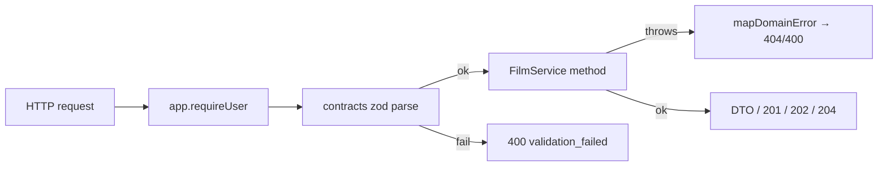

# films/routes.ts — AI component doc

> AI-facing sidecar for `films/routes.ts`. Created 2026-07-09. Keep this in sync with the code on every change.

## Purpose
Thin HTTP layer for CinemaStudio: parse with shared contracts schemas, delegate to `FilmService`, map
domain errors to status codes. Every route requires a session. ADR: `docs/wiki/decisions/cinema-studio.md`.

## What it does (for an AI reader)
- Responsibilities: register the `/api/films*` routes and funnel `FilmNotFoundError`/`FilmValidationError`
  through a `guard` into the ApiError envelope.
- Public API / endpoints:
  - `GET /api/films` → `{ items: Film[] }`
  - `POST /api/films` (201) → Film
  - `GET /api/films/:id` → FilmDetail (film + ordered shots + audio)
  - `PATCH /api/films/:id` → Film; `DELETE /api/films/:id` → 204
  - `POST /api/films/:id/shots` (201) → Shot
  - `POST /api/films/:id/shots/reorder` → `{ items: Shot[] }` (registered before :shotId so 'reorder' isn't captured as an id)
  - `PATCH /api/films/:id/shots/:shotId` → Shot; `DELETE …/:shotId` → 204
  - `POST /api/films/:id/audio` (201) → FilmAudio; `DELETE …/audio/:audioId` → 204
  - `POST /api/films/:id/renders` (202, rate-limited 10/min) → FilmRender; `GET …/renders/:renderId` → FilmRender (poll)
- Inputs → Outputs: JSON body validated by contracts zod → service call → DTO; 400 envelope on parse failure.
- Side effects: none directly (the render spawn happens inside the service).

## Dependencies
- Imports / depends on: `fastify` types, `@opencreate/contracts` (input schemas), `./service`
  (FilmService + error classes).
- Used by: `app.ts` (`registerFilmRoutes(app, filmService)`).

## Diagram

## Key decisions / gotchas
- `/shots/reorder` is registered BEFORE `/shots/:shotId` so the literal segment is not captured as a shot id.
- Render POST is rate-limited (10/min) because it spawns an ffmpeg process; reads keep the global limit.
- `guard` rethrows unmapped errors so real faults still reach the central 500 handler (never flatten a bug to 400).

## Commits
- _no commit yet_

## Update 2026-07-09 — storyboard route
- `registerFilmRoutes(app, service, storyboard?)` now takes an optional `StoryboardService`. When present, registers `POST /api/films/:id/storyboard` (rate-limited 10/min) → `{ items: Shot[] }` (draft shots). `StoryboardUnavailableError` maps to 502 `provider_error`.
