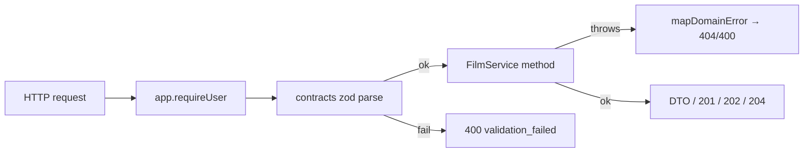

# films/routes.ts — AI component doc

> AI-facing sidecar for `films/routes.ts`. Created 2026-07-09. Keep this in sync with the code on every change.

## Purpose
Thin HTTP layer for CinemaStudio: parse with shared contracts schemas, delegate to `FilmService`, map
domain errors to status codes. Every route requires a session. ADR: `docs/wiki/decisions/cinema-studio.md`.

## What it does (for an AI reader)
- Responsibilities: register the `/api/films*` routes and funnel `FilmNotFoundError`/`FilmValidationError`
  through a `guard` into the ApiError envelope.
- Public API / endpoints:
  - `GET /api/films` → `{ items: Film[] }`
  - `POST /api/films` (201) → Film
  - `GET /api/films/:id` → FilmDetail (film + ordered shots + audio)
  - `PATCH /api/films/:id` → Film; `DELETE /api/films/:id` → 204
  - `POST /api/films/:id/shots` (201) → Shot
  - `POST /api/films/:id/shots/reorder` → `{ items: Shot[] }` (registered before :shotId so 'reorder' isn't captured as an id)
  - `PATCH /api/films/:id/shots/:shotId` → Shot; `DELETE …/:shotId` → 204
  - `POST /api/films/:id/shots/:shotId/split` → FilmDetail — split a shot at `atMs` (the NLE's
    split-at-playhead). Registered only when a `ShotSplitService` is wired. The `/split` sub-path
    carries an extra segment past `:shotId`, so it never collides with the parameterized shot routes.
  - `POST /api/films/:id/shots/:shotId/references` (201) → Shot — attach an image (shot references)
  - `DELETE /api/films/:id/shots/:shotId/references/:refId` (200) → Shot — detach an image
  - `POST /api/films/:id/shots/:shotId/clip` (201 image / 202 video, rate-limited 20/min) → Generation —
    the delivery seam: server sources the shot's attached images into the closed `referenceImages`
    channel and calls `generations.create()`. Registered only when a `ShotReferenceService` is wired.
  - `POST /api/films/:id/audio` (201) → FilmAudio; `DELETE …/audio/:audioId` → 204
  - `POST /api/films/:id/renders` (202, rate-limited 10/min) → FilmRender; `GET …/renders/:renderId` → FilmRender (poll)
- Inputs → Outputs: JSON body validated by contracts zod → service call → DTO; 400 envelope on parse failure.
- Side effects: none directly (the render spawn happens inside the service).

## Dependencies
- Imports / depends on: `fastify` types, `@opencreate/contracts` (input schemas incl.
  `addShotReferenceInputSchema` / `generateShotClipInputSchema` / `splitShotInputSchema`), `./service`
  (FilmService + error classes), `./shot-references` (ShotReferenceService type), `./shot-split`
  (ShotSplitService type).
- Used by: `app.ts`
  (`registerFilmRoutes(app, filmService, storyboardService, shotReferenceService, shotSplitService)`).

## Update 2026-07-21 — shot reference images (attach any image to a shot)
- 4th param `shotRefs?: ShotReferenceService`; when present, three routes are registered:
  `POST/DELETE …/shots/:shotId/references` (attach/detach, return the updated shot) and
  `POST …/shots/:shotId/clip` (the delivery seam). The `references`/`clip` sub-paths carry an
  extra segment past `:shotId`, so they never collide with the parameterized shot routes.
- The clip route is wrapped in the SAME `guard` as the rest: a foreign shot 404s inside the service
  BEFORE `create()` runs (provider never called), while `create()`'s own domain errors
  (validation/provider/content) fall through to the central handler (like assets3d extract/mesh).
  It gets the strict 20/min bucket because it spends provider money.

## Diagram

## Key decisions / gotchas
- `/shots/reorder` is registered BEFORE `/shots/:shotId` so the literal segment is not captured as a shot id.
- Render POST is rate-limited (10/min) because it spawns an ffmpeg process; reads keep the global limit.
- `guard` rethrows unmapped errors so real faults still reach the central 500 handler (never flatten a bug to 400).

## Update 2026-07-21 (later) — refusal detail rides the envelope

`mapDomainError` now returns `reason`/`subjectKind`/`subjectId` when a `FilmValidationError`
carries them (every `buildPlan` export refusal does), and `guard` spreads the mapped result
into the envelope's `error` object instead of hand-picking `{code, message}`.

That spread is the whole mechanism: fields present on the refusal travel, fields absent are
simply not there, and consumers reading only `{code, message}` are unaffected.

**All ten export refusals leave through THIS file, not `app.ts`'s central handler.**
`guard` catches, `mapDomainError` recognises `FilmValidationError`, and the reply is sent
here; `app.ts` is reached only when `mapDomainError` returns null (`throw error`). Verified
before building — if it had been otherwise, the reasons would have been silently dropped.

## Update 2026-07-22 — split a shot at a point
- 5th param `split?: ShotSplitService`; when present, registers
  `POST /api/films/:id/shots/:shotId/split` → the updated `FilmDetail`. Body is `splitShotInputSchema`
  (`{ atMs }`). The `/split` sub-path carries an extra segment past `:shotId`, so — like
  `references`/`clip` — it never collides with the parameterized shot routes above.
- Wrapped in the SAME `guard`: a foreign film/shot 404s (FilmNotFoundError), an out-of-range `atMs`
  400s (FilmValidationError). No new rate-limit bucket — a split is a cheap metadata write that
  spawns no process and spends no credits, so the global limit is right.

## Commits
- _no commit yet_

## Update 2026-07-09 — storyboard route
- `registerFilmRoutes(app, service, storyboard?)` now takes an optional `StoryboardService`. When present, registers `POST /api/films/:id/storyboard` (rate-limited 10/min) → `{ items: Shot[] }` (draft shots). `StoryboardUnavailableError` maps to 502 `provider_error`.

## Update 2026-07-21 — 409 for a concurrent render
`mapDomainError` maps `FilmRenderInProgressError` → 409 `conflict`. `POST /api/films/:id/renders` now answers 409 when the film already has a `processing` render, instead of starting a second ffmpeg job. The SPA branches on the code to say "already exporting" rather than showing it as a failure.

## Update 2026-07-31 — `POST /api/films` awaits, and is guarded
`createFilm` became async (it can now store a cover file), so the route awaits it — and the call moved
**inside `guard`**, so a cover the storage layer refuses surfaces as the service's `400
validation_failed` instead of an unhandled rejection. Because the bytes are written before the row,
that refusal leaves no film behind.

The body is `createFilmInputSchema`, which since this change accepts a bare `{ title }`
(`aspectRatio` optional, server-defaulted) and an optional `coverDataUri`. Both are widening: every
body an older client sends still parses.

## Update 2026-08-02 — `PATCH /api/films/:id` accepts a cover
`updateFilm` became async (it can now store a cover file). **The route needed no change**: the call
was already inside `guard`, whose `fn: () => T | Promise<T>` signature awaits either — which is also
what maps a refused cover to the service's `400 validation_failed`.

Body is `updateFilmInputSchema`, where `coverDataUri` is three-valued: a data URI replaces the cover,
`null` clears it, absent leaves it alone.

## Update 2026-08-20 - `GET /api/films?batchId=`

- `GET /api/films` accepts an optional `batchId` query parameter and passes it to
  `service.listFilms(user.id, batchId)`.
- **It is the only thing that reconstructs a Shorts Studio run board after a reload**
  (ADR shorts-studio section 2) - the batch was never anywhere but on these rows.
- **A non-uuid is a 400, not an empty list.** Every batch id is a `randomUUID()` this
  server minted, so anything else is definitionally not one; a client that mangled the id
  learns so instead of being told "your batch is gone". Matched with a module-level
  `UUID_RE` rather than a zod schema - it is one optional query string, not a body.
- Ownership still does the protecting: the service filters by user AND batch, never batch
  alone, so a leaked id addresses nothing outside its owner's library.
