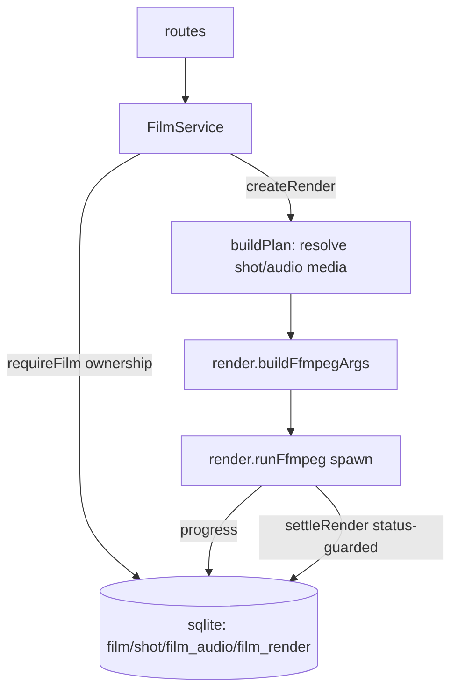

# films/service.ts — AI component doc

> AI-facing sidecar for `films/service.ts`. Created 2026-07-09. Keep this in sync with the code on every change.

## Purpose
CinemaStudio domain service: films, ordered shots, audio tracks, and ffmpeg render jobs — the
composition layer over generations. ADR: `docs/wiki/decisions/cinema-studio.md`.

## What it does (for an AI reader)
- Responsibilities: CRUD for films/shots/audio with ownership scoping; shot reorder; render
  orchestration (build plan → insert processing row → fire ffmpeg → status-guarded settle); stale
  render reaper.
- Public API / exports: `createFilmService({ db, storage, runRender? })` → `{ createFilm,
  createFromTemplate, listFilms, getFilm, updateFilm, deleteFilm, addShot, updateShot, deleteShot,
  reorderShots, addAudio, deleteAudio, createRender, getRender }`; `settleStaleRenders(db, now?, log?)`;
  errors `FilmNotFoundError` (404), `FilmValidationError` (400).
- Inputs → Outputs: userId + contract inputs → Film/Shot/FilmAudio/FilmRender/FilmDetail DTOs.
- Side effects: SQLite reads/writes; `createRender` spawns ffmpeg via `render.runFfmpeg` (fire-and-
  forget) and writes `/media/<renderId>.mp4`.

## Dependencies
- Imports / depends on: `node:crypto`, `node:fs` (existsSync), `drizzle-orm`, `@opencreate/contracts`,
  `../../db/schema` (film/shot/filmAudio/filmRender/generation), `../../storage/local` (localPath),
  `./render` (buildFfmpegArgs, runFfmpeg, canvasFor, resolveFontPath, totalDurationMs, createSemaphore).
- Used by (planned): `modules/films/routes.ts`, wired in `app.ts`. `runRender` injected by tests.

## Diagram

## Key decisions / gotchas
- OWNERSHIP IS THE TYPE SIGNATURE: every method takes userId first; `requireFilm`/`requireShot` scope
  by it and throw the SAME `FilmNotFoundError` for missing-or-foreign (no id-existence oracle).
- NO LEDGER: a render spends CPU, not a provider invoice — no cost, no refund. `settleRender` is
  status-guarded (only processing→terminal once) so the fire-and-forget promise and the boot reaper
  cannot double-settle.
- `buildPlan` throws 400 if any shot/audio media is missing or not yet succeeded — a render never
  silently drops footage the user arranged. A shot with neither generation nor title is skipped.
- Render is fire-and-forget: `createRender` inserts the processing row and returns immediately; the
  SPA polls `getRender`. Concurrency bounded by a semaphore (MAX_CONCURRENT_RENDERS=2).
- `reorderShots` requires the id list to be EXACTLY the film's shots (else a client could smuggle a
  foreign shot into this film's ordering).
- `runRender` is injectable so tests exercise the full render lifecycle without a real ffmpeg binary.

## Commits
- _no commit yet_

## Update 2026-07-11 — template catalog (ADR: `docs/wiki/decisions/template-catalog.md`)

### `createFromTemplate(userId, templateId, input, shots): FilmDetail` — the only BULK-create path
Writes the film row AND every shot in **one transaction**. Called only by the template service (the
`/api/films/from-template` route); a hand-made film still goes through `createFilm`, which stamps
`templateId: null` — provenance is a fact the SERVER establishes, never a client claim (which is why
`createFilmInputSchema` has no `templateId` field at all).

Why it is not `createFilm()` then `addShot()` × 8:
- **Atomicity.** A crash between shot 5 and 6 would leave the user staring at half a drama with no way
  to tell it apart from a finished one. A template lands whole or not at all.
- **Round trips.** Eight POSTs and eight `['film', id]` invalidations to put up one screen is a visibly
  slow way to do an instant action.
- **orderIndex.** `addShot` recomputes `max(orderIndex)` per insert; here the order is already known, so
  the indices are just `(i + 1) * ORDER_STEP`.

It **charges nothing and generates nothing**: every shot lands with `generationId = null`. Prompts,
presets, `modelId`, durations, titles and spoken lines are filled in — the credits are spent later, per
shot, by the user. There is no ledger interaction anywhere in this path.

### `addShot` / `updateShot` now persist `modelId` and `voiceoverJson`
`shot.modelId` pins the model (a template's tier, or the user's own last pick); `shot.voiceoverJson`
holds the spoken line as authored copy. Both nullable, both round-tripped through the DTO.

### `addAudio` REPLACES a shot-attached track instead of appending
When `input.shotId` is set, the service `requireShot`s it (so a client cannot attach a track to another
film's timeline) and then **DELETEs every existing `film_audio` row for that shot** before inserting.
Appending would mean a second click on "voice this shot" leaves two lines playing over each other — and
the user paid twice to make it worse. A film-wide bed (`shotId: null`, e.g. music) is unaffected and
still appends. The pre-existing guard is unchanged: the cited generation must be the caller's, must be
`type: 'audio'`, else 400.
