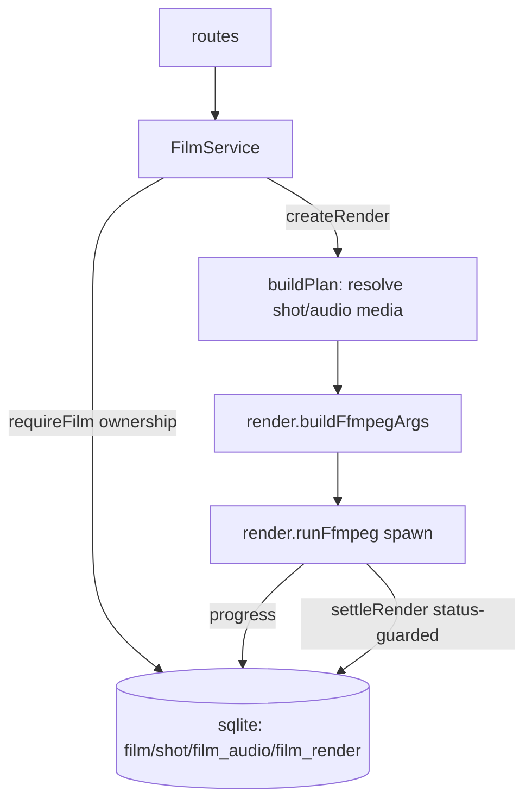

# films/service.ts — AI component doc

> AI-facing sidecar for `films/service.ts`. Created 2026-07-09. Keep this in sync with the code on every change.

## Purpose
CinemaStudio domain service: films, ordered shots, audio tracks, and ffmpeg render jobs — the
composition layer over generations. ADR: `docs/wiki/decisions/cinema-studio.md`.

## What it does (for an AI reader)
- Responsibilities: CRUD for films/shots/audio with ownership scoping; shot reorder; render
  orchestration (build plan → insert processing row → fire ffmpeg → status-guarded settle); stale
  render reaper.
- Public API / exports: `createFilmService({ db, storage, runRender? })` → `{ createFilm,
  createFromTemplate, listFilms, getFilm, updateFilm, deleteFilm, addShot, updateShot, deleteShot,
  reorderShots, addAudio, deleteAudio, createRender, getRender }`; `settleStaleRenders(db, now?, log?)`;
  errors `FilmNotFoundError` (404), `FilmValidationError` (400).
- Inputs → Outputs: userId + contract inputs → Film/Shot/FilmAudio/FilmRender/FilmDetail DTOs.
- Side effects: SQLite reads/writes; `createRender` spawns ffmpeg via `render.runFfmpeg` (fire-and-
  forget) and writes `/media/<renderId>.mp4`.

## Dependencies
- Imports / depends on: `node:crypto`, `node:fs` (existsSync), `drizzle-orm`, `@opencreate/contracts`,
  `../../db/schema` (film/shot/filmAudio/filmRender/generation), `../../storage/local` (localPath),
  `./render` (buildFfmpegArgs, runFfmpeg, canvasFor, resolveFontPath, totalDurationMs, createSemaphore).
- Used by (planned): `modules/films/routes.ts`, wired in `app.ts`. `runRender` injected by tests.

## Diagram

## Key decisions / gotchas
- OWNERSHIP IS THE TYPE SIGNATURE: every method takes userId first; `requireFilm`/`requireShot` scope
  by it and throw the SAME `FilmNotFoundError` for missing-or-foreign (no id-existence oracle).
- NO LEDGER: a render spends CPU, not a provider invoice — no cost, no refund. `settleRender` is
  status-guarded (only processing→terminal once) so the fire-and-forget promise and the boot reaper
  cannot double-settle.
- `buildPlan` throws 400 if any shot/audio media is missing or not yet succeeded — a render never
  silently drops footage the user arranged. A shot with neither generation nor title is skipped.
- Render is fire-and-forget: `createRender` inserts the processing row and returns immediately; the
  SPA polls `getRender`. Concurrency bounded by a semaphore (MAX_CONCURRENT_RENDERS=2).
- `reorderShots` requires the id list to be EXACTLY the film's shots (else a client could smuggle a
  foreign shot into this film's ordering).
- `runRender` is injectable so tests exercise the full render lifecycle without a real ffmpeg binary.

## Update 2026-07-15 — native generation audio
- `toShotDto`/`addShot`/`updateShot` carry `shot.audio` (default false).
- `buildPlan` marks a segment `nativeAudio` only when BOTH halves agree: the
  shot asks (user intent) AND the generation row's `params.audio === true`
  (provenance). Shot alone would map [i:a] on a silent mp4 and kill the render;
  row alone would force sound on users who turned it off after the fact.

## Update 2026-07-21 — `toShotDto` lifted + exported; `Shot.referenceImages`
- `toShotDto` moved from a closure inside `createFilmService` to a module-level
  `export function toShotDto(row)` so the `shot-references.ts` sibling maps rows through the
  exact same function (one source of truth for the Shot shape). Pure, so call sites are unchanged.
- It now populates `referenceImages` from `shot.reference_images_json` (NULL → `[]`, the same
  array-never-null discipline as `entityRefs`). Attaching/detaching images and the clip delivery
  seam live in `shot-references.ts`, NOT here — this file is already over the 500-line guideline.

## Update 2026-07-21 — `FilmValidationError` carries a reason and a subject

Every `buildPlan` export refusal now names its CAUSE (`RenderBlockReason`) and the SHOT,
TRACK or FILM it is about. Ten refusals previously arrived at the client as one
`validation_failed` with English developer prose, so the UI could only render one generic
sentence for all of them.

Two throw sites were SPLIT because they conflated opposite instructions:
- the shot-side `status !== 'succeeded'` branch → `shot_clip_processing` (wait, it resolves
  itself) vs `shot_clip_failed` (regenerate, it never will);
- the audio-side check → `audio_generation_missing` / `audio_processing` / `audio_failed` /
  `audio_media_missing`, replacing one sentence that hedged with "remove it or wait for it"
  precisely because it could not tell them apart.

The fields are OPTIONAL on the class: most `FilmValidationError`s are ordinary input
rejections (a bad reorder payload, a non-audio generation) with no subject to point at.

**Known debt, deliberately untouched:** this file is now 801 lines, over the 500 rule. It was
667 before this pass and already over. Splitting it is a separate single-owner job and was
kept out of a behaviour change on purpose.

## Commits
- _no commit yet_

## Update 2026-07-11 — template catalog (ADR: `docs/wiki/decisions/template-catalog.md`)

### `createFromTemplate(userId, templateId, input, shots): FilmDetail` — the only BULK-create path
Writes the film row AND every shot in **one transaction**. Called only by the template service (the
`/api/films/from-template` route); a hand-made film still goes through `createFilm`, which stamps
`templateId: null` — provenance is a fact the SERVER establishes, never a client claim (which is why
`createFilmInputSchema` has no `templateId` field at all).

Why it is not `createFilm()` then `addShot()` × 8:
- **Atomicity.** A crash between shot 5 and 6 would leave the user staring at half a drama with no way
  to tell it apart from a finished one. A template lands whole or not at all.
- **Round trips.** Eight POSTs and eight `['film', id]` invalidations to put up one screen is a visibly
  slow way to do an instant action.
- **orderIndex.** `addShot` recomputes `max(orderIndex)` per insert; here the order is already known, so
  the indices are just `(i + 1) * ORDER_STEP`.

It **charges nothing and generates nothing**: every shot lands with `generationId = null`. Prompts,
presets, `modelId`, durations, titles and spoken lines are filled in — the credits are spent later, per
shot, by the user. There is no ledger interaction anywhere in this path.

### `addShot` / `updateShot` now persist `modelId` and `voiceoverJson`
`shot.modelId` pins the model (a template's tier, or the user's own last pick); `shot.voiceoverJson`
holds the spoken line as authored copy. Both nullable, both round-tripped through the DTO.

### `addAudio` REPLACES a shot-attached track instead of appending
When `input.shotId` is set, the service `requireShot`s it (so a client cannot attach a track to another
film's timeline) and then **DELETEs every existing `film_audio` row for that shot** before inserting.
Appending would mean a second click on "voice this shot" leaves two lines playing over each other — and
the user paid twice to make it worse. A film-wide bed (`shotId: null`, e.g. music) is unaffected and
still appends. The pre-existing guard is unchanged: the cited generation must be the caller's, must be
`type: 'audio'`, else 400.

## Change log (behaviour)

### 2026-07-12 — audio can no longer vanish from an export
Found by an end-to-end run: a film exported as a **silent** mp4 while the render
reported `succeeded`, and the user had already paid for the voiceover + music.

Two defects, both closed here:

1. `addAudio` — the comment always claimed the cited generation "must be the
   caller's, **succeeded**, and actually audio", but the code only checked
   `type`. A still-processing TTS row could be attached: the Audio panel showed
   the track at once, and a render started before the mp3 landed on disk found
   nothing to mix. It now rejects any non-`succeeded` generation
   (`audio generation is not ready yet`, 400).
2. `buildPlan` — used to do `if (existsSync(file)) audio.push(...)`, i.e.
   silently DROP any track whose asset was missing and let the render settle as
   succeeded. A muted mp4 looks finished, which makes this the worst possible
   outcome. It now throws a `FilmValidationError` instead: a missing asset is a
   real failure and says so.

Net rule: **a track the user attached and paid for either reaches the mux or
stops the export.** Never a quiet downgrade.

Covered by `test/films-audio-integrity.test.ts`.

### 2026-07-20 — guard 1 REVERTED; `buildPlan` is the single enforcement point
The 2026-07-12 `addAudio` status gate (defect 1 above) **broke the client
outright** and is removed (owner-approved).

Audio generations are **async**: `POST /api/generations` returns 202 `processing`,
and a row only settles when someone polls `GET /api/generations/:id`
(`generations/service.ts:621,734,745`); nothing polls on a timer. The web flow
creates the generation and attaches it in two back-to-back calls
(`Cinema/model/voiceoverApi.ts`, `audioApi.ts`), so the cited row was ALWAYS
`processing` at attach time. Voiceover and music attachment therefore failed
100% of the time — **after** charge-at-submit had already taken the credits.

What changed:
- `addAudio` no longer checks `status`. It still checks **ownership** and
  `type === 'audio'` (mixing a video file as an audio track breaks the mux and is
  not a timing question).
- Attaching a pending track is now legal and matches how **shots** already behave:
  a shot cites a still-processing generation and the timeline renders its live
  status. Audio was the odd one out.
- `buildPlan` is unchanged in behaviour but is now load-bearing ON PURPOSE: it is
  reached by both "still processing / failed" and "succeeded but asset gone", and
  refuses the render for either. Its comment says so explicitly, because a comment
  that mis-states why a guard exists is how the next person deletes it.

The property from 2026-07-12 still holds — audio is never silently missing from an
export — because it was always guard 2 that held it. Guard 1 was belt-and-braces.

Tests: the old "refuses to attach a not-succeeded generation" case is replaced by
"attaches an audio generation that is still processing", plus two new cases
pinning that the RENDER refuses a processing/failed track. The
succeeded-but-no-file cases are untouched — they are the evidence this is safe.

## Update 2026-07-21 — render persistence + one render per film

Two render-side changes, both about a render outliving the tab that started it.

**`getFilm` now returns `latestRender`.** New private `latestRenderOf(filmId)`
selects the newest `film_render` row by `createdAt DESC LIMIT 1` and maps it
through `toRenderDto`, or returns `null`. `requireFilm` has already proven
ownership by the time it runs, so filtering by `filmId` alone is sound. This is
what makes a reloaded editor able to resume a running export, hand back a
finished mp4's download link, or explain a failed one — none of which was
possible when the render id lived only in the browser's memory.

**`createRender` refuses a concurrent render** with the new
`FilmRenderInProgressError` (409 / `conflict`). Checked BEFORE `buildPlan` so a
duplicate click gets the precise "already exporting" answer rather than whatever
the plan happens to complain about first. 409 rather than 400 because the request
is perfectly valid — it is the film's CURRENT STATE that forbids it, which is
what `conflict` is documented for in the error taxonomy.

The UI used to gate this with a local `isExporting` flag that only knew about the
tab it lived in: two tabs, or one tab after a reload, could put two encodes of
the same film on the CPU at once. A rule about a shared resource has to be
enforced where the resource is. `settleStaleRenders` is what guarantees the lock
can never wedge permanently — a render whose process died is failed by the
reaper, which releases it.

Tests: `films-render.test.ts` covers `latestRender` null/newest/succeeded and
ownership, plus refusal-while-processing and release-after-settle.
