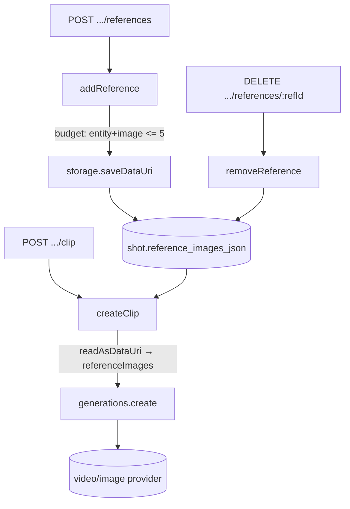

# shot-references.ts — AI component doc

> AI-facing sidecar for `shot-references.ts`. Created 2026-07-21. Keep this in sync with the code on every change.

## Purpose
Attach arbitrary reference images DIRECTLY to a Cinema shot (not tagged Entities) and deliver
them to the model on every (re-)generate. A small sibling of `films/service.ts` — that file is
already over the 500-line guideline, so this feature lives on its own. ADR:
`docs/wiki/decisions/cinema-studio.md`.

## What it does (for an AI reader)
- Responsibilities: store/remove images attached to a shot (budget-checked), and generate a
  shot's clip with those stored images folded into the server-only `referenceImages` channel.
- Public API / exports:
  - `createShotReferenceService({ db, storage, generations })` → `{ addReference, removeReference, createClip }`.
  - `ShotReferenceService` (the return type).
- Inputs → Outputs:
  - `addReference(userId, filmId, shotId, dataUri)` → the updated `Shot` (new `referenceImages`).
  - `removeReference(userId, filmId, shotId, refId)` → the updated `Shot`.
  - `createClip(userId, filmId, shotId, input: GenerateShotClipInput, reqLog?)` → `{ dto, created }`
    (same shape `generations.create()` returns; the route maps `created` → 201/202).
- Side effects: writes `shot.reference_images_json`; writes image bytes via `storage.saveDataUri`;
  reads them back via `storage.readAsDataUri`; calls `generations.create()` (which charges credits).
  It NEVER charges/refunds itself — the money path is untouched.

## Dependencies
- Imports / depends on: `node:crypto`, `drizzle-orm`, `@opencreate/contracts`
  (`MAX_SHOT_REFERENCE_IMAGES`, `EntityRef`, `GenerateShotClipInput`, `Generation`, `Shot`,
  `ShotReferenceImage`), `../../db/client` (Db), `../../storage/local` (StorageProvider),
  `../../storage/dataUri` (InvalidImageDataUriError), `../../db/schema` (film, shot),
  `../generations/service` (CreateGenerationServiceInput, GenerationService — narrowed to `create`),
  `./service` (FilmNotFoundError, FilmValidationError, `toShotDto`).
- Used by: `films/routes.ts` (the `references` + `clip` routes) and `app.ts` (wiring).

## Diagram

## Key decisions / gotchas
- **The delivery seam keeps the wire channel closed.** `createGenerationInputSchema` has no
  `referenceImages` field, so a client can never inject reference-image bytes into a generation.
  `createClip` is the ONLY place a shot's attached images enter the server-only `referenceImages`
  channel — read from storage, never from the request body.
- **Persistence = survives re-generate.** The images live on the shot (`reference_images_json`), so
  every `createClip` re-reads and re-sends them. A one-off upload on the generation request would
  vanish the moment the clip was remade.
- **Shared budget, enforced at upload.** entity tags + attached images together cap at
  `MAX_SHOT_REFERENCE_IMAGES` (5). Refused BEFORE storing so the composer's "5/5" is truth; the
  per-generation gate in `create()` does the model-specific final check (a model that accepts fewer
  refuses before charging).
- **Ownership is the type signature.** `requireShot` scopes by userId; same 404 for missing/foreign.
  A foreign shot 404s inside `createClip` BEFORE `create()` runs — the provider is never called.
- **No ledger here.** `createClip` hands a `CreateGenerationServiceInput` to `generations.create()`;
  it imports no ledger and writes no charge/refund. Importing the ledger here would be a design bug.
- **Delete leaves the file.** `removeReference` drops the ref from the shot but leaves the media file
  on disk (a harmless orphan a future sweep reclaims) — the same way entity/asset deletion behaves.
  Removing an unknown refId is a no-op, not a 404.

## Commits
- _no commit yet_
