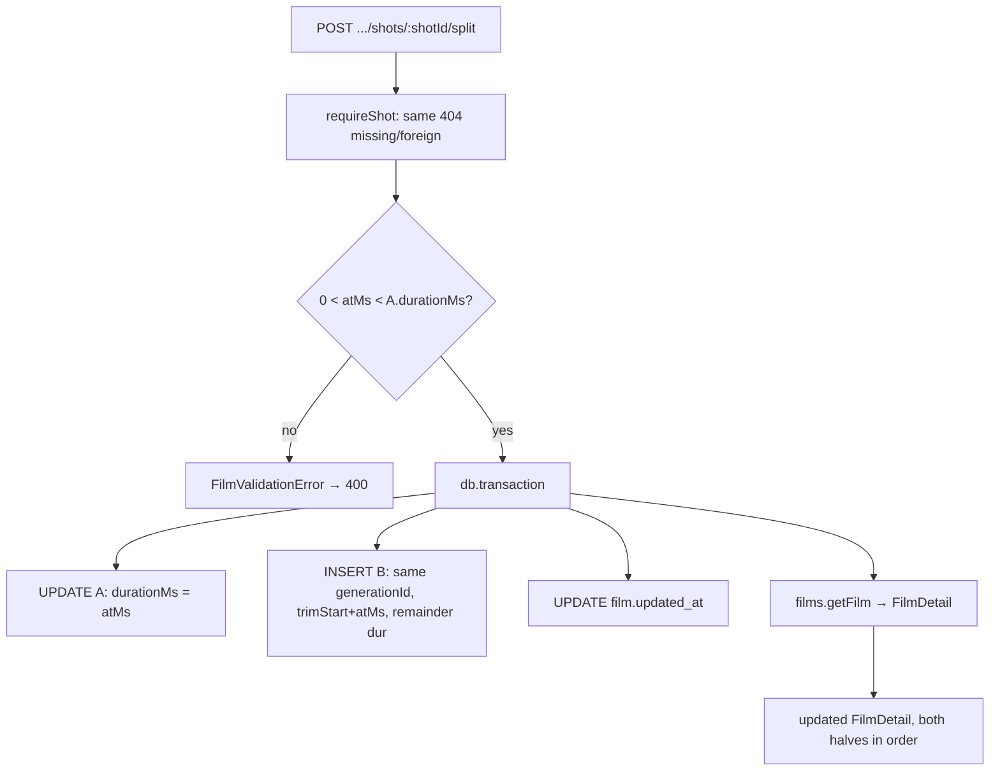

# shot-split.ts — AI component doc

> AI-facing sidecar for `shot-split.ts`. Created 2026-07-22. Keep this in sync with the code on every change.

## Purpose
Split one Cinema shot at a point on the timeline — the NLE's split-at-playhead. A small,
self-contained sibling of `films/service.ts` (that file is already past the 500-line guideline),
following the `shot-references.ts` precedent. ADR: `docs/wiki/decisions/cinema-studio.md`.

## What it does (for an AI reader)
- Responsibilities: re-slice a shot A into two contiguous shots (A + a new B) in ONE db
  transaction, so a split can never leave a half-split film.
- Public API / exports:
  - `createShotSplitService({ db, films })` → `{ splitShot }`, where `films` is the film service
    narrowed to `Pick<FilmService, 'getFilm'>` (the split's read shape only).
  - `ShotSplitService` (the return type).
- Inputs → Outputs:
  - `splitShot(userId, filmId, shotId, atMs)` → the updated `FilmDetail` (same shape
    `GET /api/films/:id` returns, so the client replaces its film cache wholesale).
  - `atMs` is the split offset measured from the shot's OWN start; the service enforces
    `0 < atMs < shot.durationMs` (throws `FilmValidationError` → 400 otherwise).
- Side effects: one transactional write to `shot` (UPDATE A's `duration_ms`, INSERT B) plus a
  `film.updated_at` bump — all in a single `db.transaction`. NO credit ledger, NO generation, NO
  provider call: a split cites the SAME generation, it never creates one.

## Dependencies
- Imports / depends on: `node:crypto` (randomUUID for B's id), `drizzle-orm` (`and`, `asc`, `eq`,
  `gt`), `@opencreate/contracts` (`FilmDetail`), `../../db/client` (Db), `../../db/schema`
  (`film`, `shot`), `./service` (`FilmNotFoundError`, `FilmValidationError`, and the `FilmService`
  type it narrows).
- Used by: `films/routes.ts` (the `POST …/shots/:shotId/split` route) and `app.ts` (wiring —
  `createShotSplitService({ db, films: filmService })`).

## Diagram

## Key decisions / gotchas
- **Why an endpoint for a client-composable op.** The split IS composable client-side (shorten A,
  add B citing the same generation with a shifted trim, reorder B after A), but that is a 3-call,
  non-atomic sequence — a mid-sequence failure leaves a half-split film. This collapses it into ONE
  transaction (whole-or-nothing). That atomicity is the entire reason the endpoint exists.
- **The pre-split snapshot is load-bearing.** `a` is read by `requireShot` BEFORE the transaction,
  so `a.durationMs`/`a.trimStartMs` are the ORIGINAL values. B's duration is `a.durationMs - atMs`
  and B's trim is `a.trimStartMs + atMs` — even though A's row is truncated to `atMs` inside the tx.
- **The wire checks the lower bound, the service checks the upper.** `splitShotInputSchema` enforces
  `atMs > 0` (positive int ms). `atMs < durationMs` needs the shot, which only the service can see —
  so it owns the full `0 < atMs < durationMs` rule and the invariant holds even if `splitShot` is
  called directly. Both bounds surface as the same 400 `validation_failed`.
- **What B copies, and what it does NOT (owner-approved).** B copies FOOTAGE-describing fields:
  `generationId` (same source clip), `prompt`/`promptPreset`/`modelId` (how it was made), and
  `audio` (native-audio is a property of the CLIP, which B replays). It deliberately does NOT copy
  BEAT-scoped fields: `title` (a card belongs to one beat), `voiceover` (a line authored for A's
  timing), `entityRefs`/`referenceImages` (attached for A's frame — carrying them would silently
  re-bill the same cast onto B's next generation). B enters from A with `transition: 'none'`: the
  halves are contiguous frames of one clip, so a crossfade would double-expose the footage.
- **Order index = midpoint insert.** B lands at the midpoint of A's and its successor's
  `order_index` (or `A + ORDER_STEP` when A is last). The REAL column exists precisely for this
  fractional-midpoint insert — no whole-list renumber (mirrors `reorderShots` / schema.ts).
- **Ownership is the type signature.** `requireShot(userId, …)` scopes by user; same 404 for a
  missing shot and a foreign one, so an attacker cannot probe id existence. Reimplemented locally
  (not imported from the service closure) so this module stays self-contained, like shot-references.
- **No ledger, ever.** A split touches only timeline metadata that already exists. If this file ever
  imports the credit ledger, the design has gone wrong (the shot-references / assets3d rule).

## Commits
- _no commit yet_
