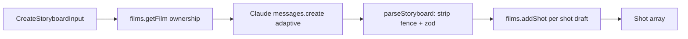

# films/storyboard.ts — AI component doc

> AI-facing sidecar for `films/storyboard.ts`. Created 2026-07-09. Keep this in sync with the code on every change.

## Purpose
CinemaStudio script→storyboard: an LLM (Claude) breaks a free-text script into DRAFT shots
(generationId=null + promptPreset). Nothing is generated or charged until the user presses Generate
per shot. Gated on ANTHROPIC_API_KEY. ADR: `docs/wiki/decisions/cinema-studio.md`.

## What it does (for an AI reader)
- Responsibilities: call Claude with the film's script, parse+validate the JSON completion, create a
  draft shot per proposed shot via `FilmService.addShot`.
- Public API / exports: `createStoryboardService({ anthropicApiKey, films, complete? })` →
  `{ generate(userId, filmId, input) → Shot[] }`; `parseStoryboard(raw)`; `StoryboardUnavailableError`
  (502 provider_error).
- Inputs → Outputs: `CreateStoryboardInput { script, styleId?, shotCount? }` → created draft `Shot[]`.
- Side effects: one Anthropic Messages API call (network); inserts draft shots.

## Dependencies
- Imports / depends on: `@anthropic-ai/sdk`, `@opencreate/contracts` (storyboardResponseSchema, types),
  `./service` (FilmService).
- Used by (planned): a storyboard route registered in `app.ts`; `complete` injected by tests.

## Diagram

## Key decisions / gotchas
- Gated on ANTHROPIC_API_KEY (unset → StoryboardUnavailableError 502), same optional-secret pattern as COMFY_BASE_URL — boot stays healthy, every other feature works without it.
- JSON is parsed + validated OURSELVES (fence-strip + `storyboardResponseSchema`) rather than depending on a specific SDK structured-output API — robust across @anthropic-ai/sdk versions. A malformed completion → clean 502, never a broken shot.
- Draft shots have generationId=null and NO title (the scene title is not set as a render overlay), so they render as empty slots the user fills by pressing Generate — nothing is charged at storyboard time.
- `complete` is injectable so tests exercise the flow without a real Anthropic call.

## Commits
- _no commit yet_
