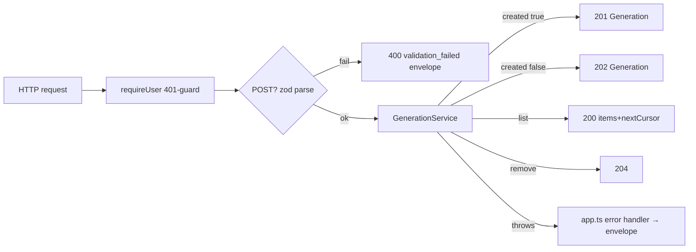

# routes.ts — AI component doc

> AI-facing sidecar for `modules/generations/routes.ts`. Created 2026-07-06. Keep this in sync with the code on every change.

## Purpose
Thin HTTP layer over the generation service (plan Task 10): parse/clamp inputs, delegate to `service.ts`, map results to status codes. No domain logic lives here.

## What it does (for an AI reader)
- Responsibilities: session-gate every route via `app.requireUser`, validate POST bodies with the SHARED contracts zod schema, clamp list pagination, translate `created` → 201/202, DELETE → 204, and hand `req.log` (per-request child logger) into `service.create`/`service.get` so money-path log lines carry the reqId.
- Public API / exports / props / endpoints: `registerGenerationRoutes(app, service)` registering:
  - `POST /api/generations` — body `CreateGenerationInput`; 400 envelope on zod failure (first issue's message); 201 (image, finished) / 202 (video, processing) with the `Generation` DTO. Strict rate bucket `config.rateLimit: 20/min per IP` (submits spend provider money); reads keep the global 300/min so the SPA's 4s polling is never throttled.
  - `GET /api/generations?limit&cursor` — limit defaults 24, caps 50 (NaN/0/negative → default); `cursor` is zod-allowlist-validated (`cursorSchema`: compound `<epochMs>_<id>` or legacy bare `<epochMs>`; anything else → 400 `validation_failed`) before it reaches the service; returns `{ items, nextCursor }`.
  - `GET /api/generations/:id` — returns the DTO; while processing this doubles as the Runware poll (service.get).
  - `DELETE /api/generations/:id` — 204 on success; 409 `conflict` while the generation is still processing (service-level rule).
- Inputs → Outputs: HTTP request → contracts-shaped JSON; domain errors (`ValidationError` 400, `InsufficientCreditsError` 402, `NotFoundError` 404, `ConflictError` 409, `RunwareError` 502, unauthorized 401) propagate to the app.ts central handler which emits the ApiError envelope.
- Side effects (I/O, network, state): none of its own — everything is delegated to the service.

## Dependencies
- Imports / depends on: `@opencreate/contracts` (`createGenerationInputSchema`), `./service` (`GenerationService` type), `fastify` types; relies on the `requireUser` decorator from `modules/auth/plugin.ts`.
- Used by: `app.ts` (Task 11 wiring); exercised end-to-end by `test/generations.test.ts`.

## Diagram

## Key decisions / gotchas
- The POST body is validated with the same zod object the SPA uses (`@opencreate/contracts`), so client and server can never disagree about what a valid request is.
- zod failures answer directly with the 400 envelope (first issue message) instead of throwing — cheaper and keeps the central handler for *unexpected* errors.
- Fastify route generics (`Querystring`/`Params`) type the inputs without casts — required under `strict` + `no-explicit-any`.
- `limit` clamp: `Number()` first, then finite/positive check; hostile `?limit=1e9` gets 50, `?limit=abc` gets 24.
- `?cursor=` is attacker-controlled (review finding): allowlist-validated with zod at the route boundary instead of being fed into `Number()`/SQL params blindly — the service only ever parses cursor shapes it minted itself (plus the legacy numeric form so open SPA sessions keep paginating across the deploy). Pinned by `test/generations-pagination.test.ts`.
- `req.log` is passed to `create` AND `get` (not `list`/`remove`): those two are the money-touching calls (charge/refund/settle happen inside), and the observability requirement is "reqId on every money log line".

## Commits
- 681e20f feat(api): generation lifecycle — charge, runware, store, poll, refund
- 5e8de3d feat(api): native env loading + structured logging — req.log passed to create/get
- cdd94a3 feat(api): sanitized errors + rate limits — 20/min bucket on POST /api/generations
- a7e4cd9 fix(api): ssrf allowlist, cursor tiebreaker, poll throttle — zod cursorSchema allowlist on ?cursor=
