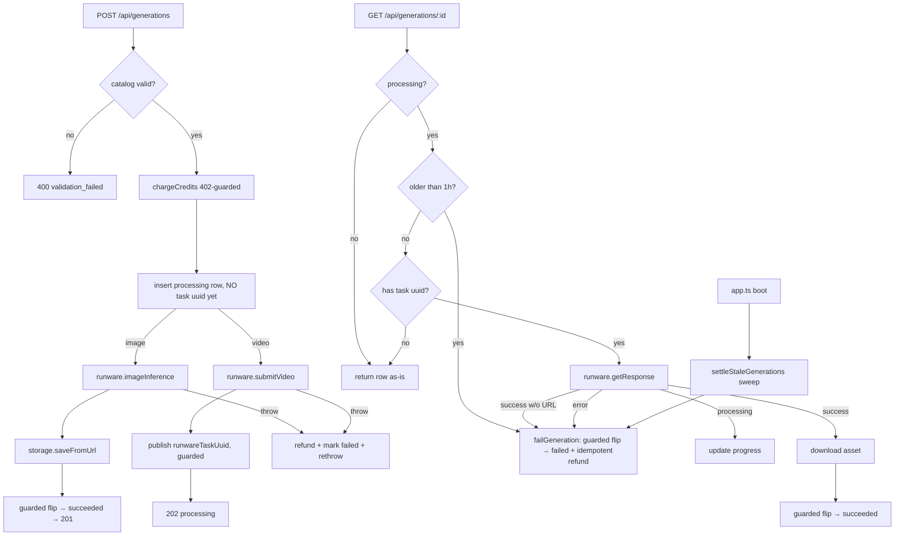

# service.ts — AI component doc

> AI-facing sidecar for `modules/generations/service.ts`. Created 2026-07-06. Keep this in sync with the code on every change.

## Purpose
The generation lifecycle service (plan Task 10) — the core money-touching sequence of the product: charge credits at submit, call Runware, persist state transitions, download finished assets into our own storage, refund exactly once on failure. Everything else (routes, SPA) is a thin shell around this file.

## What it does (for an AI reader)
- Responsibilities: catalog-level validation (model/aspect/duration/i2v support), credit charge before any provider call, generation row persistence, sync image flow (inference → asset download → succeeded), async video flow (submit → 202; `get()` doubles as the Runware poll applying processing/succeeded/failed transitions), refund on every failure path, cursor pagination, owner-scoped reads/deletes.
- Public API / exports / props / endpoints:
  - `createGenerationService({ db, runware, storage })` → `{ create, get, list, remove }` (`GenerationService` type).
  - `create(userId, input)` → `{ dto: Generation, created: boolean }` — `created: true` = image finished synchronously (route → 201); `false` = video accepted (route → 202). Throws `ValidationError` (400), `InsufficientCreditsError` (402, from ledger), `RunwareError` (502).
  - `get(userId, id)` → `Generation`; while the row is processing it polls `runware.getResponse` and applies the transition (no background workers in MVP — the SPA's 4s polling drives progress). Rows without a `runwareTaskUuid` are never polled (submit still in flight); rows older than `STALE_PROCESSING_MS` (1h) are settled as failed + refunded instead of polling.
  - `settleStaleGenerations(db, now?)` → number of settled rows — boot-time sweep called by `app.ts`; fails + refunds processing rows older than `STALE_PROCESSING_MS` so poll-abandoned generations (expired 7-day asset URLs, crashes mid-create) never hold credits forever.
  - `STALE_PROCESSING_MS` — exported staleness threshold (1 hour).
  - `list(userId, limit, cursor?)` → `{ items, nextCursor }` — newest-first; cursor is the createdAt epoch-ms of the last returned row; fetches `limit + 1` to detect the next page without COUNT.
  - `remove(userId, id)` — deletes the media file (idempotent) then the row; 404 if not owned.
  - Errors: `NotFoundError` (404/not_found), `ValidationError` (400/validation_failed), `ContentBlockedError` (422/content_blocked — NSFW safety filter) — statusCode+apiCode consumed by the app.ts central error handler.
- Inputs → Outputs: `CreateGenerationInput` (contracts) → `Generation` DTO (contracts). DB rows mapped by `toDto` (JSON columns parsed, dates → ISO strings).
- Side effects (I/O, network, state): DB writes (generation rows + ledger rows inside ledger transactions), outbound Runware calls, asset downloads into `StorageProvider`, media file deletions.

## Dependencies
- Imports / depends on: `@opencreate/contracts` (input/DTO types), `db/schema` (`generation`), `credits/ledger` (`chargeCredits`/`refundCredits`), `catalog/catalog` (`getModel`/`creditsFor`/`resolutionFor`), `integrations/runware/client` (type), `storage/local` (type), drizzle operators, `node:crypto`.
- Used by: `modules/generations/routes.ts` (wired in `app.ts`, Task 11); tested by `test/generations.test.ts` and `test/generations-races.test.ts` with the scripted `fakeRunware`.

## Diagram

## Key decisions / gotchas
- Charge happens BEFORE any provider call: a 402 means Runware was never contacted (asserted in tests).
- **Anti-double-spend (create/poll race)**: the processing row is inserted WITHOUT `runwareTaskUuid`; the uuid is published only after the provider call is acknowledged (video) — and images never need it. `get()` refuses to poll a row with a null uuid. This closes the window where a concurrent GET /:id polled Runware for a task it didn't know yet, misread the error as terminal, refunded, and create() then flipped the row to succeeded anyway (charge + refund = 0, asset delivered). Pinned by `test/generations-races.test.ts`.
- The image success transition is a status-guarded transaction (only processing → succeeded); if the row was settled elsewhere, the downloaded asset is discarded instead of delivered.
- Every failure path after the charge refunds; `refundCredits` is idempotent (once-per-generation guard lives in the ledger), so concurrent polls cannot double-refund.
- Poll success downloads the asset BEFORE flipping status: a failed download leaves the row processing so the next poll retries — a succeeded row always has media. Poll success WITHOUT a URL is unrecoverable (same payload forever) → `failGeneration` + refund.
- **Stuck-processing settlement**: `failGeneration` centralizes the guarded fail + idempotent refund; the get()-level reaper and the `settleStaleGenerations` boot sweep guarantee hold→settle/refund even when downloads fail permanently or the owner never polls again. Pinned by `test/generations-stale.test.ts`.
- **NSFW safety gate (spec §2/§9.4)**: `NSFWContent === true` on the image result or the video poll is checked BEFORE any storage download — flagged assets are never stored or served. Both paths settle failed + refund with `errorCode: 'content_blocked'` (persisted in the `error_code` column, surfaced in the DTO) so the SPA renders localized safety copy; the image path additionally returns the 422 `content_blocked` envelope via `ContentBlockedError`.
- Transitions out of `processing` re-read the fresh status inside a transaction because two tabs can poll the same generation concurrently.
- All reads/deletes are `(id, userId)`-scoped: another account gets 404, never data.
- `creditsFor`'s plain Errors (missing/unsupported duration) are re-thrown as `ValidationError` — caller mistakes must be 400, not 500.
- `duration!` non-null assertion in the video branch is safe: `creditsFor` already threw if duration was undefined for a video model.

## Commits
- 681e20f feat(api): generation lifecycle — charge, runware, store, poll, refund
- 138ab61 fix(api): close create/poll race — rows are not pollable until the provider call completes
- 5d16801 fix(api): settle stuck processing generations — no-asset polls fail with refund, stale rows reaped on poll and boot
