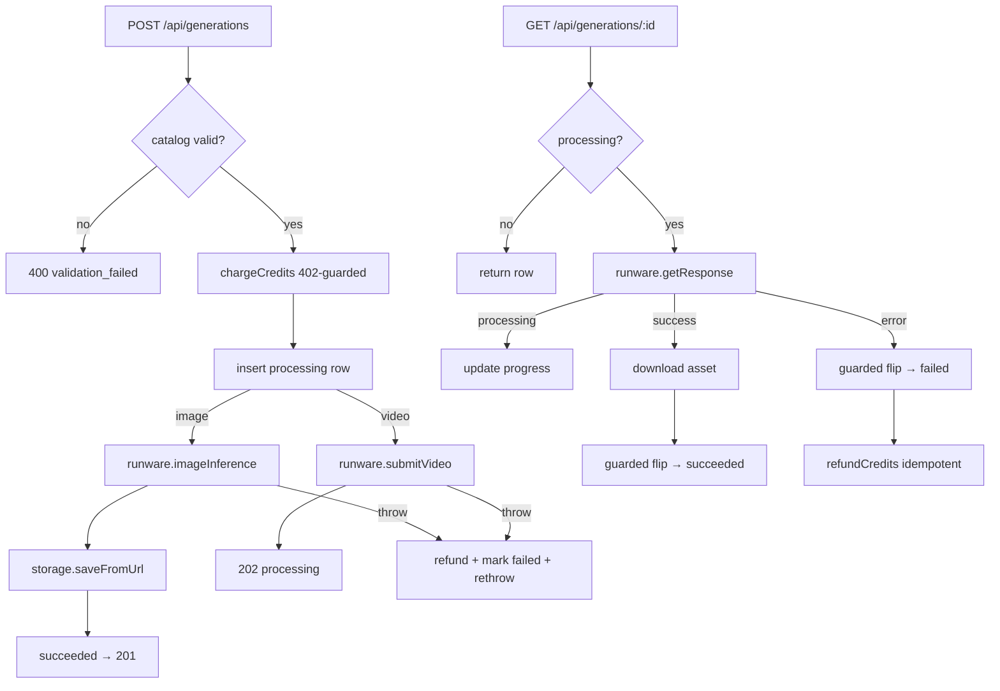

# service.ts — AI component doc

> AI-facing sidecar for `modules/generations/service.ts`. Created 2026-07-06. Keep this in sync with the code on every change.

## Purpose
The generation lifecycle service (plan Task 10) — the core money-touching sequence of the product: charge credits at submit, call Runware, persist state transitions, download finished assets into our own storage, refund exactly once on failure. Everything else (routes, SPA) is a thin shell around this file.

## What it does (for an AI reader)
- Responsibilities: catalog-level validation (model/aspect/duration/i2v support), credit charge before any provider call, generation row persistence, sync image flow (inference → asset download → succeeded), async video flow (submit → 202; `get()` doubles as the Runware poll applying processing/succeeded/failed transitions), refund on every failure path, cursor pagination, owner-scoped reads/deletes.
- Public API / exports / props / endpoints:
  - `createGenerationService({ db, runware, storage })` → `{ create, get, list, remove }` (`GenerationService` type).
  - `create(userId, input)` → `{ dto: Generation, created: boolean }` — `created: true` = image finished synchronously (route → 201); `false` = video accepted (route → 202). Throws `ValidationError` (400), `InsufficientCreditsError` (402, from ledger), `RunwareError` (502).
  - `get(userId, id)` → `Generation`; while the row is processing it polls `runware.getResponse` and applies the transition (no background workers in MVP — the SPA's 4s polling drives progress).
  - `list(userId, limit, cursor?)` → `{ items, nextCursor }` — newest-first; cursor is the createdAt epoch-ms of the last returned row; fetches `limit + 1` to detect the next page without COUNT.
  - `remove(userId, id)` — deletes the media file (idempotent) then the row; 404 if not owned.
  - Errors: `NotFoundError` (404/not_found), `ValidationError` (400/validation_failed) — statusCode+apiCode consumed by the app.ts central error handler.
- Inputs → Outputs: `CreateGenerationInput` (contracts) → `Generation` DTO (contracts). DB rows mapped by `toDto` (JSON columns parsed, dates → ISO strings).
- Side effects (I/O, network, state): DB writes (generation rows + ledger rows inside ledger transactions), outbound Runware calls, asset downloads into `StorageProvider`, media file deletions.

## Dependencies
- Imports / depends on: `@opencreate/contracts` (input/DTO types), `db/schema` (`generation`), `credits/ledger` (`chargeCredits`/`refundCredits`), `catalog/catalog` (`getModel`/`creditsFor`/`resolutionFor`), `integrations/runware/client` (type), `storage/local` (type), drizzle operators, `node:crypto`.
- Used by: `modules/generations/routes.ts` (wired in `app.ts`, Task 11); tested by `test/generations.test.ts` with the scripted `fakeRunware`.

## Diagram

## Key decisions / gotchas
- Charge happens BEFORE any provider call: a 402 means Runware was never contacted (asserted in tests).
- Every failure path after the charge refunds; `refundCredits` is idempotent (once-per-generation guard lives in the ledger), so concurrent polls cannot double-refund.
- Poll success downloads the asset BEFORE flipping status: a failed download leaves the row processing so the next poll retries — a succeeded row always has media.
- Transitions out of `processing` re-read the fresh status inside a transaction because two tabs can poll the same generation concurrently.
- All reads/deletes are `(id, userId)`-scoped: another account gets 404, never data.
- `creditsFor`'s plain Errors (missing/unsupported duration) are re-thrown as `ValidationError` — caller mistakes must be 400, not 500.
- `duration!` non-null assertion in the video branch is safe: `creditsFor` already threw if duration was undefined for a video model.

## Commits
- _no commit yet_
