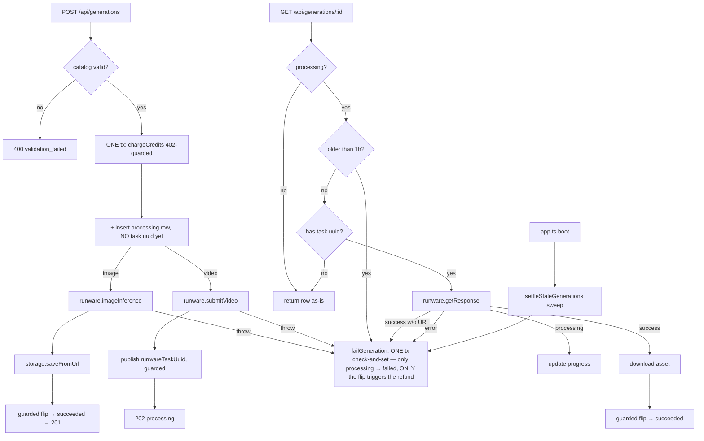

# service.ts — AI component doc

> AI-facing sidecar for `modules/generations/service.ts`. Created 2026-07-06. Keep this in sync with the code on every change.

## Purpose
The generation lifecycle service (plan Task 10) — the core money-touching sequence of the product: charge credits at submit, call Runware, persist state transitions, download finished assets into our own storage, refund exactly once on failure. Everything else (routes, SPA) is a thin shell around this file.

## What it does (for an AI reader)
- Responsibilities: catalog-level validation (model/aspect/duration/i2v support), credit charge before any provider call, generation row persistence, sync image flow (inference → asset download → succeeded), async video flow (submit → 202; `get()` doubles as the Runware poll applying processing/succeeded/failed transitions), refund on every failure path, cursor pagination, owner-scoped reads/deletes, structured money-path logging (`generation.settle` / `generation.fail` / `provider.error` + ledger events via the passed logger).
- Public API / exports / props / endpoints:
  - `createGenerationService({ db, runware, storage, log?, pollMinIntervalMs? })` → `{ create, get, list, remove }` (`GenerationService` type). `log` is the base app logger — fallback for money events when no request logger is passed. `pollMinIntervalMs` (default `DEFAULT_POLL_MIN_INTERVAL_MS` = 3000) throttles per-generation Runware polling; tests inject 0 to disable.
  - `create(userId, input, reqLog?)` → `{ dto: Generation, created: boolean }` — `created: true` = image finished synchronously (route → 201); `false` = video accepted (route → 202). Throws `ValidationError` (400), `InsufficientCreditsError` (402, from ledger), `RunwareError` (502). `reqLog` (routes pass `req.log`) stamps every money-path line of this call with the reqId.
  - `get(userId, id, reqLog?)` → `Generation`; while the row is processing it polls `runware.getResponse` and applies the transition (no background workers in MVP — the SPA's 4s polling drives progress). Rows without a `runwareTaskUuid` are never polled (submit still in flight); rows older than `STALE_PROCESSING_MS` (1h) are settled as failed + refunded instead of polling; polls inside `pollMinIntervalMs` of the last real poll are answered from the DB state without a provider call (throttle).
  - `settleStaleGenerations(db, now?, log?)` → number of settled rows — boot-time sweep called by `app.ts`; fails + refunds processing rows older than `STALE_PROCESSING_MS` so poll-abandoned generations (expired 7-day asset URLs, crashes mid-create) never hold credits forever.
  - `STALE_PROCESSING_MS` — exported staleness threshold (1 hour); `DEFAULT_POLL_MIN_INTERVAL_MS` — exported poll-throttle default (3s).
  - `list(userId, limit, cursor?)` → `{ items, nextCursor }` — newest-first by `(createdAt, id)` DESC; cursor is the compound `<createdAtMs>_<id>` of the last returned row (bare `<createdAtMs>` legacy cursors still accepted with old timestamp-only semantics); fetches `limit + 1` to detect the next page without COUNT.
  - `remove(userId, id)` — refuses processing rows with `ConflictError` (409/conflict — deleting mid-flight would forfeit the refund and orphan the Runware task), otherwise deletes the media file (idempotent) then the row; 404 if not owned.
  - Errors: `NotFoundError` (404/not_found), `ValidationError` (400/validation_failed), `ConflictError` (409/conflict — delete of a processing generation), `ContentBlockedError` (422/content_blocked — NSFW safety filter) — statusCode+apiCode consumed by the app.ts central error handler.
- Inputs → Outputs: `CreateGenerationInput` (contracts) → `Generation` DTO (contracts). DB rows mapped by `toDto` (JSON columns parsed, dates → ISO strings).
- Side effects (I/O, network, state): DB writes (generation rows + ledger rows inside ledger transactions), outbound Runware calls, asset downloads into `StorageProvider`, media file deletions, structured log lines on money-path transitions (settle/fail/provider error — success-guarded so racing pollers never emit duplicates; provider detail goes to logs ONLY, clients get the sanitized envelope).

## Dependencies
- Imports / depends on: `@opencreate/contracts` (input/DTO types), `db/schema` (`generation`), `credits/ledger` (`chargeCredits`/`refundCredits`/`logCharge`/`logRefund`/`MoneyLog`), `catalog/catalog` (`getModel`/`creditsFor`/`resolutionFor`), `integrations/runware/client` (type), `storage/local` (type), drizzle operators, `node:crypto`.
- Used by: `modules/generations/routes.ts` (wired in `app.ts`, Task 11); tested by `test/generations.test.ts`, `test/generations-races.test.ts` (scripted `fakeRunware`), `test/generations-money-atomicity.test.ts` (charge+insert / fail+refund atomicity), `test/generations-delete.test.ts` (409 on processing), `test/generations-pagination.test.ts` (same-ms tiebreaker), `test/generations-poll-throttle.test.ts` (throttle + 3s default) and `test/logging.test.ts` (money-path log lines).

## Diagram

## Key decisions / gotchas
- Charge happens BEFORE any provider call: a 402 means Runware was never contacted (asserted in tests).
- **Atomic charge+insert (review finding)**: the credit charge and the processing-row insert run in ONE `db.transaction` (`chargeCredits` in tx mode) — as two transactions, a crash between them charged the user for a row that never existed (nothing to settle or refund). The `credits.charge` audit line is emitted only after the combined commit (`logCharge`). Pinned by `test/generations-money-atomicity.test.ts`.
- **Atomic failure settlement (review finding)**: `failGeneration` runs the processing→failed flip AND the idempotent refund in ONE transaction (`refundCredits` in tx mode). The old flip-then-refund pair could crash in between, leaving a failed row whose charge was kept forever (the stale sweep only rescues 'processing' rows). Now a refund failure aborts the flip too — the row stays processing and the next poll/sweep re-runs the settlement. Fail/refund logs are emitted after the commit, gated on the flip/mutation actually applying.
- **Refund-after-success race (review finding)**: the check-and-set inside `failGeneration`'s transaction guards the WHOLE settlement, refund included — only the processing → failed flip triggers `refundCredits`. Previously the refund ran unconditionally while only the flip was guarded, so a row a concurrent settler had already flipped to 'succeeded' stayed succeeded but was refunded anyway (user keeps asset + money). A non-processing row is now left completely untouched. Pinned by `test/generations-money-atomicity.test.ts` ("raced to succeeded").
- **Atomic video submit settlement (review finding)**: `create()`'s video catch block reuses `failGeneration` instead of running `refundCredits` and an unguarded failed-flip as two separate transactions (refund-then-flip order could commit the refund while the row stayed processing). Pinned by `test/generations-money-atomicity.test.ts` (sabotaged-flip + happy-failure cases).
- **Anti-double-spend (create/poll race)**: the processing row is inserted WITHOUT `runwareTaskUuid`; the uuid is published only after the provider call is acknowledged (video) — and images never need it. `get()` refuses to poll a row with a null uuid. This closes the window where a concurrent GET /:id polled Runware for a task it didn't know yet, misread the error as terminal, refunded, and create() then flipped the row to succeeded anyway (charge + refund = 0, asset delivered). Pinned by `test/generations-races.test.ts`.
- The image success transition is a status-guarded transaction (only processing → succeeded); if the row was settled elsewhere, the downloaded asset is discarded instead of delivered.
- Every failure path after the charge refunds; `refundCredits` is idempotent (once-per-generation guard lives in the ledger), so concurrent polls cannot double-refund.
- Poll success downloads the asset BEFORE flipping status: a failed download leaves the row processing so the next poll retries — a succeeded row always has media. Poll success WITHOUT a URL is unrecoverable (same payload forever) → `failGeneration` + refund.
- **Stuck-processing settlement**: `failGeneration` centralizes the guarded fail + idempotent refund; the get()-level reaper and the `settleStaleGenerations` boot sweep guarantee hold→settle/refund even when downloads fail permanently or the owner never polls again. Pinned by `test/generations-stale.test.ts`.
- **NSFW safety gate (spec §2/§9.4)**: `NSFWContent === true` on the image result or the video poll is checked BEFORE any storage download — flagged assets are never stored or served. Both paths settle failed + refund with `errorCode: 'content_blocked'` (persisted in the `error_code` column, surfaced in the DTO) so the SPA renders localized safety copy; the image path additionally returns the 422 `content_blocked` envelope via `ContentBlockedError`.
- Transitions out of `processing` re-read the fresh status inside a transaction because two tabs can poll the same generation concurrently.
- All reads/deletes are `(id, userId)`-scoped: another account gets 404, never data.
- **No delete while processing (review finding)**: `remove()` throws `ConflictError` (409) for processing rows. Deleting mid-flight would erase the row every failure-settlement path needs to flip+refund against (the user would silently forfeit the refund) and orphan the in-flight Runware task. Terminal rows delete normally. Pinned by `test/generations-delete.test.ts`.
- **Poll throttle (review finding)**: per-generation in-memory `lastPolledAt` Map — a real `getResponse` call stamps the id BEFORE the await (so N concurrent GETs cost exactly one provider call), and polls inside `pollMinIntervalMs` (default 3s < the SPA's 4s cadence, so a single well-behaved client never notices) return the DB state untouched. Entries are dropped at every terminal transition get() observes; single-process MVP, so restart loss only costs one extra poll. Pinned by `test/generations-poll-throttle.test.ts`.
- **Same-ms pagination (review finding)**: the old createdAt-only cursor with strict `<` skipped rows sharing the boundary millisecond. `list()` now orders by `(createdAt, id)` DESC and the compound cursor resumes with `createdAt < ts OR (createdAt = ts AND id < cursorId)`. Pinned by `test/generations-pagination.test.ts`.
- `creditsFor`'s plain Errors (missing/unsupported duration) are re-thrown as `ValidationError` — caller mistakes must be 400, not 500.
- `duration!` non-null assertion in the video branch is safe: `creditsFor` already threw if duration was undefined for a video model.
- **Money-path logging contract**: `credits.charge`/`credits.refund` are logged by the ledger (after commit), `generation.settle`/`generation.fail` here, gated on the guarded transition actually applying — log line exists ⇔ the state moved. `provider.error` carries the raw provider error (`err`/`detail`) because the HTTP envelope for unexpected failures is sanitized; logs are the only place with the real cause.

## Key decisions (2026-07-08)
- Video submit forwards `omitSafety: true` when the catalog model has `supportsSafetyParam === false` (ByteDance/Seedance reject Runware's `safety` param with 400 unsupportedParameter). Moderation for these models still applies via the NSFWContent flag on poll results, which this service already enforces (content_blocked + refund).

## Key decisions (2026-07-09) — VideoProvider seam / wan-runpod routing
- The VIDEO path now calls a `VideoProvider` from a `videoProviders` registry instead of `runware.*` directly. Provider is resolved from the catalog model's `provider` at submit (`providerId`, default `runware`) and from the row's persisted `provider` at poll (durable — a job always polls the backend it submitted to). The IMAGE path still calls `runware.imageInference` directly and is UNCHANGED.
- `videoProviders` is optional: when absent the service derives `{ runware: createRunwareVideoAdapter(runware) }`, so the existing direct-service unit tests (`{ db, runware, storage }`) keep exercising `submitVideo`/`getResponse` through the adapter unchanged. `buildApp` injects the full registry (runware + wan-runpod).
- Neutral field rename only — `poll.assetUrl` / `poll.costUsd` / `poll.nsfw` replace `videoURL/imageURL` / `cost` / `NSFWContent`. Provider job id + cost REUSE the `runwareTaskUuid` / `runwareCostUsd` columns. Every money-path guard (charge+insert atomic, submit-window null-id guard, guarded fail+refund, stale reaper, poll throttle) is byte-for-byte unchanged.
- wan-runpod reports `nsfw:false` (no self-host moderation) → the §9.4 gate never fires for it; documented gap.

## Commits
- 681e20f feat(api): generation lifecycle — charge, runware, store, poll, refund
- 138ab61 fix(api): close create/poll race — rows are not pollable until the provider call completes
- 5d16801 fix(api): settle stuck processing generations — no-asset polls fail with refund, stale rows reaped on poll and boot
- 3b96d8c fix(api,web,contracts): respect the NSFW flag — content_blocked failure with refund, never store flagged assets, localized safety copy
- 5e8de3d feat(api): native env loading + structured logging — settle/fail/provider.error events, req.log threading
- 1cdb3a8 fix(api): atomic charge+insert and failure settlement — one tx for charge+row insert, one tx in failGeneration for flip+refund
- 2859858 fix(api): forbid deleting processing generations — ConflictError 409 in remove()
- a7e4cd9 fix(api): ssrf allowlist, cursor tiebreaker, poll throttle — compound (createdAt,id) cursor, per-generation lastPolledAt throttle (DEFAULT_POLL_MIN_INTERVAL_MS)
- ecb7c7f fix(api): guard refund against succeeded race + atomic video submit failure — failGeneration check-and-set covers the refund too; video submit catch reuses it

## Key decisions (2026-07-09) — CinemaStudio (audio + presets)
- `Deps.audioProvider?: AudioProvider` added (fallback derived from `runware` via `createRunwareAudioAdapter`, mirroring the video registry fallback). Audio SUBMITS through it; it POLLS through the video registry (audio row is `provider: 'runware'`; the runware video adapter maps `audioURL` → `assetUrl`), so every money-path invariant is reused unchanged.
- `create()` now: (1) validates aspectRatio only for image/video (audio has none; audio skips `resolutionFor`); (2) composes the model-facing prompt via `applyPromptPreset(entityComposedPrompt, input.promptPreset)` — with no preset this returns the entity-composed prompt unchanged, so preset-less requests are byte-for-byte identical; (3) stores `composed_prompt` (only when a preset was used) + `prompt_preset_json`; (4) has a unified async branch: `model.type === 'audio'` submits via the audio provider, else the video registry — the publish/catch/settlement after submit is shared.
- Video submit now sends `modelPrompt` (was `input.prompt`) + the style preset `negativePrompt` (both omitted-when-empty). Image sends `modelPrompt` + `negativePrompt`. `negativePrompt` is wired through `VideoSubmitInput` → video-adapter → `RunwareVideoRequest`/`RunwareImageRequest`.
- `assetExt(type)` helper: video→mp4, audio→mp3, image→webp. Used by the download (get), and remove(); the image discard-on-race stays literal 'webp'.
- `toDto` now returns `composedPrompt` (null → client reads `prompt`) and `promptPreset` (parsed from `promptPresetJson`).

## Key decisions (2026-07-12) — Studio3D (`model3d` on the existing lifecycle)
`model3d` was routed through this service by adding **branches, not money code**. Zero lines of
`chargeCredits`, `failGeneration`, any `db.transaction`, the poll throttle, or the stale reaper were
touched. That is the whole design: a mesh is a fourth media type, not a fourth subsystem.

- **`Deps.meshProvider?: Mesh3dProvider`** — resolved as `meshProvider ?? createRunwareMeshAdapter(runware)`,
  exactly mirroring the audio fallback, so a caller injecting only `{ db, runware, storage }` (every
  direct-service unit test) still gets a working 3D path. A single adapter, **not a registry** like
  `videoProviders`: `'runware'` is the only 3D backend built; `'comfy-3d'` is a designed-but-unbuilt
  self-host seam (ADR D2 — hosted TRELLIS.2 beats running our own GPU).
- **`assetExt` gains `model3d → 'glb'`.** Load-bearing, not cosmetic: a mesh written under the default
  `.webp` is a file no GLB loader (three.js, `<model-viewer>`, iOS Quick Look) can open — a succeeded,
  paid-for, unopenable generation. One function owns the mapping so `get()`'s download, the
  discard-on-race cleanup and `remove()` cannot disagree.
- **Two PRE-charge guards in `create()`** (both before `chargeCredits` — a job we know will fail must
  cost the user nothing):
  1. the aspect-ratio gate now skips `model3d` as well as `audio` — a mesh has no 2D aspect ratio (the
     catalog's `'1:1'` is a throwaway `catalogBase` requires and the service never reads), and
     `resolutionFor` is likewise skipped (0,0 placeholders, never sent);
  2. `model.type === 'model3d' && !input.inputImage` → `ValidationError`. **v1 is image→3D only.**
     Text→3D exists on the provider (Tripo) but the composer UX does not, and a photo-less 3D row would
     submit a `3dInference` task with an empty `inputs.images` and fail AFTER the charge.
- **The async submit branch gains a `model3d` arm** next to audio's, submitting through `mesh.submit`
  with the `taskUUID` `create()` already minted (Runware requires the CALLER to mint the task id; it
  doubles as the idempotency key for the client's bounded retry). The arm exists precisely so a 3D job
  can never fall through to the video arm: a `videoInference` task can never produce a mesh, so the user
  would be charged for a job that can only fail. Everything AFTER the submit — the status-guarded job-id
  publish, the submit-window race guard, the shared poll path, the guarded fail+refund — is byte-for-byte
  unchanged and shared with video/audio.
- **The poll in `get()` resolves the registry from the ROW's media type**, never the live catalog:
  `row.type === 'model3d' ? mesh.poll(...) : resolveProvider(row.provider).poll(...)`. Durable state —
  a catalog edit must never redirect an in-flight job's poll. `MeshPollResult` is a type ALIAS of
  `VideoPollResult`, so every settlement branch below it (NSFW gate, no-asset guard,
  download-before-flip, guarded refund) is byte-for-byte the pre-Studio3D logic.
- **NSFW gap (inherited, documented):** `3dInference` exposes no moderation signal, so the mesh adapter
  reports `nsfw: false` and the §9.4 gate never fires for 3D — exactly as it does not for self-hosted
  wan-runpod.
- Pinned by `test/generations-3d.test.ts`: 202-not-201 + charged once, `.glb` on disk, refund on provider
  error, refund on success-with-no-asset, 400-before-charge without a photo, and **never submitted to the
  video provider**.
