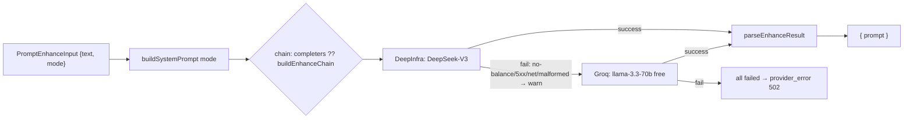

# prompt/enhance.ts — AI component doc

> AI-facing sidecar for `prompt/enhance.ts`. Created 2026-07-21. Keep this in sync with the code on every change.

## Purpose
Rewrites a user's rough, messy shot idea into ONE vivid, concrete ENGLISH cinematic prompt for the Wan
text-to-video model, via an ORDERED CHAIN of OpenAI-compatible LLM providers. FREE (charges no credits)
and stateless. Two modes: `enhance` (default) and `soften` (also rewrites away content a safety filter
would block — the "Смягчить и повторить" retry after a `content_blocked` generation).

## What it does (for an AI reader)
- Responsibilities: build the mode's system prompt, try each configured provider in order, parse+validate
  the JSON completion, return `{ prompt }`. Fall through to the next provider on ANY failure. No credits,
  no db, no film scoping.
- Public API / exports:
  - `createPromptEnhanceService({ deepinfraToken, groqApiKey, completers?, log? })` → `{ enhance(input) → Promise<{ prompt }> }`.
  - `buildEnhanceChain(deepinfraToken, groqApiKey, fetchImpl?)` → ordered `Completer[]` (DeepInfra→Groq, only the configured ones).
  - `createDeepinfraCompleter(token, fetchImpl?)` / `createGroqCompleter(apiKey, fetchImpl?)` → a `Completer`.
  - `buildSystemPrompt(mode)`, `parseEnhanceResult(raw)`, `PromptEnhanceUnavailableError` (502 provider_error).
  - `Completer` type = `{ id: string; complete: (system, user) => Promise<string> }`.
- Inputs → Outputs: `PromptEnhanceInput { text(1..2000), mode }` → `PromptEnhanceResult { prompt }`.
- Side effects: one OpenAI-compatible chat HTTP call PER ATTEMPTED provider (network) in the default path;
  none when `completers` is injected. Emits a `warn` log per provider failure (`event: prompt.provider_failed`).

## Dependencies
- Imports / depends on: `@opencreate/contracts` (`promptEnhanceResultSchema`, input/result types),
  `fastify` (`FastifyBaseLogger` type only, for the minimal `EnhanceLog` shape).
- Used by: `prompt/routes.ts` (registers `POST /api/prompt/enhance`), wired in `app.ts` with
  `config.deepinfraToken` + `config.groqApiKey` + `app.log`. Tests inject `completers` / a mocked `fetch`.

## Diagram

## Key decisions / gotchas
- ORDERED FAILOVER CHAIN (why it exists): DeepInfra is primary (paid/better when funded) but runs dry
  ("You need positive balance to do inference"); a single-provider enhancer is then simply down. Groq is the
  free fallback with the SAME system prompt, modes, and `[[eN]]` rule, so output is behaviorally identical —
  only the provider differs. First configured+succeeding provider wins; ALL fail → provider_error; none
  configured (empty chain) → provider_error.
- Fallthrough triggers on ANY provider failure INCLUDING a malformed answer — so `parseEnhanceResult` runs
  INSIDE the per-provider try, and a garbage answer from DeepInfra still gets a real answer from Groq.
- SANITIZATION: `callOpenAiChat` never reads a provider's response body into its thrown Error — only the HTTP
  status or a neutral category ('HTTP 402' / 'network error' / 'empty response'). So a no-balance body cannot
  leak, in the failover LOG or the (fixed) client `provider_error` envelope.
- FREE by construction: the service takes only `{ deepinfraToken, groqApiKey, completers?, log? }` — no db,
  no ledger, no generation service — so it structurally cannot charge (an HTTP test pins balance-unchanged).
- The `[[eN]]` verbatim-copy rule lives in the BASE system prompt, so cast tokens survive in BOTH modes AND
  through the fallback path; the user's text (with its tokens) is handed to every provider unchanged.
- Test seams: `completers` (a ready ordered chain — fakes or real adapters over a mocked fetch — replaces the
  token-derived chain) and each adapter's `fetchImpl` param. Production sets neither.
- Models: DeepInfra `deepseek-ai/DeepSeek-V3-0324` (NOT R1); Groq `llama-3.3-70b-versatile`. Both temp 0.4,
  max_tokens 700, `Bearer` auth, 30s timeout.

## Commits
- _no commit yet_
