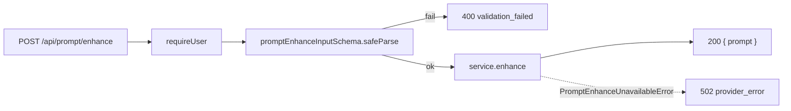

# prompt/routes.ts — AI component doc

> AI-facing sidecar for `prompt/routes.ts`. Created 2026-07-21. Keep this in sync with the code on every change.

## Purpose
HTTP layer for the prompt enhancer: registers `POST /api/prompt/enhance`, a session-guarded, FREE,
stateless text transform (rough idea → one cinematic Wan prompt). Thin — parse at the boundary, delegate
to the service, let the service's typed error map itself.

## What it does (for an AI reader)
- Responsibilities: require a session (`app.requireUser`), validate the body with `promptEnhanceInputSchema`
  (400 on failure), call `service.enhance`, return `{ prompt }`. Apply a strict per-route rate limit.
- Public API / exports / endpoints: `registerPromptRoutes(app, service)`; endpoint
  `POST /api/prompt/enhance` — body `{ text: string(1..2000), mode?: 'enhance' | 'soften' }` → `{ prompt: string }`.
- Inputs → Outputs: request body → `{ prompt }` (200); 400 validation_failed, 401 unauthorized,
  429 rate_limited, 502 provider_error.
- Side effects: none directly (delegates the one network call to the service). No credit ledger touch.

## Dependencies
- Imports / depends on: `fastify` types, `@opencreate/contracts` (`promptEnhanceInputSchema`),
  `./enhance` (`PromptEnhanceService`).
- Used by: `app.ts` — `registerPromptRoutes(app, promptEnhanceService)`.

## Diagram

## Key decisions / gotchas
- No `guard()`/`mapDomainError`: the only domain error, `PromptEnhanceUnavailableError`, already carries
  `statusCode` + `apiCode`, so app.ts's central handler emits the standard envelope. Adding a local mapper
  would be dead code.
- Session-guarded but NOT film/ownership scoped — it is a pure text transform, so there is no object to
  authorize; `requireUser` is the whole auth story.
- Dedicated `ENHANCE_RATE_LIMIT` (20/min): a FREE endpoint that still spends LLM tokens must not ride the
  generous 300/min global; 20/min allows prompt iteration + a few "soften & retry" clicks while capping abuse.
- Route is ALWAYS registered (like storyboard): when `DEEPINFRA_TOKEN` is unset the endpoint exists and
  answers 502 provider_error rather than 404, so boot stays healthy and the SPA gets one consistent message.

## Commits
- _no commit yet_
