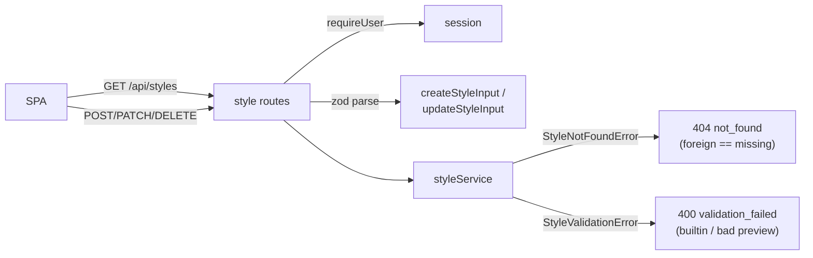

# routes.ts (styles) — AI component doc

> AI-facing sidecar for `modules/styles/routes.ts`. Created 2026-07-31. Keep this in sync with the code on every change.

## Purpose
HTTP layer for the style registry (ADR `docs/wiki/decisions/style-studio.md` D4). Thin by design,
mirroring `canvas/routes.ts`: require a session, parse with the shared contracts schema, delegate to
the service, map the two domain errors onto the `ApiError` envelope.

## What it does (for an AI reader)
- Responsibilities: authentication gate, wire validation, error→status mapping. No business rules —
  ownership, the builtin refusal and the preview citation all live in the service.
- Endpoints (all require a session; all answer 401 without one):
  - `GET /api/styles` → `{ items: Style[] }` — builtin + the caller's own, one list. **This is what
    every style picker renders from**, replacing the SPA's static `STYLE_PRESETS` import.
  - `POST /api/styles` → `201 Style`
  - `PATCH /api/styles/:id` → `200 Style`
  - `DELETE /api/styles/:id` → `204`
- Inputs → Outputs: `createStyleInputSchema` / `updateStyleInputSchema` bodies → `Style` DTOs.
  Invalid body → `400 validation_failed` with the first zod issue's message.
- Side effects: none of its own; delegates to the service.

## Dependencies
- Imports / depends on: `@opencreate/contracts` (input schemas), `./service`, fastify.
- Used by: `app.ts` (`registerStyleRoutes`).

## Diagram

## Key decisions / gotchas
- **No rate bucket beyond the global one.** This is free text CRUD writing a handful of short
  columns and spending nothing. The one expensive thing a style leads to — its preview — is an
  ordinary `POST /api/generations`, which carries the money path's own limits and charges.
- **404 vs 400 is meaningful here**: `StyleNotFoundError` → 404 with a fixed message so a foreign id
  and a missing one are indistinguishable; `StyleValidationError` → 400 and carries its message,
  because those refusals (a builtin, a bad preview citation) describe an action the caller may fix.
- `GET /api/styles` is the ONLY read: there is no `GET /api/styles/:id`, because the list is small,
  bounded by one user's rows plus seven, and every consumer wants the whole thing.

## Commits
- _no commit yet_
