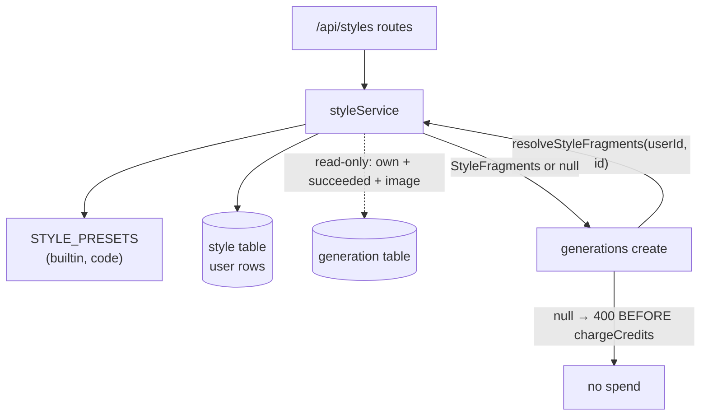

# service.ts (styles) — AI component doc

> AI-facing sidecar for `modules/styles/service.ts`. Created 2026-07-31. Keep this in sync with the code on every change.

## Purpose
The **style registry** (ADR `docs/wiki/decisions/style-studio.md` D1) — the service that answers
"what does `styleId` X mean, for THIS caller?" from two sources: the seven builtin styles that ship
as code (`STYLE_PRESETS`), and the caller's own rows in the `style` table. Also the owner-scoped CRUD
behind `/api/styles`.

## What it does (for an AI reader)
- Responsibilities: list builtin + own styles; create/update/delete a user's own style; resolve a
  style id to prompt fragments for the generation service; resolve a cited preview generation to a
  media URL.
- Public API / exports:
  - `createStyleService({ db }) → StyleService`
  - `listStyles(userId) → Style[]` (builtins first, then own, oldest first)
  - `createStyle(userId, CreateStyleInput) → Style`
  - `updateStyle(userId, styleId, UpdateStyleInput) → Style`
  - `deleteStyle(userId, styleId) → void`
  - `resolveStyleFragments(userId, styleId) → StyleFragments | null`
  - Errors: `StyleNotFoundError` (→404), `StyleValidationError` (→400)
- Inputs → Outputs: wire inputs validated by the contracts schemas in `routes.ts` → `Style` DTOs; a
  style id + caller id → `{ fragment, negative }` or `null`.
- Side effects: reads/writes the `style` table; READS the `generation` table (never writes it).
  No network, no filesystem, **no credit ledger**.

## Dependencies
- Imports / depends on: `@opencreate/contracts` (`resolveBuiltinStyle`, `STYLE_PRESETS`, types),
  `db/schema` (`style`, `generation`), `db/client` (`Db`), drizzle, `node:crypto`.
- Used by: `modules/styles/routes.ts`; `app.ts` (constructs it before the generation service);
  the generation service via the injected `resolveStyle` function.

## Diagram

## Key decisions / gotchas
- **It takes NO generation service, on purpose.** The dependency runs styles → generations (create()
  resolves a style on every styled request), so depending back would close a cycle. What this module
  needs from a generation is four facts and no behaviour, so it reads the row directly — the same
  acyclicity choice, for the same reason, that `entities/service.ts` documents on `copyGeneratedAsset`.
- **Zero money code.** A style is text. The only spend near it is the PREVIEW, which is an ordinary
  `POST /api/generations` the SPA makes; this service only records which generation a style cites.
- **Foreign == missing (404), but builtin == 400.** A foreign row and a nonexistent one must be
  indistinguishable or status codes become a probe for which ids exist. A BUILTIN is the opposite
  case: it demonstrably exists (it ships in the SPA bundle and this service lists it), so answering
  404 would be a lie — the objection is to the ACTION, not the id. `refuseBuiltin` therefore runs
  BEFORE `requireStyle`, or a builtin would 404 (it has no row) and hide the real reason.
- **`resolvePreviewUrl` is used in two modes and that is the design.** WRITING a citation refuses
  null (a citation that resolves to nothing is a preview that will never render); READING one treats
  null as simply "no preview", so a generation deleted from the gallery leaves the list working with
  an empty slot instead of throwing. Ownership is re-checked on every READ rather than trusted from
  write time.
- **One refusal message for all four preview failure modes** (foreign / missing / unfinished /
  not-an-image), the `copyGeneratedAsset` precedent — the difference between "not yours" and "not
  there" must not leak.
- **Builtins are immutable for everyone, including their author.** Their ids are cited by templates,
  films and shots saved months ago; a mutable builtin would silently re-render all of them.
- **Deleting a style does not touch films/shots that used it** (ADR D4). The stored `styleId` stays
  and the next generation resolves to nothing and fails honestly — a delete must not silently edit
  the user's films.
- **`resolveStyleFragments` checks builtin FIRST**, so a user row could never shadow a builtin id
  even if it somehow carried one. Its `null` deliberately does not distinguish unknown from foreign
  from deleted: all three are the same 400 at the caller.
- `kind` is fixed to `'prompt'` here and absent from the wire input, so it has exactly one decision
  point until a second kind exists.

## Commits
- _no commit yet_
