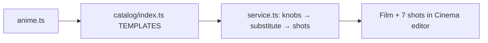

# anime.ts — AI component doc

> AI-facing sidecar for `catalog/anime.ts`. Created 2026-07-18. Keep this in sync with the code on every change.

## Purpose

«Аниме» — a battle-episode cold open in TV-anime grammar, third FORMAT
template (owner request 2026-07-18). Six 8s beats — город на рассвете → проход
героя → явление врага → пробуждение силы (sakuga money-shot) → битва → тишина
после битвы — closed by the canonical free «Продолжение следует» card.

## What it does (for an AI reader)

- Exports `anime: Template` (id `'anime'`, category `'format'`, 16:9,
  defaultStyleId `'anime'` — cel shading base; prompts add the tropes: speed
  lines, impact frames, sakuga, sakura, god rays).
- Knobs: `hero` (школьник с катаной / девушка-маг / киборг-ронин) in every
  character beat; `power` (огонь/молния/лёд) colors the two spectacle beats
  (power-up + clash).
- Tiers: draft `pixverse-v6` · standard `wan-2-7` (r2v references keep the
  SAME hero across episodes — the point of a series) · premium `veo-3-1-fast`.
  8s @ 16:9 everywhere (templates.test.ts invariant).
- musicPrompt: j-rock anime opening (taiko, electric guitar, chorus swell).
- Voices: Dmitry (герой), Nikolai (рассказчик и голос врага).

## Dependencies

- Imports: `../types` (`Template`).
- Used by: `catalog/index.ts` (registry → /api/templates → web gallery →
  create-film-from-template flow in service.ts).

## Diagram

## Commits

- _no commit yet_
