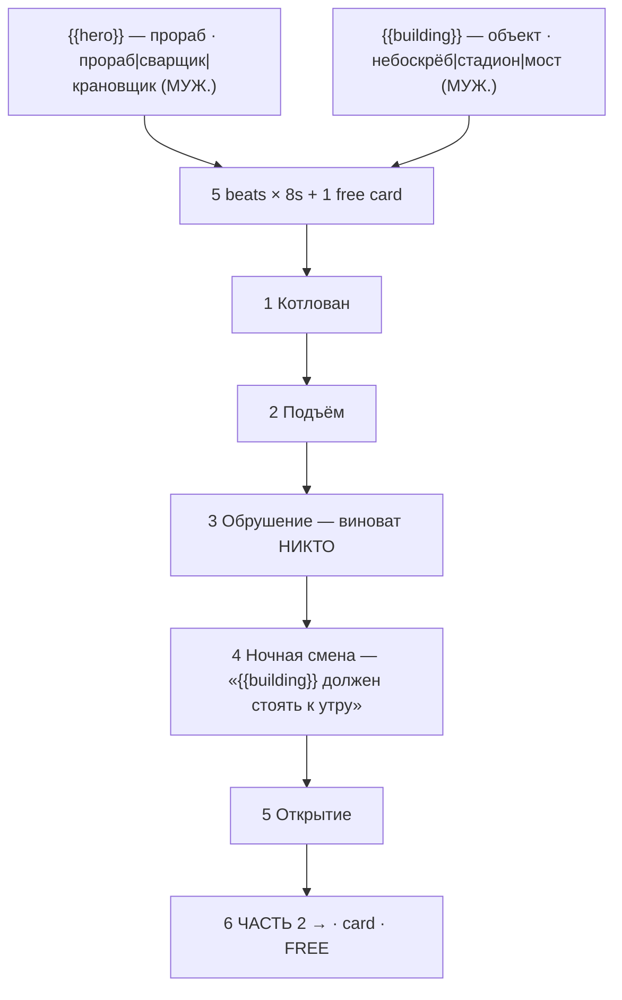

# brick-build.ts — AI component doc

> AI-facing sidecar for `brick-build.ts`. Created 2026-07-30. Keep this in sync with the code on every change.

## Purpose

«Стройка века» — the construction story of the «Брик-мульты» shelf, and the most honest one on
it: the medium's actual subject is building, so this is the one story where what the audience
watches (parts going together, a structure rising, a structure coming apart) IS the plot.
Catalog DATA: six beats (five generated 8s clips + one free title card), two knobs.
ADR: `docs/wiki/decisions/template-catalog.md`.

## What it does (for an AI reader)

- Responsibilities: hold the prompts, presets, titles, voice lines, tier models and knob
  definitions of one template. No behaviour — `service.ts` reads it.
- Public API / exports: `brickBuild: Template` (`id: 'brick-build'`, category `brick`, 9:16,
  `defaultStyleId: 'cinematic'`).
- Inputs → Outputs: `{{hero}}` / `{{building}}` values → five substituted English prompts,
  five Russian voice lines, and the film title («Стройка века: небоскрёб»).
- Side effects (I/O, network, state): none — a module-level constant.

## Dependencies

- Imports / depends on: `../types` (`Template`).
- Used by: `catalog/index.ts` (registered in `TEMPLATES`, fifth of the brick shelf).

## Diagram

## Key decisions / gotchas

- **THE BRAND NAME APPEARS NOWHERE** — enforced by a test. See `brick-heist.ts.md` for the
  two reasons (trademark; Veo moderation breaking the premium tier only, silently).
- **The three prompt instructions the look depends on** — stepped stop-motion with no motion
  blur, a rigid printed face that never acts, tilt-shift macro for scale. Stated in full in
  `brick-heist.ts.md`; they apply here unchanged.
- **THE DISASTER IS CAUSED BY NOBODY, and that is the point.** No villain, no sabotage, no
  twist: a sling slips and eight tonnes of plastic comes apart in mid-air. That is what
  separates this story from `brick-race`, where a rival engineers the crash. Here the
  antagonist is the job, and the heroism is only that somebody stayed all night. Adding a
  saboteur would turn it into a worse copy of `brick-race`.
- **Grammar**: `hero` and `building` options are all MASCULINE NOMINATIVE, which is what makes
  beat 4's «{{building}} должен стоять к утру» agree for every combination. A feminine
  building («Башня», «Арена») silently breaks «должен»; a neuter one («Здание») breaks it
  differently.
- **9:16**: a tower is the one subject a vertical frame renders better than a wide one — the
  whole story is looking UP at something that is not finished yet.
- Price: 280 / 675 / 700 credits (draft / standard / premium), 42s total.

## Commits

- `c64523e` feat(templates): brick toons 5-8 + the shelf's invariants
