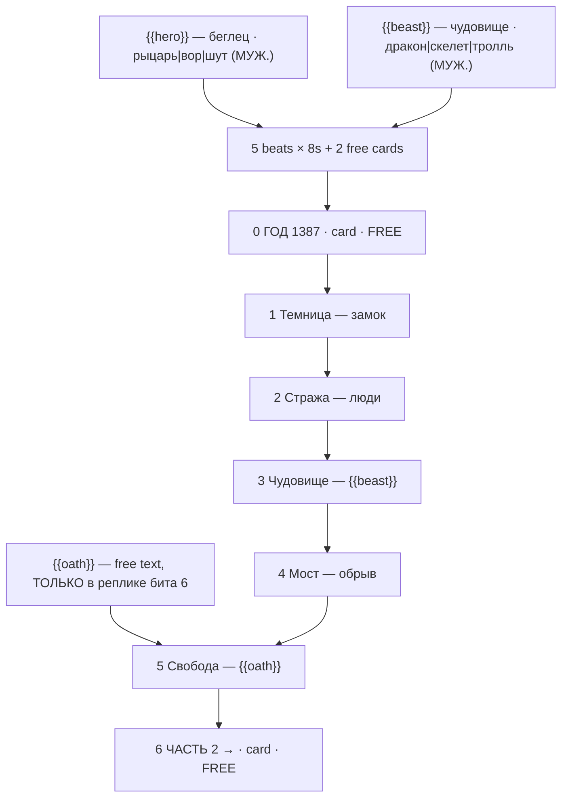

# brick-castle.ts — AI component doc

> AI-facing sidecar for `brick-castle.ts`. Created 2026-07-30. Keep this in sync with the code on every change.

## Purpose

«Побег из замка» — the medieval escape story of the «Брик-мульты» shelf, and its one fantasy
story. Catalog DATA: seven beats (five generated 8s clips + **two** free title cards — it is
the first of two templates on the shelf that OPEN on a card), three knobs.
ADR: `docs/wiki/decisions/template-catalog.md`.

## What it does (for an AI reader)

- Responsibilities: hold the prompts, presets, titles, voice lines, tier models and knob
  definitions of one template. No behaviour — `service.ts` reads it.
- Public API / exports: `brickCastle: Template` (`id: 'brick-castle'`, category `brick`,
  9:16, `defaultStyleId: 'cinematic'`).
- Inputs → Outputs: `{{hero}}` / `{{beast}}` / `{{oath}}` values → five substituted English
  prompts, five Russian voice lines, and the film title («рыцарь без доспехов против
  дракона»).
- Side effects (I/O, network, state): none — a module-level constant.

## Dependencies

- Imports / depends on: `../types` (`Template`).
- Used by: `catalog/index.ts` (registered in `TEMPLATES`, fourth of the brick shelf).

## Diagram

## Key decisions / gotchas

- **THE BRAND NAME APPEARS NOWHERE** — enforced by a test. See `brick-heist.ts.md` for the
  two reasons (trademark; Veo moderation breaking the premium tier only, silently).
- **The three prompt instructions the look depends on** — stepped stop-motion with no motion
  blur, a rigid printed face that never acts, tilt-shift macro for scale. Stated in full in
  `brick-heist.ts.md`; they apply here unchanged.
- **EACH OBSTACLE IS A DIFFERENT KIND OF OBSTACLE, and the order is not interchangeable:** a
  lock (patience) → men (stealth) → a monster (courage) → a drop (nerve). An escape story
  that repeats a kind of obstacle feels twice as long and half as tense.
- **Why fantasy suits the medium cheaply**: a monster that would cost a fortune in any other
  technique is, here, a thing you build out of the parts you already own.
- **It OPENS on a free card** — the only story on the shelf besides `brick-pirates` that
  does. A period piece needs one line of place-and-date before the first image or the viewer
  spends beat 1 working out where they are; a title card carries no generation, so the whole
  medieval register costs zero credits and two seconds.
- **Grammar**: `hero` and `beast` options are all MASCULINE NOMINATIVE, so the film title
  «{{hero}} против {{beast}}» and beat 3's «Он не пройдёт мимо. {{beast}} чует страх.» agree
  for all nine combinations. A feminine beast («Ведьма», «Змея») silently breaks «чует» in
  the reading the line is written for.
- **The free-text knob lands ONLY in a spoken line** (beat 5) — never in a visual prompt, per
  the rule in `types.ts`. What a man shouts when he gets out is the line a user most wants to
  write themselves.
- **9:16**: dungeons, arrow slits, a spiral stair, a rope down a wall — this story is composed
  of tall spaces, so the vertical frame is an asset rather than a constraint.
- Price: 280 / 675 / 700 credits (draft / standard / premium), 44s total.
- **Disclosure tier `none`, not loopable** (ADR shorts-studio §12/§10, fields added
  2026-08-20). Plastic minifigures are stylised AND fantastical, so no label is required;
  the argument for the whole shelf lives in `brick-heist.ts.md`. The story resolves, so
  there is nothing to loop back to.

## Commits

- `de1e970` feat(templates): brick toons 1-4 — heist, space, race, castle
