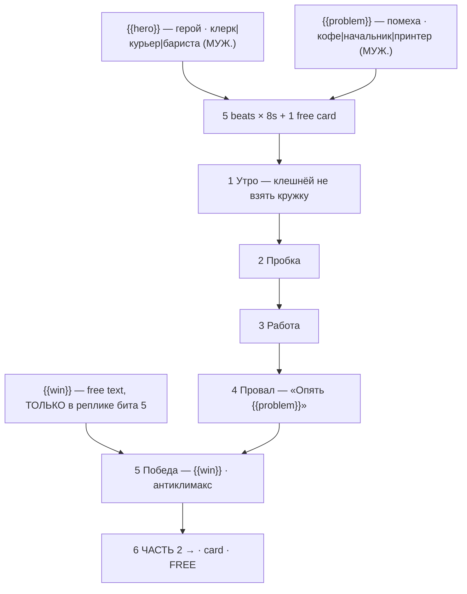

# brick-city.ts — AI component doc

> AI-facing sidecar for `brick-city.ts`. Created 2026-07-30. Keep this in sync with the code on every change.

## Purpose

«День минифигурки» — the everyday comedy that closes the «Брик-мульты» shelf, and the only
story on it that treats the minifigure's body as a body with REAL LIMITATIONS instead of a
character in costume. Catalog DATA: six beats (five generated 8s clips + one free title card),
three knobs. ADR: `docs/wiki/decisions/template-catalog.md`.

## What it does (for an AI reader)

- Responsibilities: hold the prompts, presets, titles, voice lines, tier models and knob
  definitions of one template. No behaviour — `service.ts` reads it.
- Public API / exports: `brickCity: Template` (`id: 'brick-city'`, category `brick`, 9:16,
  `defaultStyleId: 'cinematic'`).
- Inputs → Outputs: `{{hero}}` / `{{problem}}` / `{{win}}` values → five substituted English
  prompts, five Russian voice lines, and the film title («День минифигурки: клерк»).
- Side effects (I/O, network, state): none — a module-level constant.

## Dependencies

- Imports / depends on: `../types` (`Template`).
- Used by: `catalog/index.ts` (registered in `TEMPLATES`, eighth and last of the brick shelf).

## Diagram

## Key decisions / gotchas

- **THE BRAND NAME APPEARS NOWHERE** — enforced by a test. See `brick-heist.ts.md` for the
  two reasons (trademark; Veo moderation breaking the premium tier only, silently).
- **The three prompt instructions the look depends on** — stepped stop-motion with no motion
  blur, a rigid printed face that never acts, tilt-shift macro for scale. Stated in full in
  `brick-heist.ts.md`; they apply here unchanged. In THIS template instruction 2 is not a
  constraint to work around — it is the punchline.
- **THE TOY'S LIMITATIONS ARE THE JOKES.** This is the oldest running gag in the medium and
  the one thing only this medium can be funny about:
  - the hands are C-shaped claws that cannot hold a mug, a pen or a phone (beat 1);
  - the arms rotate at the shoulder and nowhere else, so nothing reaches the face (beat 3);
  - the legs bend only at the hip, so the figure cannot sit properly or climb stairs;
  - the face is printed, so the expression is IDENTICAL through every humiliation of the day —
    the unchanging half-smile through five disasters is funnier than any animated reaction
    could be (beat 4 depends entirely on it).
- **The beats are deliberately small.** A story about a bad Tuesday only works if nothing in it
  is dramatic. Do not "improve" a beat by raising its stakes.
- **The ending is a DELIBERATE ANTICLIMAX** — he wins nothing except one part clicking into
  place. The shelf's other seven stories end on gold, freedom, a finish line or a burning ship;
  this one ends on a person feeling slightly better, which is the note the shelf needs to close
  on. It is also why this template is last in `TEMPLATES`.
- **Grammar**: `hero` and `problem` options are all MASCULINE NOMINATIVE so beat 4's «Опять
  {{problem}}. Ну конечно. Именно сегодня.» reads correctly for every combination — a feminine
  problem («Пробка», «Почта») turns the line into something a Russian speaker would not say.
- **The free-text knob lands ONLY in the last spoken line** — never in a visual prompt, per the
  rule in `types.ts`. The small win is the whole point of the story, so it is the thing to let
  the user own.
- **9:16**: a kitchen, a lift, a desk, a bus queue. The everyday is vertical, and this is the
  story on the shelf most likely to be posted rather than watched.
- Price: 280 / 675 / 700 credits (draft / standard / premium), 42s total.
- **Disclosure tier `none`, not loopable** (ADR shorts-studio §12/§10, fields added
  2026-08-20). Plastic minifigures are stylised AND fantastical, so no label is required;
  the argument for the whole shelf lives in `brick-heist.ts.md`. The story resolves, so
  there is nothing to loop back to.

## Commits

- `c64523e` feat(templates): brick toons 5-8 + the shelf's invariants
