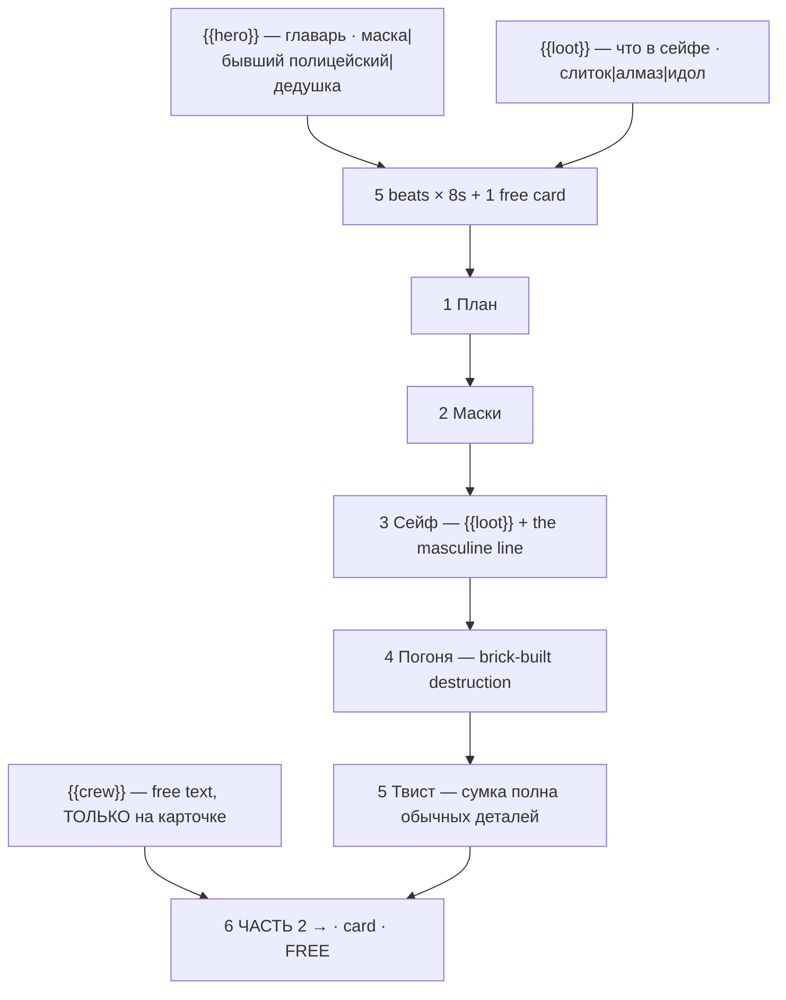

# brick-heist.ts — AI component doc

> AI-facing sidecar for `brick-heist.ts`. Created 2026-07-30. Keep this in sync with the code on every change.

## Purpose

«Ограбление кирпичного банка» — the heist story of the «Брик-мульты» shelf, and the
template that establishes the shelf's whole visual grammar (its header is the one the
other seven point back to). Catalog DATA, not logic: six beats (five generated 8s clips +
one free title card) of stop-motion brickfilm, with three knobs.
ADR: `docs/wiki/decisions/template-catalog.md`.

## What it does (for an AI reader)

- Responsibilities: hold the prompts, presets, titles, voice lines, tier models and knob
  definitions of one template. No behaviour — `service.ts` reads it.
- Public API / exports: `brickHeist: Template` (`id: 'brick-heist'`, category `brick`,
  9:16, `defaultStyleId: 'cinematic'`).
- Inputs → Outputs: `{{hero}}` / `{{loot}}` / `{{crew}}` values → five substituted English
  prompts, five Russian voice lines, the film title («Ограбление века: золотой слиток»),
  and the closing card.
- Side effects (I/O, network, state): none — a module-level constant.

## Dependencies

- Imports / depends on: `../types` (`Template`).
- Used by: `catalog/index.ts` (registered in `TEMPLATES`, first of the brick shelf).

## Diagram

## Key decisions / gotchas

- **THE BRAND NAME APPEARS NOWHERE, and a test enforces it** (`templates.test.ts`, "names
  no trademark the providers moderate on"). Two independent reasons: it is someone else's
  registered mark, and Veo's moderation rejects it — which would break the *premium tier
  only*, silently, while draft and standard rendered fine. Vocabulary instead: "plastic
  construction bricks", "minifigure", "brickfilm", "visible brick studs".
- **THE THREE PROMPT INSTRUCTIONS THE LOOK DEPENDS ON** (this file's header is the
  canonical statement of them; the other seven brick templates reference it):
  1. *stepped stop-motion, no motion blur* — a video model trained on live action
     interpolates smoothly, which makes brick characters move like a CGI render and kills
     the illusion outright. Same fight the `hand-drawn` style documents in `presets.ts`.
  2. *rigid unmoving printed face* — left alone the model animates a rubbery cartoon face
     and the toy stops being a toy. Emotion is carried by BODY and CAMERA.
  3. *tilt-shift macro, visible studs, mould seams, dust, fingerprints* — this is what says
     "somebody photographed this on a table" rather than "somebody rendered this".
- **`styleId: 'cinematic'` and NOT `'3d-cartoon'`** — a brickfilm is photographed physical
  plastic, so the photoreal style is correct, and its negative prompt ("cartoon, anime,
  illustration") actively pushes away failure mode 2 above. Same reasoning `fruit-drama`
  uses for hyperreal macro fruit.
- **Grammar is load-bearing**: every `hero` and `loot` option is MASCULINE NOMINATIVE, which
  is what lets beat 3's «Вот он. {{loot}}. Двадцать лет я о нём мечтал.» decline correctly
  for all nine combinations. A feminine loot («корона», «монета») silently breaks «он» and
  «о нём». See `fruit-drama.ts.md` on why the templates carry this convention instead of a
  grammar engine.
- **The twist is structural, not decoration.** A heist that simply succeeds has no ending;
  and "the sack was full of ordinary grey bricks" is a punchline only this medium can tell.
- **The free-text knob lands ONLY on the closing card.** A gang name is exactly what a user
  wants to own and exactly what does not belong in a paid prompt (the rule from `types.ts`,
  asserted for every template).
- 9:16 because the beats are close-ups of hands, a face and a safe dial. Price: 280 / 675 /
  700 credits (draft / standard / premium), 42s total.
- **Disclosure tier `none` for the whole brick shelf, none of it loopable** (ADR
  shorts-studio §12/§10, fields added 2026-08-20). A world of plastic minifigures is
  stylised AND fantastical, which is the definition of the no-label tier — this file
  carries the argument and the other seven point back to it, the same way they do for
  the three prompt instructions above. A brick card is a story with an ending, so
  `loopable: false` throughout.

## Commits

- `de1e970` feat(templates): brick toons 1-4 — heist, space, race, castle
