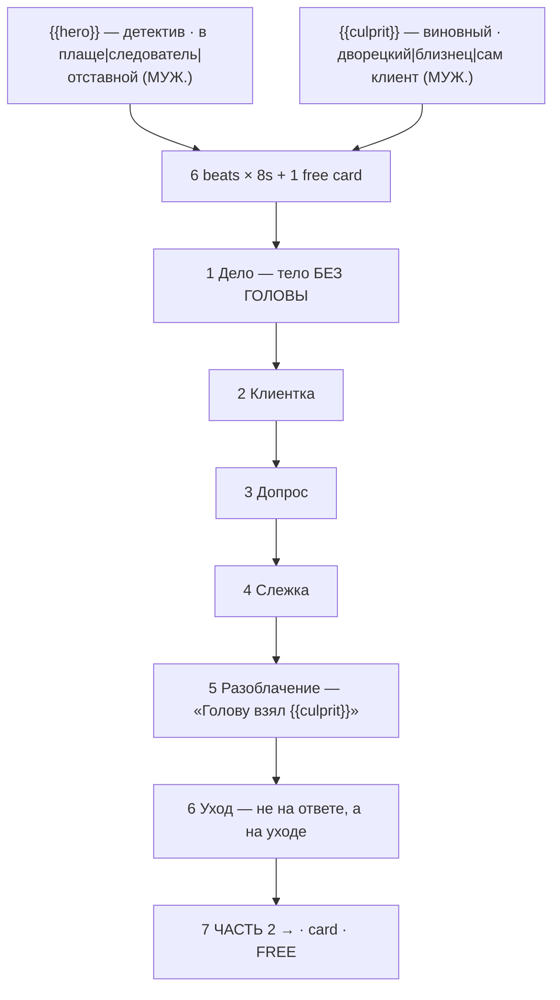

# brick-noir.ts — AI component doc

> AI-facing sidecar for `brick-noir.ts`. Created 2026-07-30. Keep this in sync with the code on every change.

## Purpose

«Кирпичный детектив» — the noir story of the «Брик-мульты» shelf, and the best genre fit on
the whole shelf: noir is the one genre where every limitation of a minifigure is an asset.
Catalog DATA: seven beats (six generated 8s clips + one free title card), two knobs.
ADR: `docs/wiki/decisions/template-catalog.md`.

## What it does (for an AI reader)

- Responsibilities: hold the prompts, presets, titles, voice lines, tier models and knob
  definitions of one template. No behaviour — `service.ts` reads it.
- Public API / exports: `brickNoir: Template` (`id: 'brick-noir'`, category `brick`, 9:16,
  `defaultStyleId: 'cinematic'`).
- Inputs → Outputs: `{{hero}}` / `{{culprit}}` values → six substituted English prompts, six
  Russian voice lines, and the film title («детектив в плаще и пропавшая голова»).
- Side effects (I/O, network, state): none — a module-level constant.

## Dependencies

- Imports / depends on: `../types` (`Template`).
- Used by: `catalog/index.ts` (registered in `TEMPLATES`, sixth of the brick shelf).

## Diagram

## Key decisions / gotchas

- **THE BRAND NAME APPEARS NOWHERE** — enforced by a test. See `brick-heist.ts.md` for the
  two reasons (trademark; Veo moderation breaking the premium tier only, silently).
- **The three prompt instructions the look depends on** — stepped stop-motion with no motion
  blur, a rigid printed face that never acts, tilt-shift macro for scale. Stated in full in
  `brick-heist.ts.md`; they apply here unchanged.
- **WHY NOIR IS THE BEST FIT ON THE SHELF — three reasons, all structural:**
  1. the medium cannot act with its face, and noir is the one genre where a motionless,
     unreadable face is CORRECT. Every limitation listed in `brick-heist.ts.md` stops being a
     limitation here;
  2. noir is *lit*, not staged — venetian-blind stripes, a desk lamp, rain on a window, a
     figure in a doorway are all achievable on a table with one lamp and a comb, which is how
     brickfilmers have always shot it;
  3. the genre runs on voice-over, and this shelf ships a Russian line on every paid beat —
     on the premium tier the model speaks them itself.
- **THE PREMISE IS MEDIUM-NATIVE and could not be told any other way.** A minifigure's head is
  a detachable part, so a missing head is simultaneously a murder mystery, a body-horror image
  and a completely innocent thing that happens to every one of these toys in a real toy box.
  That triple reading is the joke, and it is why this template exists instead of a generic
  "stolen jewels" case.
- **The reveal is beat 5 of 6, not last, on purpose.** Noir does not end on the answer, it ends
  on the detective leaving. Beat 6 is the genre; cutting it would make this a puzzle instead
  of a noir.
- **Grammar**: `hero` and `culprit` options are all MASCULINE NOMINATIVE, so beat 5's «Голову
  взял {{culprit}}. И он всё ещё в этой комнате.» agrees for every combination — «взял» and
  «он» both depend on it. A feminine culprit («Сестра», «Секретарша») silently breaks the line.
- **9:16**: an office, a doorway, a bar stool, a fire escape — vertical, all of it. The one
  story on the shelf where the phone frame is a stylistic asset rather than a compromise.
- Price: 336 / 810 / 840 credits (draft / standard / premium), 50s total.
- **Disclosure tier `none`, not loopable** (ADR shorts-studio §12/§10, fields added
  2026-08-20). Plastic minifigures are stylised AND fantastical, so no label is required;
  the argument for the whole shelf lives in `brick-heist.ts.md`. The story resolves, so
  there is nothing to loop back to.

## Commits

- `c64523e` feat(templates): brick toons 5-8 + the shelf's invariants
