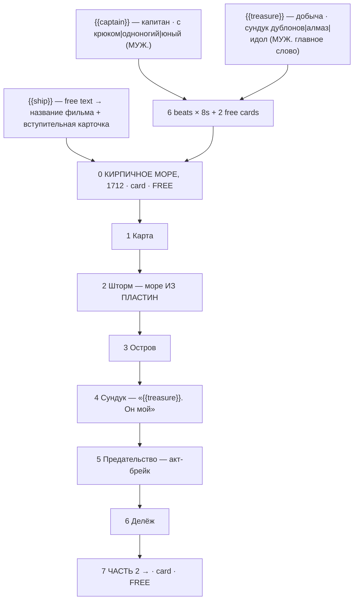

# brick-pirates.ts — AI component doc

> AI-facing sidecar for `brick-pirates.ts`. Created 2026-07-30. Keep this in sync with the code on every change.

## Purpose

«Пираты кирпичного моря» — the treasure story of the «Брик-мульты» shelf and the longest one
on it (eight beats), because it is the only one with a genuine act break before the goal is
even in sight. Catalog DATA: six generated 8s clips + **two** free title cards, three knobs.
ADR: `docs/wiki/decisions/template-catalog.md`.

## What it does (for an AI reader)

- Responsibilities: hold the prompts, presets, titles, voice lines, tier models and knob
  definitions of one template. No behaviour — `service.ts` reads it.
- Public API / exports: `brickPirates: Template` (`id: 'brick-pirates'`, category `brick`,
  **16:9**, `defaultStyleId: 'cinematic'`).
- Inputs → Outputs: `{{captain}}` / `{{treasure}}` / `{{ship}}` values → six substituted
  English prompts, six Russian voice lines, both cards, and the film title («Пираты кирпичного
  моря: «ЧЁРНЫЙ КИРПИЧ»»).
- Side effects (I/O, network, state): none — a module-level constant.

## Dependencies

- Imports / depends on: `../types` (`Template`).
- Used by: `catalog/index.ts` (registered in `TEMPLATES`, seventh of the brick shelf).

## Diagram

## Key decisions / gotchas

- **THE BRAND NAME APPEARS NOWHERE** — enforced by a test. See `brick-heist.ts.md` for the
  two reasons (trademark; Veo moderation breaking the premium tier only, silently).
- **The three prompt instructions the look depends on** — stepped stop-motion with no motion
  blur, a rigid printed face that never acts, tilt-shift macro for scale. Stated in full in
  `brick-heist.ts.md`; they apply here unchanged.
- **YOU CANNOT ANIMATE WATER — the single most important instruction in this file.**
  Brickfilmers build the sea out of blue and transparent plates and TILT them between frames,
  so a storm is a floor that rocks; spray is pulled cotton wool. Prompting "stormy sea" gets
  photoreal fluid simulation and the table-top illusion dies instantly, so every marine beat
  here specifies waves BUILT FROM PLATES. If a later edit loosens one of those phrases, that
  beat will silently stop looking like a brickfilm.
- **The betrayal is the act break, not a twist.** A treasure story that ends when the chest
  opens has no second half, because the question the genre actually asks is not "is there
  gold" but "what does the gold do to them".
- **Eight beats — the longest on the shelf — is earned by the storm**, which is an obstacle
  before the goal is even visible. The other stories cannot support that length.
- **Two free cards**: an opening card for place/year/ship name (same reasoning as
  `brick-castle`) and the closing serial card.
- **Grammar**: `captain` and `treasure` options are all MASCULINE NOMINATIVE — and for
  `treasure` that means the HEAD noun is masculine («сундук дублонов», not «шкатулка») —
  because beat 4's line is «{{treasure}}. Он мой. Я двадцать лет шёл за ним.» A feminine
  treasure («Корона», «Шкатулка») silently breaks «он», «мой» and «за ним» in one line.
- **16:9**: a ship, a horizon, a beach. Nothing in this story is vertical.
- Price: 336 / 810 / 840 credits (draft / standard / premium), 52s total.
- **Disclosure tier `none`, not loopable** (ADR shorts-studio §12/§10, fields added
  2026-08-20). Plastic minifigures are stylised AND fantastical, so no label is required;
  the argument for the whole shelf lives in `brick-heist.ts.md`. The story resolves, so
  there is nothing to loop back to.

## Commits

- `c64523e` feat(templates): brick toons 5-8 + the shelf's invariants
