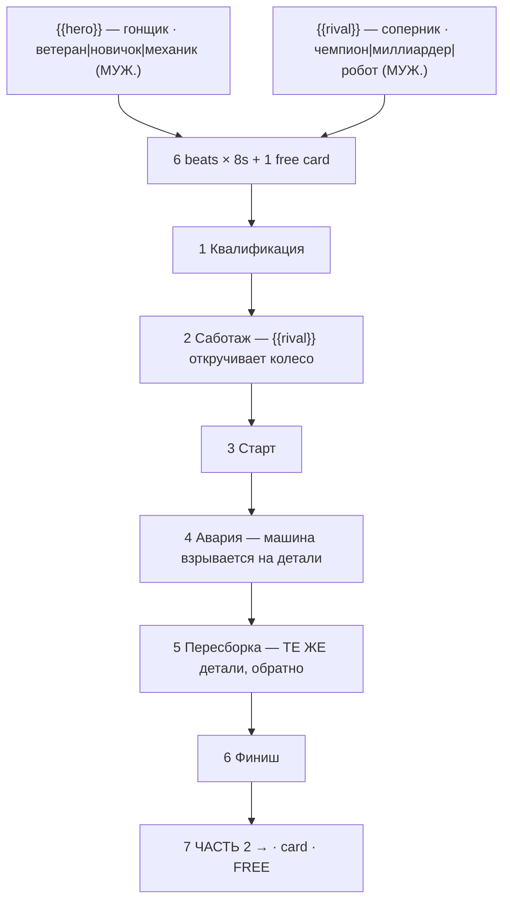

# brick-race.ts — AI component doc

> AI-facing sidecar for `brick-race.ts`. Created 2026-07-30. Keep this in sync with the code on every change.

## Purpose

«Большая гонка» — the motorsport story of the «Брик-мульты» shelf, and the only story on it
that uses the medium's one native special effect twice: a model bursting into loose bricks
as catastrophe (beat 4) and as salvation (beat 5). Catalog DATA: seven beats (six generated
8s clips + one free title card), two knobs.
ADR: `docs/wiki/decisions/template-catalog.md`.

## What it does (for an AI reader)

- Responsibilities: hold the prompts, presets, titles, voice lines, tier models and knob
  definitions of one template. No behaviour — `service.ts` reads it.
- Public API / exports: `brickRace: Template` (`id: 'brick-race'`, category `brick`,
  **16:9**, `defaultStyleId: 'cinematic'`).
- Inputs → Outputs: `{{hero}}` / `{{rival}}` values → six substituted English prompts, six
  Russian voice lines, and the film title («ветеран трассы против чемпиона»).
- Side effects (I/O, network, state): none — a module-level constant.

## Dependencies

- Imports / depends on: `../types` (`Template`).
- Used by: `catalog/index.ts` (registered in `TEMPLATES`, third of the brick shelf).

## Diagram

## Key decisions / gotchas

- **THE BRAND NAME APPEARS NOWHERE** — enforced by a test. See `brick-heist.ts.md` for the
  two reasons (trademark; Veo moderation breaking the premium tier only, silently).
- **The three prompt instructions the look depends on** — stepped stop-motion with no motion
  blur, a rigid printed face that never acts, tilt-shift macro for scale. Stated in full in
  `brick-heist.ts.md`; they apply here unchanged.
- **THE REBUILD GAG is why a race belongs on this shelf at all.** The medium has exactly one
  native special effect — a model bursting into its component bricks — and a race is the only
  story shape that can use it twice, as catastrophe and then as salvation (the pit crew
  snapping the car back together out of the same loose parts). It is the most satisfying thing
  this medium does, and no other story on the shelf gets to do it.
- **The sabotage is load-bearing, not decoration.** A crash the hero causes himself makes him
  incompetent; a crash somebody engineered makes the comeback a moral event. Compare
  `brick-build`, where the disaster is deliberately caused by *nobody* — that story's
  antagonist is the job, so it needs no rival.
- **Grammar**: `hero` and `rival` options are all MASCULINE NOMINATIVE, so beat 2's
  «{{rival}} не любит проигрывать» and the film title «{{hero}} против {{rival}}» agree for
  all nine combinations. A feminine option («Гонщица», «Команда») breaks the subject
  agreement the line is written for.
- **16:9**: a race is horizontal motion. A vertical frame can hold a driver's face but not
  two cars side by side, and two cars side by side is the sport.
- Price: 336 / 810 / 840 credits (draft / standard / premium), 50s total.
- **Disclosure tier `none`, not loopable** (ADR shorts-studio §12/§10, fields added
  2026-08-20). Plastic minifigures are stylised AND fantastical, so no label is required;
  the argument for the whole shelf lives in `brick-heist.ts.md`. The story resolves, so
  there is nothing to loop back to.

## Commits

- `de1e970` feat(templates): brick toons 1-4 — heist, space, race, castle
