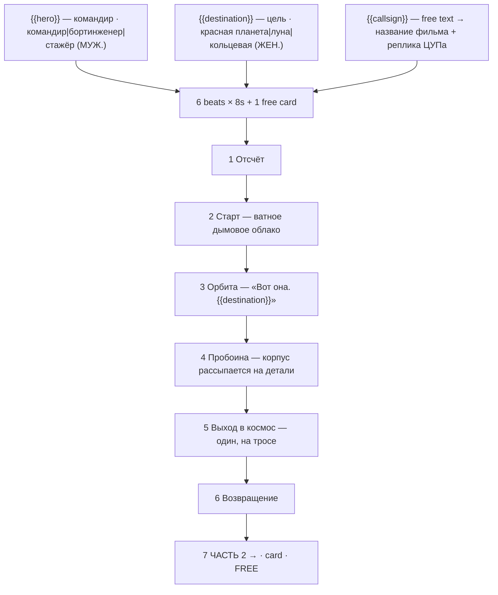

# brick-space.ts — AI component doc

> AI-facing sidecar for `brick-space.ts`. Created 2026-07-30. Keep this in sync with the code on every change.

## Purpose

«Космическая миссия» — the space-rescue story of the «Брик-мульты» shelf, and the shelf's
one genuine spectacle (everything else on it is people in rooms). Catalog DATA: seven beats
(six generated 8s clips + one free title card), three knobs.
ADR: `docs/wiki/decisions/template-catalog.md`.

## What it does (for an AI reader)

- Responsibilities: hold the prompts, presets, titles, voice lines, tier models and knob
  definitions of one template. No behaviour — `service.ts` reads it.
- Public API / exports: `brickSpace: Template` (`id: 'brick-space'`, category `brick`,
  **16:9**, `defaultStyleId: 'cinematic'`).
- Inputs → Outputs: `{{hero}}` / `{{destination}}` / `{{callsign}}` values → six substituted
  English prompts, six Russian voice lines, and the film title («Миссия «КИРПИЧ-1»»).
- Side effects (I/O, network, state): none — a module-level constant.

## Dependencies

- Imports / depends on: `../types` (`Template`).
- Used by: `catalog/index.ts` (registered in `TEMPLATES`, second of the brick shelf).

## Diagram

## Key decisions / gotchas

- **THE BRAND NAME APPEARS NOWHERE** — enforced by a test. See `brick-heist.ts.md` for the
  two reasons (trademark; Veo moderation breaking the premium tier only, silently).
- **The three prompt instructions the look depends on** — stepped stop-motion with no motion
  blur, a rigid printed face that never acts, tilt-shift macro for scale. Stated in full in
  `brick-heist.ts.md`; they apply here unchanged.
- **COTTON WOOL, NOT SMOKE — the one practical effect this file turns on.** Brickfilmers
  have used pulled-apart cotton wool for exhaust, smoke and explosions since the Super 8
  days, because it holds still between frames and real smoke does not. Prompting "smoke"
  makes a video model render volumetric fluid simulation, which breaks the table-top
  illusion on the first frame. Every smoke/steam/dust beat on this shelf says "cotton wool".
- **Why space is the second story**: it is the oldest subject in the medium — the first known
  brickfilm (the Hassing brothers, Denmark, 1973) was a moon voyage.
- **The disaster has to happen where nobody can help.** The Apollo-13 arc shape: the repair
  beat only means something because the character is alone outside the ship. Moving the
  breach to the launch pad would cost the story its centre.
- **Grammar, and it is the mirror of the other brick templates**: `hero` options are all
  MASCULINE nominative (beat 5: «{{hero}} вышел один») and `destination` options are all
  FEMININE nominative (beat 3: «Вот она. {{destination}}. Мы первые, кто её увидел.»).
  Adding a masculine destination («Марс», «Астероид») silently breaks «она»/«её»; a feminine
  hero breaks «вышел».
- **16:9, unlike the shelf's dramas**: a launch tower, a planet through a window and a figure
  on a tether against black are landscape compositions. All three tier models do 8s at 16:9
  as well as 9:16, so the choice costs nothing — `assertTemplatesValid()` checks it at boot.
- Price: 336 / 810 / 840 credits (draft / standard / premium), 50s total.

## Commits

- `de1e970` feat(templates): brick toons 1-4 — heist, space, race, castle
