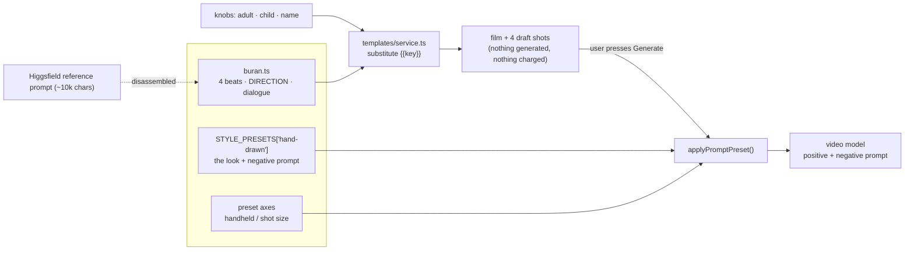

# buran.ts — AI component doc

> AI-facing sidecar for `buran.ts`. Created 2026-07-12. Keep this in sync with the code on every change.

## Purpose
«Буран» — the first template on the `animation` shelf: a hand-drawn animated short (one scene,
four hard cuts, 4 × 8s, 16:9) in which an adult carries an infant up a snow slope through a
blizzard while a toddler stumbles behind. It is the packaged form of a single ~10 000-character
Higgsfield reference prompt, disassembled so the system can actually reproduce the look on demand.

## What it does (for an AI reader)
- **Responsibilities:** declares one `Template` — four `TemplateClip` beats with finished prompts,
  presets, durations; three `select` knobs; a model per price tier. Carries no logic.
- **Public API / exports:** `buran: Template`. Registered in `catalog/index.ts` (listed FIRST, so
  the Animation shelf leads the gallery).
- **Inputs → Outputs:** knob values (`adult`, `child`, `name`) → `service.ts` substitutes `{{key}}`
  → a film + 4 draft shots in CinemaStudio. Generates nothing and charges nothing on instantiation.
- **Side effects:** none.

## Where the reference prompt went (the one thing to understand)
A 10k-char blob is not a template — and `shot.prompt` is hard-capped at 2000 chars
(`contracts/film.ts`, asserted in `templates.test.ts`). It was split three ways:

| Layer | Lives in | Why there |
|---|---|---|
| **The look** — on twos, oil-brush, line boil, no interpolation | `STYLE_PRESETS['hand-drawn']` (contracts/presets.ts) | Reusable on ANY CinemaStudio shot, not just this story. Carries the negative prompt that pushes away 3D/CGI/smooth motion. |
| **The camera** — handheld, shot size | preset axes (`cameraShot`, `cameraMotion: 'handheld'`) | Structured, so the picker shows it and the user can change it. |
| **The direction** — storm, acting, blocking, dialogue | the four shot prompts here | Per-shot. Shared clauses hoisted into the `DIRECTION` / `VOICE` consts. |

`DIRECTION` (~620 chars) is pasted into all four prompts because each shot is generated as an
**independent request that shares no context with its neighbours** — the storm and the acting rules
must be restated every time or the model quietly calms the blizzard down.

## Key decisions / gotchas
- **Dialogue lives in the prompt, not in `shot.voiceover`.** Unlike every other template. Two
  reasons: (1) the TTS catalog has no Kazakh voice — only RU/EN (`Svetlana, Elena, Dmitry, Nikolai,
  Ashley, Alex`), and a Russian-accented Kazakh reading is exactly what the reference forbids;
  (2) the lips form the syllables **on twos, on camera** — that is a video instruction, so only the
  model that draws the mouth can speak it. Consequence: `hasVoiceover` is **false**, and only the
  premium tier (Veo, native audio) voices the lines. Draft/standard render the same performance
  silent — stated on the card via `tierNotes`.
- **No `musicPrompt`.** The reference ends "No music." — the storm is the score. Unset means the
  audio panel does not pre-fill a bed: the template *having* an opinion, not forgetting to.
- **THE ADULT / THE CHILD tag indirection.** Shot prompts never use pronouns, because `adult` is a
  knob — "her robe" would misgender the father and grandmother options.
- **`name` is a `select`, not free text.** It lands inside a quoted Kazakh line, i.e. inside a
  *visual* prompt, and only a closed set is allowed to reach one (`templates.test.ts` enforces this).
  Its `prompt` is the latin transliteration the model pronounces; `spoken` is the Cyrillic form used
  in the film title.
- **⚠️ The 2000-char wall is 9 chars away.** Worst-case substitution (grandmother + boy + Aruzhan)
  measures **1991 / 2000** on the «Не отставай» beat. Any addition to `DIRECTION`, `VOICE` or a
  character option will break `templates.test.ts`. That test is the guard — do not raise the cap.
- **⚠️ The `standard` tier is economically dominated.** Only three catalog models price an 8-second
  clip: Swift 56, Cinema 135, Premiere 140. So the totals are 224 / 540 / 560 — standard costs
  20 credits less than premium and *cannot speak*. Nothing better is assignable while beats are 8s.

## Dependencies
- **Imports:** `../types` (`Template`).
- **Depends on (by id, not import):** `STYLE_PRESETS['hand-drawn']`, catalog models
  `pixverse-v6` / `wan-2-7` / `veo-3-1-fast`, category `animation` (contracts/templates.ts).
- **Used by:** `catalog/index.ts` → `templates/service.ts` (`toSummary`, `instantiate`) → the
  `/templates` gallery and the film it creates.

## Diagram

## Commits
- _no commit yet_
