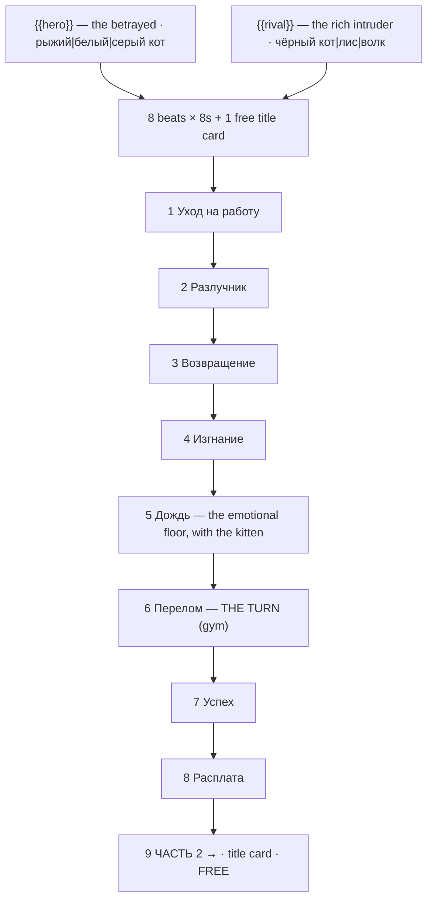

# cat-drama.ts — AI component doc

> AI-facing sidecar for `cat-drama.ts`. Created 2026-07-11. Keep this in sync with the code on every change.

## Purpose

«Кошачья измена» — the AI cat soap opera, the single biggest AI-video genre of 2025–26.
Catalog DATA, not logic: nine beats (eight generated 8s clips + one free title card) of
photoreal cat-headed humans playing out betrayal → rock bottom → glow-up → revenge, with
two knobs. ADR: `docs/wiki/decisions/template-catalog.md`.

## What it does (for an AI reader)

- Responsibilities: hold the prompts, presets, titles, voice lines, tier models and knob
  definitions of one template. No behaviour — `service.ts` reads it.
- Public API / exports: `catDrama: Template` (`id: 'cat-drama'`, category `brainrot`,
  9:16, `defaultStyleId: 'cinematic'`).
- Inputs → Outputs: `{{hero}}` / `{{rival}}` values → the substituted prompts, the film
  title («Рыжий кот и предательство»), and eight spoken lines.
- Side effects (I/O, network, state): none — a module-level constant.

## Dependencies

- Imports / depends on: `../types` (`Template`).
- Used by: `catalog/index.ts` (registered in `TEMPLATES`, second).

## Diagram

## Key decisions / gotchas

- **THIS IS NOT "ITALIAN BRAINROT" — the mistake everyone makes.** Italian brainrot
  (Ballerina Cappuccina, Bombardiro Crocodilo, Mar 2025) is AI hybrid creatures with
  pseudo-Italian names and Italian narration: a different genre with different grammar. Do
  not merge them. The genre here is the cat microdrama: the 2024 "sad cat story"
  slideshows (@mpminds, the fat ginger cat "Chubby") and then the 2025–26 microdramas
  (@meowmeowaiart, Meow Story Time).
- **THE LOOK, precisely: photoreal fluffy CAT HEADS on HUMAN BODIES** — veiny forearms,
  broad shoulders, a suit or a work shirt. NOT cats standing on two legs. Huge glossy
  teary eyes. Uncanny, over-saturated, slightly janky — the jank is part of the format.
- **THE CASTING IS FIXED BY THE GENRE**: the sympathetic husband is a fat ginger tabby, the
  rival is a sleek black cat in a tailored suit. That is also why **the wife is not a
  knob** — she is a fixed white cat, and a third picker would be a choice nobody wants to
  make.
- **THE ARC IS RIGIDLY CONVENTIONAL and that is the whole appeal**: three jobs for her →
  she lets the rival in → he catches them → she throws him out → he cries in the rain
  holding their kitten → gym montage → he is rich → she begs on the street and he walks
  past. Deviating from the arc is how you make a video nobody watches. The kitten in beat 5
  is non-negotiable — it is what the genre cries about.
- **Grammar**: both option sets are masculine nominative, so the voice lines and the film
  title decline correctly (see `fruit-drama.ts.md` on why this matters).
- **The audio convention is "meow-covers"** — sad pop hits (Billie Eilish's "What Was I
  Made For?", Sia's "Unstoppable") re-sung entirely in meows. No music model will meow on
  command, so `musicPrompt` aims at the same emotional target instrumentally: piano ballad
  building to a triumphant orchestral swell, tracking the arc's turn at beat 6.
- **`veo-3-1-fast` is the premium tier because the characters speak natively.** Same
  reasoning as `fruit-drama`.
- **Disclosure tier `in-player` — THE AMBIGUOUS ONE, resolved upward on purpose** (ADR
  shorts-studio §12, field added 2026-08-20). A cat head on a human body is unmistakably
  synthetic, which argues for `description`. But everything else in frame is photoreal:
  human bodies, a real apartment, a real gym, a rainy street. `description` is defined as
  the NON-photoreal tier and this is not that, so the only clean literal fit above it is
  `in-player`. The rule when a card sits between two tiers is to take the higher one —
  over-labelling costs a line of copy, under-labelling a photoreal human drama is a
  policy exposure, and TikTok's C2PA detection will apply the label here whatever we
  declare. Not loopable: betrayal → glow-up → revenge, and it ends.

## Commits

- _no commit yet_
