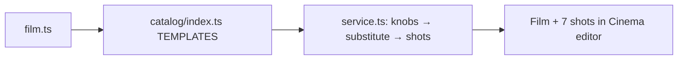

# film.ts — AI component doc

> AI-facing sidecar for `catalog/film.ts`. Created 2026-07-18. Keep this in sync with the code on every change.

## Purpose

«Фильм» — a big-screen movie TRAILER template, first of the three FORMAT
templates (owner request 2026-07-18: «как фильм / как сериал / как аниме»).
Six 8s beats in trailer grammar — cold open → hero → threat → escalation →
climax → final shot — closed by a free title card carrying the user's film
name.

## What it does (for an AI reader)

- Exports `film: Template` (id `'film'`, category `'format'`, 16:9,
  defaultStyleId `'cinematic'`).
- Knobs: `hero` (детектив/космонавт/самурай), `world` (неоновый мегаполис /
  мёртвая пустыня / северный порт) — both substitute into EVERY clip prompt,
  re-aiming the same arc across genres; `title` (free text, max 40) lands ONLY
  in the title card and the final spoken line (catalog-wide test enforces
  text-knobs-never-in-visual-prompts).
- Tiers: draft `pixverse-v6` · standard `wan-2-7` (owner works through
  Cinema+Wan; r2v references keep a tagged hero consistent) · premium
  `veo-3-1-fast` (native scene audio). All three hold 8s @ 16:9 — the
  templates.test.ts invariant.
- musicPrompt: epic trailer score (braams, ostinato, percussion hits).
- Voice: Nikolai throughout — ONE trailer-announcer voice is the format.

## Dependencies

- Imports: `../types` (`Template`).
- Used by: `catalog/index.ts` (registry → /api/templates → web gallery →
  create-film-from-template flow in service.ts).

## Diagram

## Commits

- _no commit yet_
