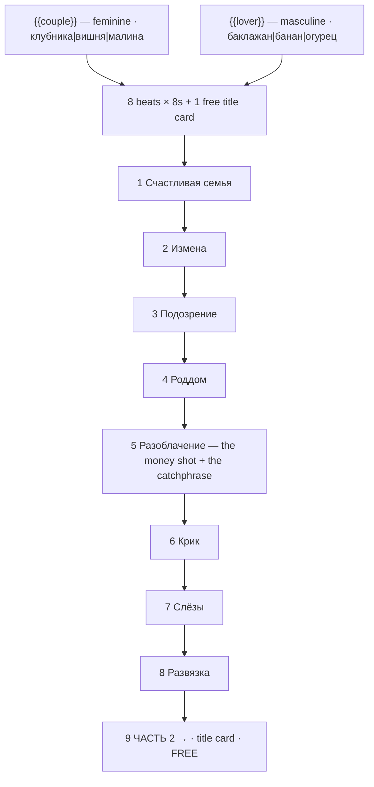

# fruit-drama.ts — AI component doc

> AI-facing sidecar for `fruit-drama.ts`. Created 2026-07-11. Keep this in sync with the code on every change.

## Purpose

«Фруктовая измена» — the cheating-fruit soap opera. Catalog DATA, not logic: nine beats
(eight generated 8s clips + one free title card) of hyperreal macro fruit playing out a
betrayal, with two knobs. ADR: `docs/wiki/decisions/template-catalog.md`.

## What it does (for an AI reader)

- Responsibilities: hold the prompts, presets, titles, voice lines, tier models and knob
  definitions of one template. It has no behaviour — `service.ts` reads it.
- Public API / exports: `fruitDrama: Template` (`id: 'fruit-drama'`, category
  `brainrot`, 9:16, `defaultStyleId: 'cinematic'`).
- Inputs → Outputs: `{{couple}}` / `{{lover}}` values → the substituted prompts, the film
  title («Клубника и Баклажан»), and eight spoken lines.
- Side effects (I/O, network, state): none — a module-level constant.

## Dependencies

- Imports / depends on: `../types` (`Template`).
- Used by: `catalog/index.ts` (registered in `TEMPLATES`, listed FIRST — the dramas are
  why anyone opens the gallery).

## Diagram

## Key decisions / gotchas

- **THE FORMAT is research, not invention** (sources in the ADR). Originated 28 Feb 2026
  on TikTok (@trombonechef) as the "sad fruit story" / "cheating AI fruit" trend: a
  strawberry wife cheats on her strawberry husband with her eggplant boss and the baby is
  born an eggplant. Part 2 hit ~25M views; the "Fruit Love Island" spinoff cleared 300M.
  In Russian the trend crystallized around one catchphrase, which is **beat 5 verbatim**:
  «Я клубника, ты клубника — почему у нас родился банан?»
- **THE LOOK is HYPERREAL MACRO, not a cartoon and not a Pixar render.** A photographically
  real strawberry — seed pits, pores, wet specular highlights — with glossy human eyes and
  a mouth cut into the flesh. The fruit's body IS the head. That is why every clip runs
  `styleId: 'cinematic'` (photorealistic) rather than a cartoon style, and why the prompts
  insist on "macro photography" and "glistening flesh". Getting this wrong produces a
  different (and much less viral) video.
- **THE RUSSIAN GRAMMAR IS LOAD-BEARING.** Every `couple` option is FEMININE nominative
  (клубника, вишня, малина) and every `lover` option is MASCULINE nominative (баклажан,
  банан, огурец), so beat 5's line — «Я {{couple}}, ты {{couple}}, почему у нас родился
  {{lover}}?» — declines correctly for all nine combinations with no grammar engine.
  **Adding a neuter or feminine `lover` option silently breaks that line. Don't.**
- **Two knobs, because the joke writes the punchline.** The couple share a fruit and the
  baby comes out as the LOVER's fruit; nothing else needs to vary. There is no free-text
  knob here on purpose — the plot IS the product, and letting the user rewrite it is
  letting them break it.
- **Eight 8-second beats** because the video models generate ~8s natively and creators cut
  on that grid. The 8s duration and 9:16 aspect are exactly what `assertTemplatesValid()`
  checks against all three tier models.
- **`veo-3-1-fast` is the premium tier because it generates the dialogue audio itself** —
  which is how the real videos in this trend are made. The flat, slightly-wrong AI delivery
  is a load-bearing feature of the format, not a defect to work around.
- **The title card is free** (`kind: 'title'`, no generation — ffmpeg draws it over black),
  and it is the "ЧАСТЬ 2 →" cliffhanger. Serialization is the engine of this format: it is
  why the viewer follows the account.
- Beat 1 carries the premise as a burned-in title because ~70% of this format is watched
  muted — without it the viewer scrolls past.

## Commits

- _no commit yet_
