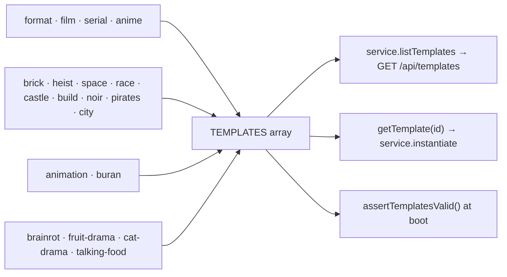

# index.ts — AI component doc

> AI-facing sidecar for `index.ts`. Created 2026-07-11. Keep this in sync with the code on every change.

## Purpose

The template registry — the single ordered list the `/templates` gallery renders.
ADR: `docs/wiki/decisions/template-catalog.md`.

## What it does (for an AI reader)

- Responsibilities: aggregate the one-file-per-template modules into `TEMPLATES`, and
  resolve an id to a template.
- Public API / exports: `TEMPLATES: Template[]`, `getTemplate(id): Template | undefined`.
- Inputs → Outputs: a template id → the `Template`, or `undefined` (which
  `service.instantiate` turns into `TemplateNotFoundError` → 404).
- Side effects (I/O, network, state): none — a module-level constant.

## Dependencies

- Imports / depends on: `../types` (`Template`) and all eleven template modules —
  `./film`, `./serial`, `./anime` (shelf `format`); `./brick-heist`, `./brick-space`,
  `./brick-race`, `./brick-castle`, `./brick-build`, `./brick-noir`, `./brick-pirates`,
  `./brick-city` (shelf `brick`); `./buran` (shelf `animation`); `./fruit-drama`,
  `./cat-drama`, `./talking-food` (shelf `brainrot`).
- Used by: `../service.ts` (`listTemplates`, `instantiate`, and the default argument of
  `assertTemplatesValid`), `../templates.test.ts`.

## Diagram

## Key decisions / gotchas

- **One file per template, on purpose.** This catalog is meant to grow to dozens; a
  single `templates.ts` would be a thousand lines of prompt prose within a month, and
  prompts are the thing that gets iterated on most. One file per template keeps each one
  reviewable in a diff, keeps blame legible, and makes adding a template a new file plus
  one line here — never an edit to a shared blob.
- **Array order IS gallery order — and SHELF order.** `TemplateCatalog` groups by category in
  first-seen order, so the first entry also decides which shelf leads. It is curated:
  the FORMAT shelf (`film`, `serial`, `anime` — Фильм · Сериал · Аниме, owner request 2026-07-18)
  leads: a format is the widest door into CinemaStudio, a starting grid the user rewrites.
  Then БРИК-МУЛЬТЫ (see below). `buran` (Анимация) is third, keeping the role it has always
  had — the brainrot dramas are picked to be *posted*, «Буран» is picked to be *worked on*.
  Then the dramas, because they are why anyone opened the page originally; the cheap, simple
  `talking-food` is last.
- **Why the brick shelf sits second** (owner request 2026-07-30: «лего-мультфильмы с
  историями», «много готовых шаблонов»): it is the largest shelf in the catalog — eight of the
  eleven templates — and the only one that is complete STORIES, arcs that resolve. A format
  template is picked to be rewritten and a brainrot template to be posted; a brick template is
  picked to be watched. Burying eight stories under a single-template shelf would
  misrepresent what the page now contains. Within the shelf the order is by how legible the
  story is from its name alone: `brick-heist` and `brick-space` sell themselves,
  `brick-city` («День минифигурки») needs the card read.
- **The brick shelf's own invariants live in `../templates.test.ts`**, not here: the shelf holds
  exactly eight ids, each 5–6 paid clips plus 1–2 free cards, each speaking on every paid beat,
  each with 2–3 knobs and at most one free-text knob. And catalog-wide, the toy brand's name
  must appear in no template string — it is a trademark AND a phrase Veo's moderation rejects,
  which would break the premium tier only, silently.

## Commits

- `de1e970` feat(templates): brick toons 1-4 — heist, space, race, castle
- `c64523e` feat(templates): brick toons 5-8 + the shelf's invariants
