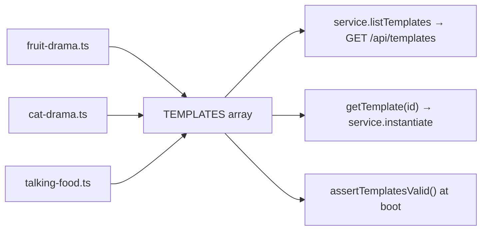

# index.ts — AI component doc

> AI-facing sidecar for `index.ts`. Created 2026-07-11. Keep this in sync with the code on every change.

## Purpose

The template registry — the single ordered list the `/templates` gallery renders.
ADR: `docs/wiki/decisions/template-catalog.md`.

## What it does (for an AI reader)

- Responsibilities: aggregate the one-file-per-template modules into `TEMPLATES`, and
  resolve an id to a template.
- Public API / exports: `TEMPLATES: Template[]`, `getTemplate(id): Template | undefined`.
- Inputs → Outputs: a template id → the `Template`, or `undefined` (which
  `service.instantiate` turns into `TemplateNotFoundError` → 404).
- Side effects (I/O, network, state): none — a module-level constant.

## Dependencies

- Imports / depends on: `../types` (`Template`), `./fruit-drama`, `./cat-drama`,
  `./talking-food`.
- Used by: `../service.ts` (`listTemplates`, `instantiate`, and the default argument of
  `assertTemplatesValid`), `../templates.test.ts`.

## Diagram

## Key decisions / gotchas

- **One file per template, on purpose.** This catalog is meant to grow to dozens; a
  single `templates.ts` would be a thousand lines of prompt prose within a month, and
  prompts are the thing that gets iterated on most. One file per template keeps each one
  reviewable in a diff, keeps blame legible, and makes adding a template a new file plus
  one line here — never an edit to a shared blob.
- **Array order IS gallery order — and SHELF order.** `TemplateCatalog` groups by category in
  first-seen order, so the first entry also decides which shelf leads. It is curated:
  the FORMAT shelf (`film`, `serial`, `anime` — Фильм · Сериал · Аниме, owner request 2026-07-18)
  leads: a format is the widest door into CinemaStudio, a starting grid the user rewrites.
  `buran` (Анимация) keeps second place for the reason it used to lead — the
  brainrot dramas are picked to be *posted*, «Буран» is picked to be *worked on*. Then the
  dramas, because they are why anyone opens the page; the cheap, simple `talking-food` is last.

## Commits

- _no commit yet_
