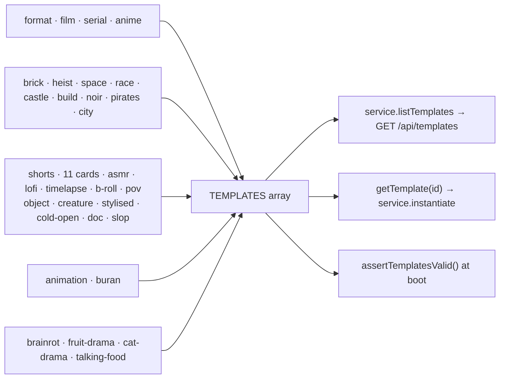

# index.ts — AI component doc

> AI-facing sidecar for `index.ts`. Created 2026-07-11. Keep this in sync with the code on every change.

## Purpose

The template registry — the single ordered list the `/templates` gallery renders.
ADR: `docs/wiki/decisions/template-catalog.md`.

## What it does (for an AI reader)

- Responsibilities: aggregate the one-file-per-template modules into `TEMPLATES`, and
  resolve an id to a template.
- Public API / exports: `TEMPLATES: Template[]`, `getTemplate(id): Template | undefined`.
- Inputs → Outputs: a template id → the `Template`, or `undefined` (which
  `service.instantiate` turns into `TemplateNotFoundError` → 404).
- Side effects (I/O, network, state): none — a module-level constant.

## Dependencies

- Imports / depends on: `../types` (`Template`) and twenty-six of the twenty-seven template modules —
  `./film`, `./serial`, `./anime` (shelf `format`); `./brick-heist`, `./brick-space`,
  `./brick-race`, `./brick-castle`, `./brick-build`, `./brick-noir`, `./brick-pirates`,
  `./brick-city` (shelf `brick`); `./shorts-asmr-impossible`, `./shorts-lofi-loop`,
  `./shorts-b-roll`, `./shorts-talking-object`, `./shorts-absurd-creature`,
  `./shorts-stylised-everyday`, `./shorts-what-if-doc`, `./shorts-ai-slop`,
  `./shorts-timelapse-cycle`, `./shorts-pov-immersion`, `./shorts-cold-open-loop`
  (shelf `shorts`; `./shorts-figurine-pov` is authored but **not imported** — see below);
  `./buran` (shelf `animation`); `./fruit-drama`, `./cat-drama`, `./talking-food`
  (shelf `brainrot`).
- Used by: `../service.ts` (`listTemplates`, `instantiate`, and the default argument of
  `assertTemplatesValid`), `../templates.test.ts`.

## Diagram

## Key decisions / gotchas

- **One file per template, on purpose.** This catalog is meant to grow to dozens; a
  single `templates.ts` would be a thousand lines of prompt prose within a month, and
  prompts are the thing that gets iterated on most. One file per template keeps each one
  reviewable in a diff, keeps blame legible, and makes adding a template a new file plus
  one line here — never an edit to a shared blob.
- **Array order IS gallery order — and SHELF order.** `TemplateCatalog` groups by category in
  first-seen order, so the first entry also decides which shelf leads. It is curated:
  the FORMAT shelf (`film`, `serial`, `anime` — Фильм · Сериал · Аниме, owner request 2026-07-18)
  leads: a format is the widest door into CinemaStudio, a starting grid the user rewrites.
  Then БРИК-МУЛЬТЫ, then ШОРТСЫ (see below for both). `buran` (Анимация) is fourth, keeping
  the role it has always had — the brainrot dramas are picked to be *posted*, «Буран» is picked to be *worked on*.
  Then the dramas, because they are why anyone opened the page originally; the cheap, simple
  `talking-food` is last.
- **Why the brick shelf sits second** (owner request 2026-07-30: «лего-мультфильмы с
  историями», «много готовых шаблонов»): it is the largest shelf in the catalog — eight of the
  eleven templates — and the only one that is complete STORIES, arcs that resolve. A format
  template is picked to be rewritten and a brainrot template to be posted; a brick template is
  picked to be watched. Burying eight stories under a single-template shelf would
  misrepresent what the page now contains. Within the shelf the order is by how legible the
  story is from its name alone: `brick-heist` and `brick-space` sell themselves,
  `brick-city` («День минифигурки») needs the card read.
- **Why the shorts shelf sits third** (ADR `shorts-studio`, 2026-08-20): it is the shelf the
  batch runner exists for, and it is ordered ahead of «Буран» and the dramas for the same
  reason БРИК-МУЛЬТЫ is — it is a whole pack rather than one card, and it is what a user
  arrives wanting. Within the shelf the order runs from the formats that need no explanation
  at all (`shorts-asmr-impossible`, `shorts-lofi-loop`) to the ones whose card has to be read
  (`shorts-what-if-doc`, `shorts-ai-slop`). Wave 2 (2026-08-20) added four by the same rule
  rather than appending them — `shorts-timelapse-cycle` third, `shorts-pov-immersion` fifth,
  `shorts-figurine-pov` seventh, `shorts-cold-open-loop` tenth — and the shelf then shipped at
  **eleven**, because the figurine card was pulled (below). `templates.test.ts` pins that exact order, so a card added without a decision about
  where it belongs fails rather than landing silently at the end.
- **Every shorts card is the SAME SHAPE, and that is arithmetic rather than taste** (ADR §6):
  three clips × 8s, no title cards, 24s total, on the vertical triple
  `seedance-1-5-pro` / `wan-2-7` / `veo-3-1-fast` whose native duration tables intersect at
  exactly `{8}`. So every shorts card costs the same **168 / 405 / 420** credits — which is the
  property a batch runner needs: the price of a run is rows × beats × one number, and the user
  reading the itemised confirm does not have to hold eight per-template rates in their head.
  A shorts template wanting another clip length must name a different tier triple and prove it
  against `assertTemplatesValid`.
- **The draft tier moved from `pixverse-v6` to `seedance-1-5-pro` on 2026-08-20, and the reason
  was deployment reality rather than craft.** None of the original triple could generate on
  production: `pixverse-v6` and `veo-3-1-fast` both route to Runware, whose production key is a
  placeholder, and `wan-2-7` routes to Alibaba DashScope, whose key is unset. **`assertTemplatesValid`
  checks ratio and duration; it does not check that a provider is reachable** — so the shelf passed
  every check and then failed on the first real click. `seedance-1-5-pro` runs on kie.ai, is verified
  working in production, and costs the SAME 56 credits at 8s, so the swap changed no price and no
  beat. Standard and premium were deliberately left pointing at unreachable providers: aiming all
  three tiers at one working model would make the tier picker a lie, three prices for identical
  output. Instead **every shorts card now carries a note on all three tier pills saying which tiers
  work today**, and `templates.test.ts` pins that all three notes exist — an unreachable tier with a
  silent pill is exactly the trap this change removes.
- **Note what is NOT gated: `CATALOG` itself.** `/api/catalog` filters unreachable video models out
  of what the client is offered (`catalog/routes.ts`), but the entries stay in `CATALOG`, so
  `getModel()` still resolves and the boot check still passes for a template pinning `wan-2-7`.
  That is why standard and premium can stay pinned without risking the deploy.
- **`shorts-figurine-pov` is authored, documented, priced — and deliberately NOT registered**
  (2026-08-20). Its format needs a tier that can hold a character across three separate
  generations; the only tier model carrying `referenceMode` is `wan-2-7`, whose DashScope key
  this deployment does not have, and the one tier that *does* run (draft, `seedance-1-5-pro`)
  has no reference mode at all — so it produces a different figurine in each beat. The
  distinction that decided it: **every other shorts card DEGRADES on the working tier, that one
  is BROKEN on it.** Three different figurines is not a cheaper version of "that character in a
  big world", it is the absence of the format, and a first batch that teaches a user the card
  cannot do its one job is worse than a card they never saw — a tier note is not enough when the
  tier that works is the wrong one. **Return condition:** re-register it the moment any tier it
  pins is both reachable AND carries `referenceMode` at 9:16/8s. That is the import plus one
  line here; nothing in the card changes. There is deliberately no test asserting its absence —
  a comment naming the condition is the right weight.
- **Nine of the eleven shorts are loopable**, and their final beat's prompt states the return to
  frame 1 explicitly — a claim `templates.test.ts` checks **against that prompt** rather than
  trusting the flag (ADR §10). The two that are not — `shorts-what-if-doc` and `shorts-ai-slop` —
  are escalations whose payoff is the last beat, and each says so in its own header rather
  than pretending otherwise.
- **The shelf holds three different KINDS of loop, and they are worth telling apart.**
  `shorts-timelapse-cycle` loops because a cycle returns (free, and the most robust);
  `shorts-cold-open-loop` loops on MEANING — its last line recontextualises its first, and the
  replay is the payoff rather than a visual trick; every other loopable card buys its loop with
  an authored frame match in the final prompt.
- **Two formats the research surfaced were deliberately NOT taken**, and the reasons belong
  here so nobody re-proposes them: the Vox-style explainer needs composited lower-thirds and a
  6–9 beat arc, and this grid has neither (the compositor does not exist yet); audio-reactive
  beat-sync needs beat markers extracted BEFORE generation, which is a different pipeline. Both
  are real formats, and both would have to be faked on this shelf.
- **The brick shelf's own invariants live in `../templates.test.ts`**, not here: the shelf holds
  exactly eight ids, each 5–6 paid clips plus 1–2 free cards, each speaking on every paid beat,
  each with 2–3 knobs and at most one free-text knob. And catalog-wide, the toy brand's name
  must appear in no template string — it is a trademark AND a phrase Veo's moderation rejects,
  which would break the premium tier only, silently.
- **THE TEMPLATE SUITE DOES NOT SEE STRUCTURAL ERRORS — run `tsc` too.** A rewrite of the
  `models`/`tierNotes` blocks once left `shorts-figurine-pov.ts` with **two `tierNotes` keys in
  one object literal**, and the whole vitest suite passed green: esbuild silently takes the last
  key, so the duplicate was invisible to every assertion in `templates.test.ts`. Only
  `tsc --noEmit` caught it (TS1117). The tests here check catalog *semantics* — placeholders,
  prices, voices, durations, loop claims — and cannot check that the object is well formed. On
  any bulk or scripted edit to catalog files, a green suite is not proof; typecheck as well.

## Commits

- `de1e970` feat(templates): brick toons 1-4 — heist, space, race, castle
- `c64523e` feat(templates): brick toons 5-8 + the shelf's invariants
