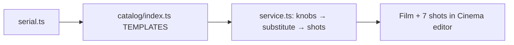

# serial.ts — AI component doc

> AI-facing sidecar for `catalog/serial.ts`. Created 2026-07-18. Keep this in sync with the code on every change.

## Purpose

«Сериал» — one episode of a prime-time TV melodrama, second FORMAT template
(owner request 2026-07-18). Episode grammar: free recap card «В предыдущих
сериях…» → затишье → находка → конфронтация → слёзы → клиффхэнгер → free
«Продолжение следует…» card. The two free cards are the serialization engine.

## What it does (for an AI reader)

- Exports `serial: Template` (id `'serial'`, category `'format'`, 16:9,
  defaultStyleId `'cinematic'`, TV-drama look via prompts: warm practicals,
  handheld intimacy).
- Knobs: `place` (кухня/офис/больница) and `find` (письмо / второй телефон /
  старая фотография) — both substitute into clip prompts. **GRAMMAR
  LOAD-BEARING:** `find` options' `spoken` forms are GENITIVE («письма»,
  «телефона», «снимка») because the cliffhanger line reads «…из-за этого
  {{find}}». New options must stay genitive or that line breaks silently.
- Tiers: draft `pixverse-v6` · standard `wan-2-7` (references keep the couple
  consistent across episodes) · premium `veo-3-1-fast`. 8s @ 16:9 everywhere.
- Voices: Elena (жена), Dmitry (муж), Nikolai (третья фигура в клиффхэнгере).

## Dependencies

- Imports: `../types` (`Template`).
- Used by: `catalog/index.ts` (registry → /api/templates → web gallery →
  create-film-from-template flow in service.ts).

## Diagram

- **Disclosure tier `in-player`, not loopable** (ADR shorts-studio §12/§10, fields added
  2026-08-20). This is the **most mistakable card in the catalog**: photoreal people
  arguing in a photoreal kitchen is exactly the footage a viewer reads as a record of
  something that happened. Ends on a cliffhanger by design, so it does not loop.

## Commits

- _no commit yet_
