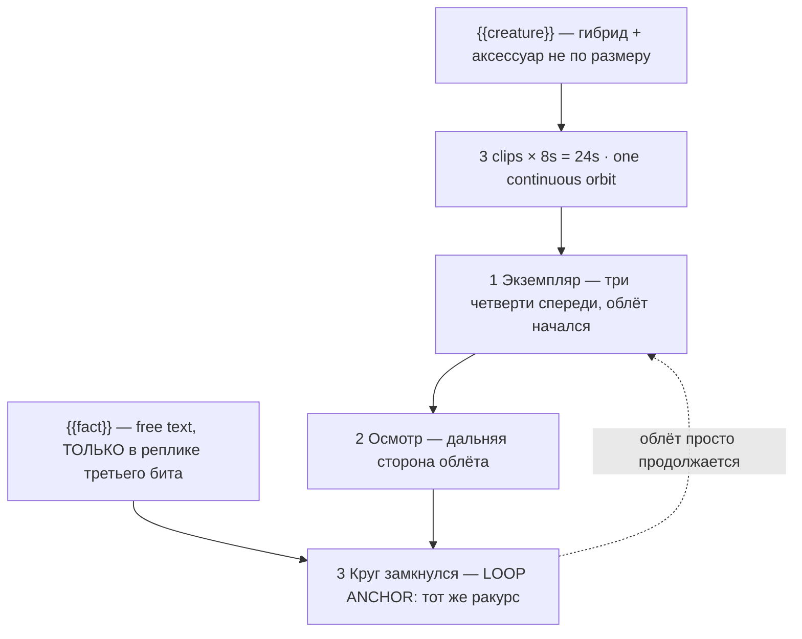

# shorts-absurd-creature.ts — AI component doc

> AI-facing sidecar for `shorts-absurd-creature.ts`. Created 2026-08-20. Keep this in sync with the code on every change.

## Purpose

«Абсурдное существо» — one photoreal impossible hybrid on a seamless sweep, a slow orbit, and a
narrator who explains nothing. Catalog DATA, not logic: three generated 8s clips (24s, no title
cards), two knobs (one of them free text), three Russian narration lines.
ADR: `docs/wiki/decisions/shorts-studio.md`.

## What it does (for an AI reader)

- Responsibilities: hold the prompts, presets, tier models, narration and knob definitions of
  one shorts template. No behaviour — `service.ts` reads it.
- Public API / exports: `shortsAbsurdCreature: Template` (`id: 'shorts-absurd-creature'`,
  category `shorts`, 9:16, `defaultStyleId: 'cinematic'`).
- Inputs → Outputs: `{{creature}}` / `{{fact}}` values → three substituted English prompts,
  three Russian lines and the film title («Существо: голубь на конских ногах»).
- Side effects (I/O, network, state): none — a module-level constant.

## Dependencies

- Imports / depends on: `../types` (`Template`).
- Used by: `catalog/index.ts` (registered in `TEMPLATES`, fifth of the shorts shelf).

## Diagram

## Key decisions / gotchas

- **MAKING THE DESIGN COHERENT KILLS IT.** Given a hybrid, a model quietly *resolves* it — it
  blends the parts into a plausible animal, scales the accessory to fit, and hands back a
  competent concept-art creature. That is the failure. The appeal is entirely in the wrongness
  of the join: the parts belong to different animals at different scales, and the accessory is
  **bolted on wrong** — it does not fit, nothing explains it, and the creature never uses it or
  acknowledges it. The `WRONG` constant says so in every shot, because "absurd" is not a word a
  model renders and "the spectacles do not fit it and it never uses them" is.
- **The register is a completely sincere nature documentary.** Not jokey, not winking: the
  narrator states the impossible in the tone of a man reading rainfall figures. If the
  narration performs the joke, the creature becomes a cartoon — the same failure
  `shorts-what-if-doc.ts` documents at length. `musicPrompt` asks for "no comedy cues" for the
  same reason.
- **NOT "Italian brainrot".** That genre (Ballerina Cappuccina, Bombardiro Crocodilo, Mar 2025)
  is AI hybrids with pseudo-Italian names and sung Italian narration — different grammar. This
  card takes the "newly discovered species" documentary-parody lineage instead. Merging them
  produces neither, the same correction `cat-drama.ts.md` makes about its own lineage.
- **The background is a plain seamless sweep for two reasons that agree**: it is what "newly
  catalogued specimen" looks like, and it is the only kind of background that survives an
  orbit. A model asked to orbit through a real environment invents a new environment on the far
  side, and then the loop cannot close. Beat 2 says "the same creature, unchanged" outright,
  because that is the beat where the model has to invent the half it has not shown yet.
- **`fact` is free text and lands ONLY in the closing spoken line** — never in a visual prompt
  (the rule from `types.ts`, asserted for every template). The last line of the narration is
  exactly what a user wants to own and exactly what must not reach a paid prompt. Same pattern
  as `brick-heist`'s `crew`.
- **Disclosure tier: `none`** (ADR §12) — fantastical on its face.
- **Loopable: yes** — the orbit *is* the loop mechanism, so beat 3 does not stop, it arrives.
  24s, 168 / 405 / 420 credits.
- **`loopable` and `disclosureTier` are now REAL FIELDS on `Template`, not header prose**
  (2026-08-20). This card declares **`loopable: true`** and **`disclosureTier: 'none'`**,
  and both travel on `TemplateSummary` — the gallery filters on the first, the export will
  stamp the label from the second. The loop claim is **enforced**: `templates.test.ts`
  asserts that a template with `loopable: true` actually asks for the return to the opening
  frame in its FINAL clip beat's prompt, because a model never infers that on its own and a
  card that claims the loop without asking for it ships a visible jump at the seam.
- **Draft tier is `seedance-1-5-pro`, not `pixverse-v6`** (changed 2026-08-20). Deployment
  reality, not craft: none of the original triple could generate on production, because
  `assertTemplatesValid` checks ratio and duration but not whether a provider is reachable.
  `seedance-1-5-pro` runs on kie.ai (verified working) and costs the same 56 credits at 8s,
  so the price is unchanged. **Standard and premium still point at providers this deployment
  cannot reach**, deliberately — pointing all three tiers at one working model would make the
  tier picker a lie — so all three `tierNotes` now lead with which tiers work today. The
  argument in full is in `index.ts.md`.

## Commits

- _no commit yet_
