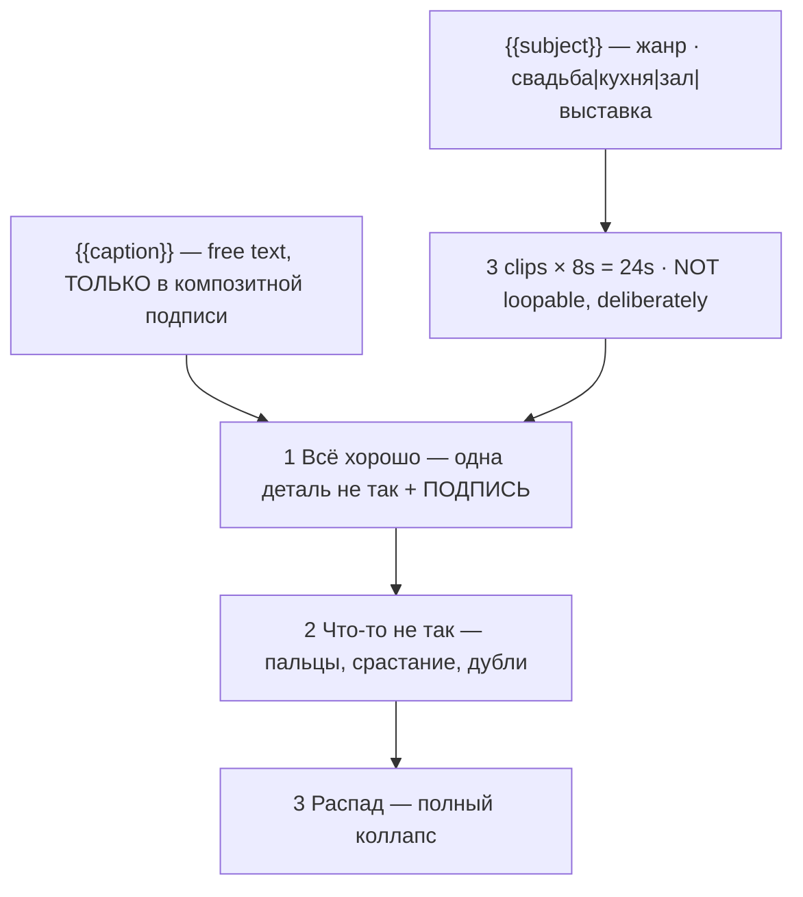

# shorts-ai-slop.ts — AI component doc

> AI-facing sidecar for `shorts-ai-slop.ts`. Created 2026-08-20. Keep this in sync with the code on every change.

## Purpose

«Нарочитый ИИ-треш» — a generation broken on purpose, captioned as the joke. Catalog DATA, not
logic: three generated 8s clips (24s, no title cards) escalating from "almost fine" to total
collapse, two knobs, three sincerely-read Russian lines. The only card in the catalog that asks
the model to fail.
ADR: `docs/wiki/decisions/shorts-studio.md`.

## What it does (for an AI reader)

- Responsibilities: hold the prompts, presets, tier models, narration, the composited caption
  and knob definitions of one shorts template. No behaviour — `service.ts` reads it.
- Public API / exports: `shortsAiSlop: Template` (`id: 'shorts-ai-slop'`, category `shorts`,
  9:16, **`defaultStyleId: null`**).
- Inputs → Outputs: `{{subject}}` / `{{caption}}` values → three substituted English prompts,
  three Russian lines, one burned-in caption and the film title («Свадебный танец: как
  получилось»).
- Side effects (I/O, network, state): none — a module-level constant.

## Dependencies

- Imports / depends on: `../types` (`Template`).
- Used by: `catalog/index.ts` (registered in `TEMPLATES`, eighth and last of the shorts shelf).

## Diagram

## Key decisions / gotchas

- **THE MISTAKE IS BEING TOO GOOD.** Half-broken reads as incompetence; fully broken reads as a
  joke. There is no middle. And 2026 models are competent enough that a plain prompt comes back
  clean — the artefacts this format is built from have to be **asked for, by name,
  aggressively**, or the template silently produces a nice wedding video. Beat 1 is nearly
  clean on purpose (the escalation needs a floor); beat 3 is unmistakably on the other side of
  the line.
- **`defaultStyleId: null` and `quality: 'none'` on every preset — the sharpest trap in the
  file.** Every other photoreal card on this shelf uses `'cinematic'`, but that preset's
  negative prompt is "cartoon, anime, illustration, low quality, **deformed**" (`presets.ts`),
  and `deformed` is exactly what this template is buying. Stamping it here would spend a
  paragraph asking for melted faces and then hand the model a negative prompt telling it not to
  melt them. `quality: 'ultra'` ("masterpiece, best quality") is the same instruction one axis
  over. This is the one card in the catalog that wants no quality floor at all.
- **THE ONE FAILURE WE CANNOT USE IS GARBLED TEXT** — the most canonical slop signature there
  is. ADR §11 forbids prompted in-frame text on every template without exception, and we do not
  carve one out for the card that would enjoy it. The breakage here is **geometric and
  physical, never typographic**, and `FRAME` says "no lettering of any kind, not even garbled
  or invented lettering".
- **The caption is the exception to the shelf's text-free rule, and it is not a contradiction.**
  Everywhere else on the shelf templates ship text-free (ADR §11); here the caption *is* the
  format, and it is **composited by ffmpeg over the finished clip, never prompted**. The model
  is still asked for zero letters. That distinction is the whole of §11: captions are
  composited, never generated. Free-text knob, `position: 'top'` (inside the safe box), on
  beat 1 only — and, per `types.ts`, it never reaches a visual prompt.
- **The audio is sincere and that is load-bearing.** The narration is read straight in the tone
  of a pleasant corporate explainer and the music bed is chirpy stock ukulele. The joke is the
  gap between what is said and what is shown; a narrator who is in on it closes the gap.
- **`tierNotes.draft` is the only positive thing said about the cheap tier anywhere in the
  catalog** — here, breaking more readily is a feature.
- **NOT loopable, deliberately.** The gag is an escalation, and a loop would put the collapse
  next to the "fine" and flatten the curve.
- **Disclosure tier: `none`** (ADR §12) — nothing about it could be mistaken for a record of
  anything; being obviously generated is its entire subject.
- 24s, 168 / 405 / 420 credits.
- **`loopable` and `disclosureTier` are now REAL FIELDS on `Template`, not header prose**
  (2026-08-20). This card declares **`loopable: false`** and **`disclosureTier: 'none'`**,
  and both travel on `TemplateSummary` — the gallery filters on the first, the export will
  stamp the label from the second. The loop claim is **enforced**: `templates.test.ts`
  asserts that a template with `loopable: true` actually asks for the return to the opening
  frame in its FINAL clip beat's prompt, because a model never infers that on its own and a
  card that claims the loop without asking for it ships a visible jump at the seam.
- **Draft tier is `seedance-1-5-pro`, not `pixverse-v6`** (changed 2026-08-20). Deployment
  reality, not craft: none of the original triple could generate on production, because
  `assertTemplatesValid` checks ratio and duration but not whether a provider is reachable.
  `seedance-1-5-pro` runs on kie.ai (verified working) and costs the same 56 credits at 8s,
  so the price is unchanged. **Standard and premium still point at providers this deployment
  cannot reach**, deliberately — pointing all three tiers at one working model would make the
  tier picker a lie — so all three `tierNotes` now lead with which tiers work today. The
  argument in full is in `index.ts.md`.

## Commits

- _no commit yet_
