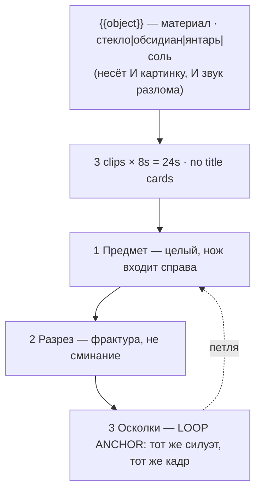

# shorts-asmr-impossible.ts — AI component doc

> AI-facing sidecar for `shorts-asmr-impossible.ts`. Created 2026-08-20. Keep this in sync with the code on every change.

## Purpose

«ASMR: невозможный материал» — the first card of the ШОРТСЫ shelf. Catalog DATA, not logic:
three generated 8s clips (24s, no title cards) of macro cutting-ASMR in which the object is
made of a material it could not possibly be made of. One knob.
ADR: `docs/wiki/decisions/shorts-studio.md`.

## What it does (for an AI reader)

- Responsibilities: hold the prompts, presets, tier models and the single knob definition of
  one shorts template. No behaviour — `service.ts` reads it.
- Public API / exports: `shortsAsmrImpossible: Template` (`id: 'shorts-asmr-impossible'`,
  category `shorts`, 9:16, `defaultStyleId: 'cinematic'`).
- Inputs → Outputs: an `{{object}}` value → three substituted English prompts and the film
  title («ASMR: клубника из стекла»). No voiceover — the format is silent by design.
- Side effects (I/O, network, state): none — a module-level constant.

## Dependencies

- Imports / depends on: `../types` (`Template`).
- Used by: `catalog/index.ts` (registered in `TEMPLATES`, first of the shorts shelf).

## Diagram

## Key decisions / gotchas

- **THE AUDIO IS THE FAILURE MODE, NOT THE PICTURE.** Left alone the model picks the sound
  from the FORM rather than the material — it sees a strawberry, so it produces a wet organic
  crunch, and a wet crunch over shattering glass is a mistake the viewer can *hear*. Every
  `object` option fragment therefore names the sound the break must make **and** the sound it
  must not. That is why the audio direction lives in the knob's fragment and not in the shot
  prompt: the sound is a property of the material, and the material is the knob.
- **The frame is cropped AT THE WRIST.** A forearm in a macro frame gives the model a whole
  limb to invent, and it invents extra knuckles. No arm, no body, no face — a blade, and at
  most a hand that enters, does one thing and leaves.
- **All three beats are a locked-off static macro**, for two reasons that agree: a moving
  camera reads as a product advert and breaks the trance, and a loop needs the last frame to
  rhyme with the first, which is free when the camera never moved.
- **The loop is a compositional rhyme, not an identity** (ADR §10). The object cannot become
  whole again, so beat 3 directs the fragments to settle into the *same silhouette in the same
  place under the same light* while the blade withdraws the way it came in. Cut back to beat 1
  and the eye reads a match cut.
- **`musicPrompt` is deliberately absent** — a music bed under cutting-ASMR destroys the thing
  the format exists for. The audio panel should open empty here.
- **Disclosure tier: `none`** (ADR §12) — the subject is impossible on its face.
- **Loopable: yes.** 3 × 8s = 24s. Price 168 / 405 / 420 credits (draft / standard / premium),
  which is every shorts card's price, because every shorts card is the same shape (ADR §6).
- **`loopable` and `disclosureTier` are now REAL FIELDS on `Template`, not header prose**
  (2026-08-20). This card declares **`loopable: true`** and **`disclosureTier: 'none'`**,
  and both travel on `TemplateSummary` — the gallery filters on the first, the export will
  stamp the label from the second. The loop claim is **enforced**: `templates.test.ts`
  asserts that a template with `loopable: true` actually asks for the return to the opening
  frame in its FINAL clip beat's prompt, because a model never infers that on its own and a
  card that claims the loop without asking for it ships a visible jump at the seam.
- **Draft tier is `seedance-1-5-pro`, not `pixverse-v6`** (changed 2026-08-20). Deployment
  reality, not craft: none of the original triple could generate on production, because
  `assertTemplatesValid` checks ratio and duration but not whether a provider is reachable.
  `seedance-1-5-pro` runs on kie.ai (verified working) and costs the same 56 credits at 8s,
  so the price is unchanged. **Standard and premium still point at providers this deployment
  cannot reach**, deliberately — pointing all three tiers at one working model would make the
  tier picker a lie — so all three `tierNotes` now lead with which tiers work today. The
  argument in full is in `index.ts.md`.

## Commits

- _no commit yet_
