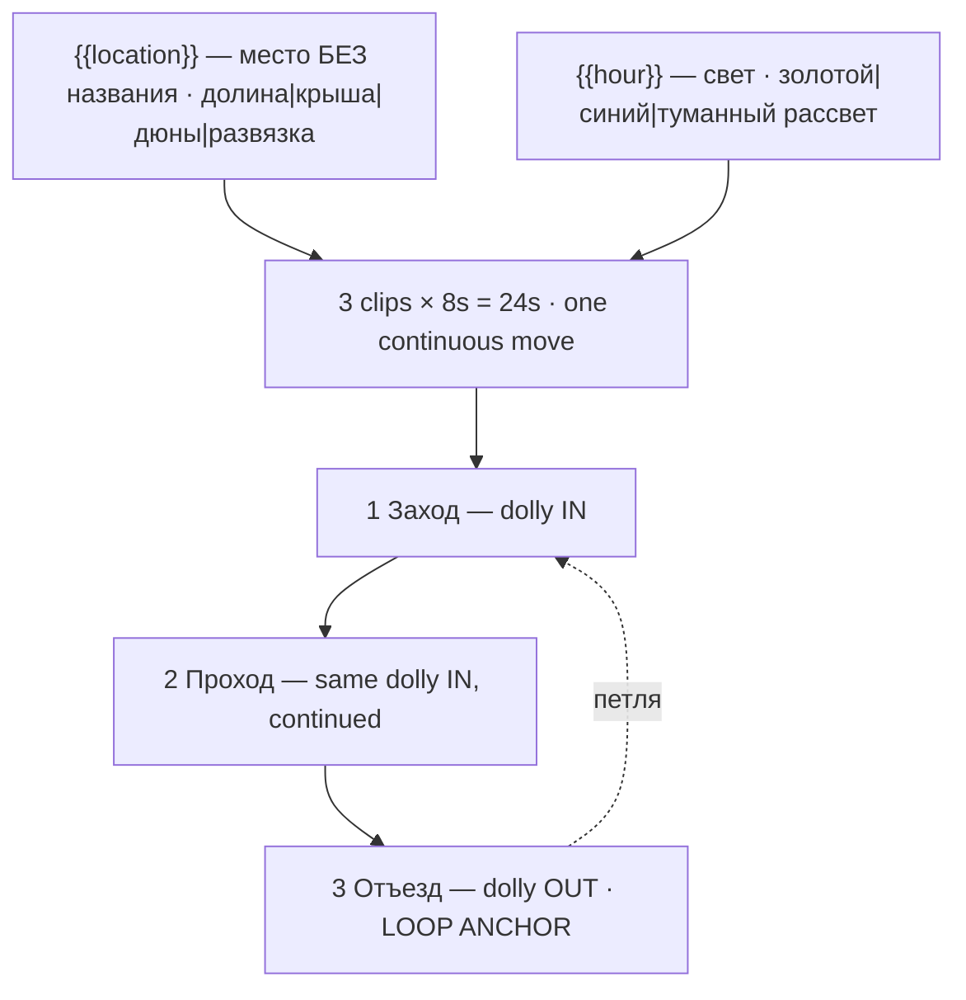

# shorts-b-roll.ts — AI component doc

> AI-facing sidecar for `shorts-b-roll.ts`. Created 2026-08-20. Keep this in sync with the code on every change.

## Purpose

«Кинематографичный B-roll» — one location, one camera move, no subject. Catalog DATA, not
logic: three generated 8s clips (24s, no title cards) that are one continuous dolly in and back
out again. Two knobs. The most useful card on the shelf and the least demonstrative.
ADR: `docs/wiki/decisions/shorts-studio.md`.

## What it does (for an AI reader)

- Responsibilities: hold the prompts, presets, tier models and knob definitions of one shorts
  template. No behaviour — `service.ts` reads it.
- Public API / exports: `shortsBRoll: Template` (`id: 'shorts-b-roll'`, category `shorts`,
  9:16, `defaultStyleId: 'cinematic'`).
- Inputs → Outputs: `{{location}}` / `{{hour}}` values → three substituted English prompts and
  the film title («Хвойная долина, золотой час»). No voiceover — a plate has no narrator.
- Side effects (I/O, network, state): none — a module-level constant.

## Dependencies

- Imports / depends on: `../types` (`Template`).
- Used by: `catalog/index.ts` (registered in `TEMPLATES`, third of the shorts shelf).

## Diagram

## Key decisions / gotchas

- **NEVER ASK FOR A COMPOUND CAMERA MOVE.** "A slow push in while craning up and panning right"
  is a sentence a director can say and a model cannot execute; what comes back is a drifting
  approximation that changes direction halfway. On a template whose entire content IS the
  camera move, that is the whole clip wasted. Each beat asks for exactly ONE simple move and
  then forbids the rest **by name**: no pan, no tilt, no zoom, no crane, no orbit, no handheld,
  no combination. One verb per clip.
- **There is no `move` knob, deliberately.** The three beats are one continuous move split
  across the 8s grid, so direction cannot vary per batch row without breaking the loop.
  Direction is authored; location and hour are what the user turns.
- **Reversing the move is still ONE move** — which is the only reason this card can loop at
  all. A pan or a crane back to the start would be the compound move the rule above forbids.
- **NO SUBJECT.** A model handed an empty landscape will put a lone figure in it, or a car, or
  a bird — it has learned that a shot needs a subject. An empty plate is the product here, and
  on a photoreal plate a walker on the ridge also drags the disclosure tier upward. Hence "no
  person, no vehicle, no animal, nothing moves but the air" in every prompt.
- **Disclosure tier: `description`, and deliberately NOT `in-player`.** Photoreal footage sets
  the floor at `description`; `in-player` is for photoreal PEOPLE, IDENTIFIABLE PLACES and
  EVENTS (ADR §12), and there is none of that here. **Anyone adding a `location` option: keep
  it anonymous.** Naming a real landmark moves this template into `in-player`, which this shelf
  does not carry.
- **The empty lower third is the working space, not a courtesy.** This is the one card whose
  output actually gets composited under other people's captions.
- **Loopable: yes.** 24s, 168 / 405 / 420 credits.
- **`loopable` and `disclosureTier` are now REAL FIELDS on `Template`, not header prose**
  (2026-08-20). This card declares **`loopable: true`** and **`disclosureTier: 'description'`**,
  and both travel on `TemplateSummary` — the gallery filters on the first, the export will
  stamp the label from the second. The loop claim is **enforced**: `templates.test.ts`
  asserts that a template with `loopable: true` actually asks for the return to the opening
  frame in its FINAL clip beat's prompt, because a model never infers that on its own and a
  card that claims the loop without asking for it ships a visible jump at the seam.
- **Draft tier is `seedance-1-5-pro`, not `pixverse-v6`** (changed 2026-08-20). Deployment
  reality, not craft: none of the original triple could generate on production, because
  `assertTemplatesValid` checks ratio and duration but not whether a provider is reachable.
  `seedance-1-5-pro` runs on kie.ai (verified working) and costs the same 56 credits at 8s,
  so the price is unchanged. **Standard and premium still point at providers this deployment
  cannot reach**, deliberately — pointing all three tiers at one working model would make the
  tier picker a lie — so all three `tierNotes` now lead with which tiers work today. The
  argument in full is in `index.ts.md`.

## Commits

- _no commit yet_
