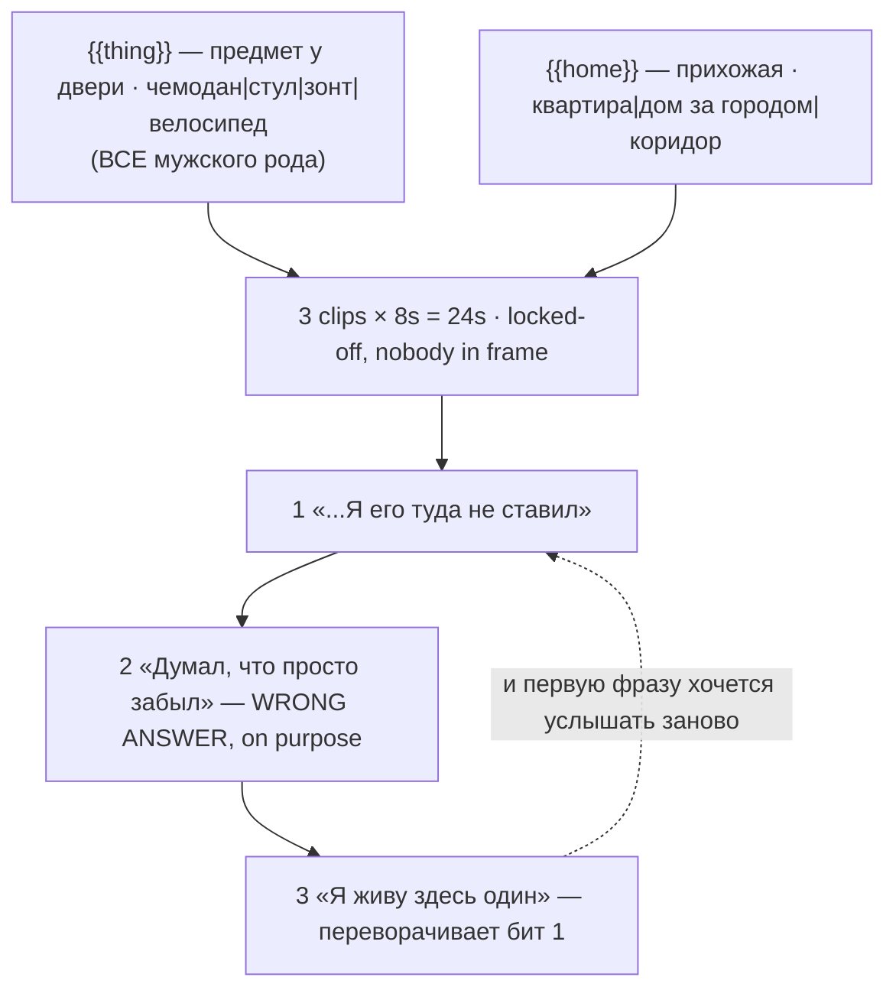

# shorts-cold-open-loop.ts — AI component doc

> AI-facing sidecar for `shorts-cold-open-loop.ts`. Created 2026-08-20. Keep this in sync with the code on every change.

## Purpose

«Холодное открытие» — the shelf's only NARRATIVE loop: it loops on meaning rather than on
picture. Opens on a line that does not yet parse, offers a wrong explanation, then
recontextualises the opening so the viewer replays it. Catalog DATA, not logic: three
generated 8s clips (24s, no title cards), two knobs, three Russian lines.
ADR: `docs/wiki/decisions/shorts-studio.md`.

## What it does (for an AI reader)

- Responsibilities: hold the prompts, presets, tier models, the three-line script and knob
  definitions of one shorts template. No behaviour — `service.ts` reads it.
- Public API / exports: `shortsColdOpenLoop: Template` (`id: 'shorts-cold-open-loop'`,
  category `shorts`, 9:16, `defaultStyleId: 'cinematic'`, `loopable: true`,
  `disclosureTier: 'description'`).
- Inputs → Outputs: `{{thing}}` / `{{home}}` values → three substituted English prompts, three
  Russian lines and the film title («Чемодан у двери»).
- Side effects (I/O, network, state): none — a module-level constant.

## Dependencies

- Imports / depends on: `../types` (`Template`).
- Used by: `catalog/index.ts` (registered in `TEMPLATES`, tenth of the shorts shelf).

## Diagram

## Key decisions / gotchas

- **THE FAILURE IS IN THE WRITING, NOT THE PROMPTING: a payoff that CONCLUDES instead of
  RECONTEXTUALISING.** If the last line finishes the story the viewer is done, the loop
  mechanic never fires, and all that exists is a very short film with a strange ending. The
  test for any rewrite is blunt: **after beat 3, does beat 1 mean something *different* — not
  merely something clearer?**
- **The three shipped lines pass that test.** Beat 1 («{{thing}} снова стоит у двери. Я его
  туда не ставил.») does not parse. Beat 2 («Первые три раза я думал, что просто забыл.»)
  supplies the obvious reading — forgetfulness — and lets the viewer settle into it. Beat 3
  («Я живу здесь один. Я проверял.») makes beat 1 a completely different sentence.
- **Beat 2 is the part a rewrite deletes, and deleting it kills the card.** It is not filler
  between hook and payoff — it is the *wrong answer offered confidently*. Without it the twist
  has nothing to overturn.
- **GRAMMAR IS LOAD-BEARING TWICE.** (1) Every `thing` option is **masculine nominative**, which
  is what lets «Я ЕГО туда не ставил» agree for all four; a feminine object («лампа»,
  «коробка») silently breaks «его». (2) **The narrator is male** — «ставил», «думал»,
  «проверял» are masculine past forms — so the voice id is not cosmetic here. A female voice
  means rewriting all three lines to «ставила / думала / проверяла».
- **The knobs vary the picture, not the script, and that is the honest shape.** The script IS
  the product on this card; twelve settings around one story is a truer offer than pretending
  a select can write a twist. Both knobs still reach a visual prompt, so §9 is satisfied on
  its own terms — `thing` is spoken *and* standing in the doorway in every beat.
- **Nobody is ever in frame** — a narrative requirement, not just a technical one. The story
  only lands if the flat is visibly empty, so the model must not helpfully add the narrator.
- **The camera never moves** because the ending's whole force is that the frame is the same
  frame. Drift between beats makes the return a coincidence instead of the point.
- **Disclosure tier `description`** (ADR §12): photoreal domestic interior, but no person and
  no identifiable place — the same line the b-roll and POV cards sit on.
- **Loopable: true, by construction.** 24s, 168 / 405 / 420 credits.
- **Draft tier is `seedance-1-5-pro`, not `pixverse-v6`** (changed 2026-08-20). Deployment
  reality, not craft: none of the original triple could generate on production, because
  `assertTemplatesValid` checks ratio and duration but not whether a provider is reachable.
  `seedance-1-5-pro` runs on kie.ai (verified working) and costs the same 56 credits at 8s,
  so the price is unchanged. **Standard and premium still point at providers this deployment
  cannot reach**, deliberately — pointing all three tiers at one working model would make the
  tier picker a lie — so all three `tierNotes` now lead with which tiers work today. The
  argument in full is in `index.ts.md`.

## Commits

- _no commit yet_
