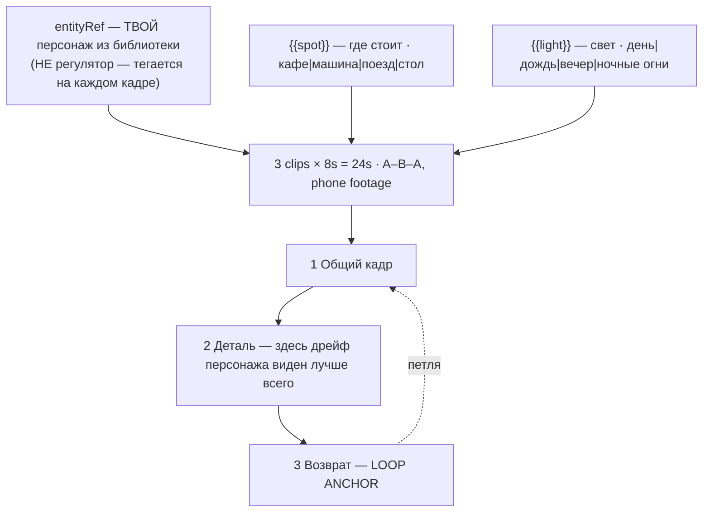

# shorts-figurine-pov.ts — AI component doc

> AI-facing sidecar for `shorts-figurine-pov.ts`. Created 2026-08-20. Keep this in sync with the code on every change.

## Purpose

«Фигурка в большом мире» — the USER'S own character, small, on a real table, shot as if on a
phone. Catalog DATA, not logic: three generated 8s clips (24s, no title cards), two knobs, no
voiceover. The one card in the catalog whose subject comes from the entity library rather than
from a knob.
ADR: `docs/wiki/decisions/shorts-studio.md`.

## What it does (for an AI reader)

- Responsibilities: hold the prompts, presets, tier models and knob definitions of one shorts
  template. No behaviour — `service.ts` reads it.
- Public API / exports: `shortsFigurinePov: Template` (`id: 'shorts-figurine-pov'`, category
  `shorts`, 9:16, `defaultStyleId: 'cinematic'`, `loopable: true`,
  `disclosureTier: 'description'`).
- Inputs → Outputs: `{{spot}}` / `{{light}}` values → three substituted English prompts and the
  film title («Столик в кафе»). The CHARACTER is not an input here — it arrives as a per-shot
  `entityRef` the user tags after instantiation.
- Side effects (I/O, network, state): none — a module-level constant.

## Dependencies

- Imports / depends on: `../types` (`Template`).
- Used by: **nobody, currently.** The card is authored and correct but deliberately NOT
  imported into `catalog/index.ts` as of 2026-08-20 — see the first gotcha below for why and for
  the exact return condition. When it goes back it belongs seventh in the shorts shelf.

## Diagram

## Key decisions / gotchas

- **NOT ON THE SHELF, AND THIS IS THE FIRST THING TO KNOW.** The card needs reference
  conditioning to hold its character across three separate generations. The only tier model that
  has it is `wan-2-7`, whose DashScope key this deployment lacks; the only tier that currently
  runs is draft (`seedance-1-5-pro`), which has no `referenceMode` at all. So today it would
  produce a different figurine in each of its three beats. **Every other shorts card degrades on
  the working tier; this one is broken on it** — three different figurines is not a cheaper
  version of "that character in a big world", it is the absence of the format, and a first batch
  that teaches a user the card cannot do its one job is worse than a card they never saw.
  **Return condition:** re-register it in `catalog/index.ts` the moment any tier it pins is both
  reachable on the deployment AND carries `referenceMode` at 9:16/8s — a DashScope key for
  `wan-2-7` is the expected route, but any reference-capable 9:16 model serving 8s natively
  qualifies. That is an import plus one line; nothing in the card itself changes.

- **THE TIER LADDER IS INVERTED ON THIS CARD — know this before running a batch.** Of the three
  tier models, **only `wan-2-7` (standard) carries `referenceMode`**; it is the first video
  model in our catalog that can hold a character across shots, and its r2v path engages
  automatically when references are present. `seedance-1-5-pro` (draft) and `veo-3-1-fast`
  (premium) have **no reference mode at all**, so on those tiers the figure *will* drift and
  paying more makes the result worse rather than better. `tierNotes` says so on all three tiers,
  in the product's own words, rather than leaving a user to discover it three generations in.
- **AND AS OF 2026-08-20 THAT COLLIDES WITH DEPLOYMENT REALITY — say it out loud rather than
  sell around it.** The only tier whose provider is reachable on production is **draft**, and
  draft is precisely the tier that cannot hold a character. So today this card generates, and
  generates a *different figure in each of its three beats* — the one failure this format cannot
  absorb. It is authored, correct and priced like its neighbours, and it becomes the card it is
  meant to be the moment a DashScope key exists and the standard tier lights up. Of the twelve
  shorts cards this is the only one whose working tier is the wrong tier for its format; the
  other eleven degrade in quality on draft, this one degrades in premise.
- **CHARACTER DRIFT IS THE FAILURE, AND RE-DESCRIBING THE CHARACTER IS THE ANTI-PATTERN.**
  Three separate generations share no context, so the figure in beat 2 is a different figure
  unless something forces it not to be — and the format collapses the moment a viewer notices
  it is not the same character. Pasting a paragraph of "a small vinyl figure with round ears
  and a wide grin" into all three prompts produces three plausible figures that are *not each
  other*. The `SAME` constant therefore **names the reference and never describes the
  character**.
- **NO REAL COLLECTIBLE LINE IS NAMED anywhere — not in a prompt, not in an option label — and
  `templates.test.ts` now enforces that catalog-wide** (the trademark pattern was widened on
  2026-08-20 alongside the toy brand). Two independent reasons, either sufficient: those are
  live trademarks under active enforcement and template copy is product copy on a public
  endpoint; and, better, a template shipping a fixed set of cute figures would be a *worse*
  version of this format, because its whole engine is that the character is YOURS. Ours would
  be nobody's.
- **The character is deliberately not a knob.** It comes from the entity library and is tagged
  per shot — which is why the description tells the user to tag it, and why the standard tier's
  note is written as a requirement rather than a nicety.
- **Phone footage, not 'cinematic' camerawork.** The format's credibility comes from looking
  like a person photographed it at a table: handheld, natural available light, shallow macro
  depth of field, no grade, no rig.
- **Beat 2 is the close-up because that is where a viewer checks identity** — hence `SAME`
  repeated there rather than assumed from beat 1.
- **Disclosure tier `description`** (ADR §12): photoreal everyday interiors, but no person ever
  appears and no place is identifiable.
- **Loopable: true** (A–B–A, beat 3 is an explicit frame match). 24s, 168 / 405 / 420 credits.

## Commits

- _no commit yet_
