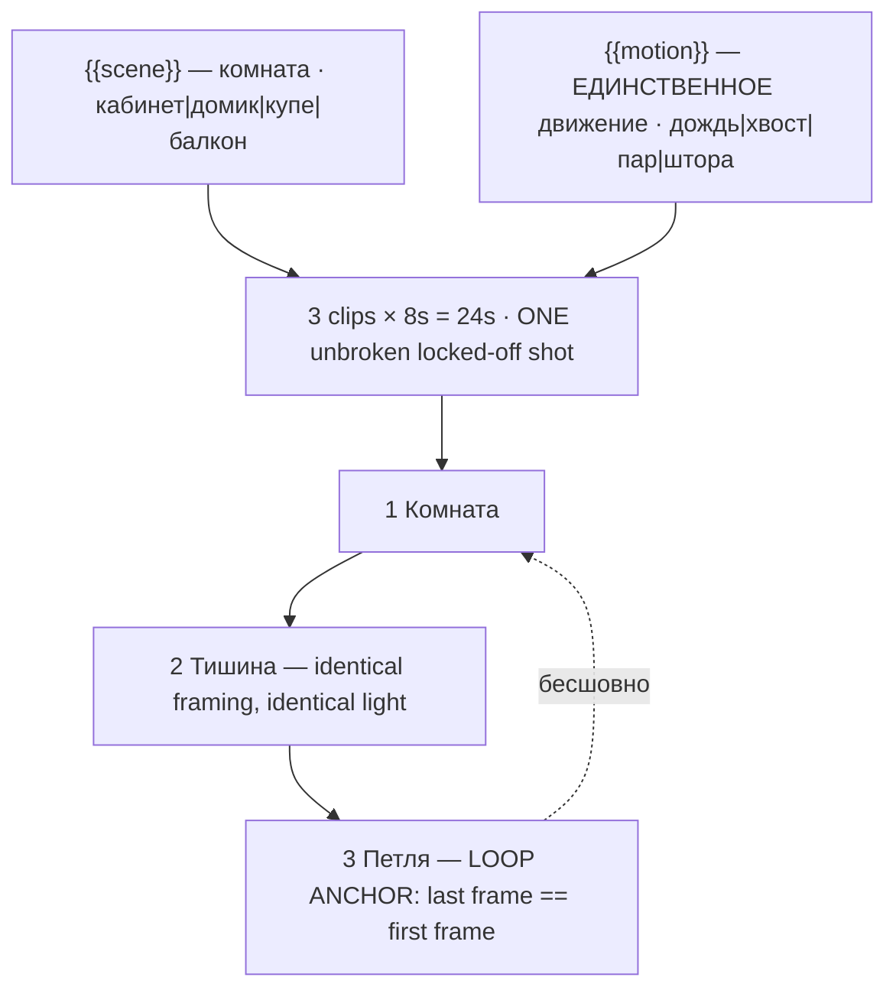

# shorts-lofi-loop.ts — AI component doc

> AI-facing sidecar for `shorts-lofi-loop.ts`. Created 2026-08-20. Keep this in sync with the code on every change.

## Purpose

«Лоу-фай петля» — the cosy ambient loop, and the shelf's purest loop case. Catalog DATA, not
logic: three generated 8s clips (24s, no title cards) that are ONE unbroken locked-off shot of
an illustrated interior in which exactly one thing moves. Two knobs.
ADR: `docs/wiki/decisions/shorts-studio.md`.

## What it does (for an AI reader)

- Responsibilities: hold the prompts, presets, tier models and knob definitions of one shorts
  template. No behaviour — `service.ts` reads it.
- Public API / exports: `shortsLofiLoop: Template` (`id: 'shorts-lofi-loop'`, category
  `shorts`, 9:16, `defaultStyleId: 'anime'`).
- Inputs → Outputs: `{{scene}}` / `{{motion}}` values → three substituted English prompts and
  the film title («Кабинет под дождём · петля»). No voiceover — the format is wordless.
- Side effects (I/O, network, state): none — a module-level constant.

## Dependencies

- Imports / depends on: `../types` (`Template`).
- Used by: `catalog/index.ts` (registered in `TEMPLATES`, second of the shorts shelf).

## Diagram

## Key decisions / gotchas

- **ANY MOTION WITH A DIRECTION OF PROGRESS EXPOSES THE SEAM.** A candle burning down, a glass
  filling, a shadow crossing a wall, a cat walking across the room — each is shorter at the end
  of the loop than at the start, and the eye catches the jump-back instantly. Every option of
  the `motion` knob is **cyclical** (a tail flicking and returning, a curtain breathing) or
  **stochastic** (rain, steam) — states with no memory, identical at second 0 and second 24.
  That is the entire design of the knob, and it is why "a candle" is not one of its options.
  The cat fragment says outright that the cat never lifts its head and never gets up.
- **The three beats are ONE UNBROKEN SHOT, not three shots.** The 8s grid (ADR §6) forces
  three generations, so beats 2 and 3 repeat the identical framing, light and locked-off
  camera, and beat 2 says "identical" three times on purpose — it is the beat a model wants to
  *develop* (reframe slightly, warm the light, add a second motion), and any of those turns a
  static loop into a slideshow.
- **EXACTLY ONE thing moves.** Not "mostly still" — one. Both knobs feed a single sentence that
  says so, because rain on the glass *and* a swaying lamp *and* a flickering screen is not
  cosy, it is busy, and busy does not loop.
- **`anime` and not `cinematic`**: the format is illustrated, and the anime preset's negative
  ("photorealistic, 3d render") actively pushes away the failure that would make this uncanny —
  a photoreal room with a photoreal cat in it, which is a riskier product.
- **Disclosure tier: `none`** (ADR §12) — drawn, not photographed.
- **Loopable: yes**, and the loop is the distribution mechanism, not a flourish: since
  2025-03-31 every replay counts as a view (ADR §10). 24s, 168 / 405 / 420 credits.
- **`loopable` and `disclosureTier` are now REAL FIELDS on `Template`, not header prose**
  (2026-08-20). This card declares **`loopable: true`** and **`disclosureTier: 'none'`**,
  and both travel on `TemplateSummary` — the gallery filters on the first, the export will
  stamp the label from the second. The loop claim is **enforced**: `templates.test.ts`
  asserts that a template with `loopable: true` actually asks for the return to the opening
  frame in its FINAL clip beat's prompt, because a model never infers that on its own and a
  card that claims the loop without asking for it ships a visible jump at the seam.
- **Draft tier is `seedance-1-5-pro`, not `pixverse-v6`** (changed 2026-08-20). Deployment
  reality, not craft: none of the original triple could generate on production, because
  `assertTemplatesValid` checks ratio and duration but not whether a provider is reachable.
  `seedance-1-5-pro` runs on kie.ai (verified working) and costs the same 56 credits at 8s,
  so the price is unchanged. **Standard and premium still point at providers this deployment
  cannot reach**, deliberately — pointing all three tiers at one working model would make the
  tier picker a lie — so all three `tierNotes` now lead with which tiers work today. The
  argument in full is in `index.ts.md`.

## Commits

- _no commit yet_
