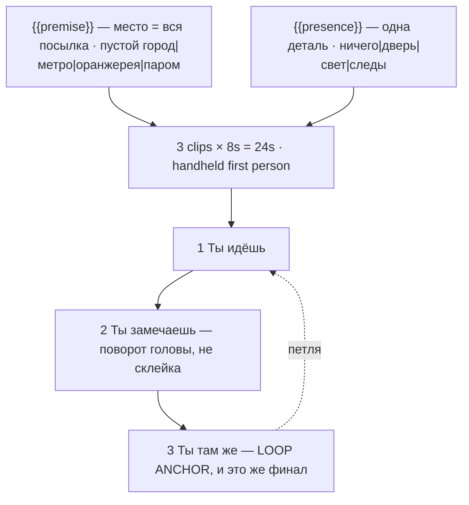

# shorts-pov-immersion.ts — AI component doc

> AI-facing sidecar for `shorts-pov-immersion.ts`. Created 2026-08-20. Keep this in sync with the code on every change.

## Purpose

«От первого лица» — POV immersion: the camera is the character and the premise is carried
entirely by the place. Catalog DATA, not logic: three generated 8s clips (24s, no title
cards), two knobs, no voiceover. Wave 2 of the ШОРТСЫ shelf.
ADR: `docs/wiki/decisions/shorts-studio.md`.

## What it does (for an AI reader)

- Responsibilities: hold the prompts, presets, tier models and knob definitions of one shorts
  template. No behaviour — `service.ts` reads it.
- Public API / exports: `shortsPovImmersion: Template` (`id: 'shorts-pov-immersion'`, category
  `shorts`, 9:16, `defaultStyleId: 'cinematic'`, `loopable: true`,
  `disclosureTier: 'description'`).
- Inputs → Outputs: `{{premise}}` / `{{presence}}` values → three substituted English prompts
  and the film title («POV: ты последний человек в городе»). Silent by design.
- Side effects (I/O, network, state): none — a module-level constant.

## Dependencies

- Imports / depends on: `../types` (`Template`).
- Used by: `catalog/index.ts` (registered in `TEMPLATES`, fifth of the shorts shelf).

## Diagram

## Key decisions / gotchas

- **HANDS ARE THE FAILURE MODE.** A first-person frame invites them, and a static open palm
  held up in frame is the canonical 2026 artefact — a still hand gives the model unlimited
  time to render fingers it cannot count. The usual mitigation ("keep the hand moving and
  partly out of focus", so motion blur and shallow DoF hide the error) does work, but the
  strongest version of the format has **no hands at all**, and that is what this card ships.
  Every prompt says so; the fallback is recorded in the file header only so nobody has to
  rediscover it.
- **REFLECTIONS ARE THE SAME FAILURE WEARING A COAT.** Three of the four premises are full of
  reflective surfaces — still black water, wet tiles, glasshouse panes, ferry windows at night
  — and a model asked for an empty place will put a figure in the glass. The no-person clause
  is therefore explicit about reflections, not just bodies.
- **`cameraShot: 'none'`, not a shot size.** A first-person frame is not a medium shot *of*
  anything; it is where the eyes are. Declaring `'medium'` pastes "medium shot" into the
  prompt and pulls the model toward filming a subject, which is what this format does not do.
- **Beat 2 is a head turn, not a cut.** A POV "reaction" has no reverse angle available, so
  the beat is written as slow → stop → look.
- **The loop is also the ending.** "You walk, you turn, and you are back where you started"
  reads as meaning in an empty place rather than as a technical trick — which is why beat 3
  asks for the return as a continued walk and not as a cut.
- **The format needs no actor, and that is why it suits AI.** No performance to go uncanny, no
  face to hold across a cut, no lip-sync — an empty place is among the easiest things a video
  model renders well.
- **Disclosure tier `description`, NOT `in-player`** (ADR §12): photoreal sets the floor, but
  no person appears and every location is generic and unnamed. **Anyone adding a `premise`
  option: keep it anonymous** — a named street or building moves this card up a tier.
- **Loopable: true.** 24s, 168 / 405 / 420 credits, like every card on the shelf.
- **Draft tier is `seedance-1-5-pro`, not `pixverse-v6`** (changed 2026-08-20). Deployment
  reality, not craft: none of the original triple could generate on production, because
  `assertTemplatesValid` checks ratio and duration but not whether a provider is reachable.
  `seedance-1-5-pro` runs on kie.ai (verified working) and costs the same 56 credits at 8s,
  so the price is unchanged. **Standard and premium still point at providers this deployment
  cannot reach**, deliberately — pointing all three tiers at one working model would make the
  tier picker a lie — so all three `tierNotes` now lead with which tiers work today. The
  argument in full is in `index.ts.md`.

## Commits

- _no commit yet_
