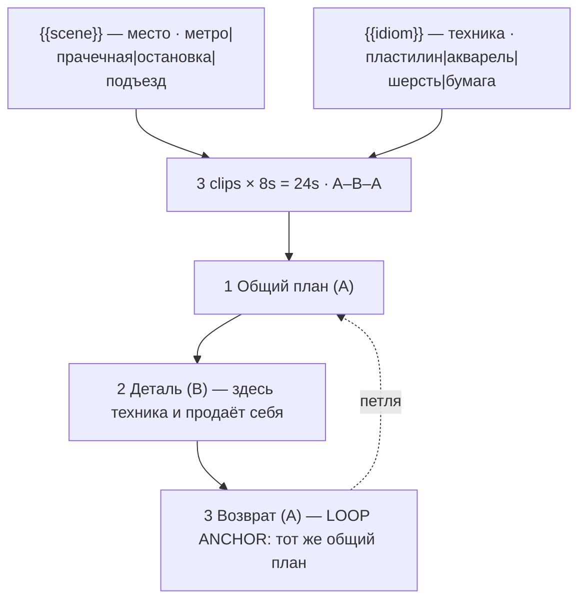

# shorts-stylised-everyday.ts — AI component doc

> AI-facing sidecar for `shorts-stylised-everyday.ts`. Created 2026-08-20. Keep this in sync with the code on every change.

## Purpose

«Будни в другой технике» — the most ordinary scene in the world, rendered wholly in one
animation idiom. Catalog DATA, not logic: three generated 8s clips (24s, no title cards) in
A–B–A (wide, detail, back to the wide), two knobs, sixteen combinations.
ADR: `docs/wiki/decisions/shorts-studio.md`.

## What it does (for an AI reader)

- Responsibilities: hold the prompts, presets, tier models and knob definitions of one shorts
  template. No behaviour — `service.ts` reads it.
- Public API / exports: `shortsStylisedEveryday: Template` (`id: 'shorts-stylised-everyday'`,
  category `shorts`, 9:16, **`defaultStyleId: null`**).
- Inputs → Outputs: `{{scene}}` / `{{idiom}}` values → three substituted English prompts and
  the film title («Метро в час пик: пластилин»). No voiceover — the scene is ambient.
- Side effects (I/O, network, state): none — a module-level constant.

## Dependencies

- Imports / depends on: `../types` (`Template`).
- Used by: `catalog/index.ts` (registered in `TEMPLATES`, sixth of the shorts shelf).

## Diagram

## Key decisions / gotchas

- **MIXING ONE PHOTOREAL ELEMENT INTO A STYLISED PLATE IS THE FAILURE.** It happens on its own:
  the model paints the carriage beautifully and then renders one commuter's face
  photographically, or drops a real reflection into a painted window. That single element
  reintroduces the exact uncanny read this format was chosen to avoid, and it is *worse* than a
  fully photoreal shot, which at least reads as one thing. Every `idiom` fragment therefore
  ends with "absolutely no photographic and no 3D-rendered element anywhere in frame". Commit
  one hundred per cent.
- **CLAYMATION ONLY READS AS CLAYMATION WITH FRAME STUTTER.** A video model trained on live
  action interpolates smoothly, and smooth plasticine looks like a 3D render *of* plasticine —
  the uncanniest possible outcome, stylised AND wrong. The stepped 12-fps cadence with no
  motion blur is demanded in the fragment itself, for all three physical idioms (clay, felt,
  paper). Same fight the `hand-drawn` style documents in `presets.ts` and the brick shelf
  documents in `brick-heist.ts`.
- **`defaultStyleId` is `null`, and that is the decision most likely to be "fixed" by mistake.**
  The `idiom` knob IS this template's style axis, and it changes per batch row. A builtin
  preset would paste a second, competing look description into every prompt — and if it were
  `'cinematic'`, its fragment ("photorealistic, film grain") would demand precisely the failure
  above. One look per plate.
- **Both knobs change what is literally on screen** (ADR §9), and this is the widest-spread
  card on the shelf: sixteen combinations, none of which resembles another.
- **The text clause in `FRAME` matters more here than anywhere else** — every one of these
  scenes is a place covered in signage in real life (a metro carriage, a laundromat, a bus
  stop), and a model reproducing that signage fills the frame with garbled lettering.
- **Beat 3 is an explicit frame match, not "wide shot again"** — a model will happily satisfy
  "wide shot again" from a different corner of the room, and then the loop does not close.
- **Disclosure tier: `none`** (ADR §12) — nothing in frame is photographic, by construction.
- **Loopable: yes.** 24s, 168 / 405 / 420 credits.
- **`loopable` and `disclosureTier` are now REAL FIELDS on `Template`, not header prose**
  (2026-08-20). This card declares **`loopable: true`** and **`disclosureTier: 'none'`**,
  and both travel on `TemplateSummary` — the gallery filters on the first, the export will
  stamp the label from the second. The loop claim is **enforced**: `templates.test.ts`
  asserts that a template with `loopable: true` actually asks for the return to the opening
  frame in its FINAL clip beat's prompt, because a model never infers that on its own and a
  card that claims the loop without asking for it ships a visible jump at the seam.
- **Draft tier is `seedance-1-5-pro`, not `pixverse-v6`** (changed 2026-08-20). Deployment
  reality, not craft: none of the original triple could generate on production, because
  `assertTemplatesValid` checks ratio and duration but not whether a provider is reachable.
  `seedance-1-5-pro` runs on kie.ai (verified working) and costs the same 56 credits at 8s,
  so the price is unchanged. **Standard and premium still point at providers this deployment
  cannot reach**, deliberately — pointing all three tiers at one working model would make the
  tier picker a lie — so all three `tierNotes` now lead with which tiers work today. The
  argument in full is in `index.ts.md`.

## Commits

- _no commit yet_
