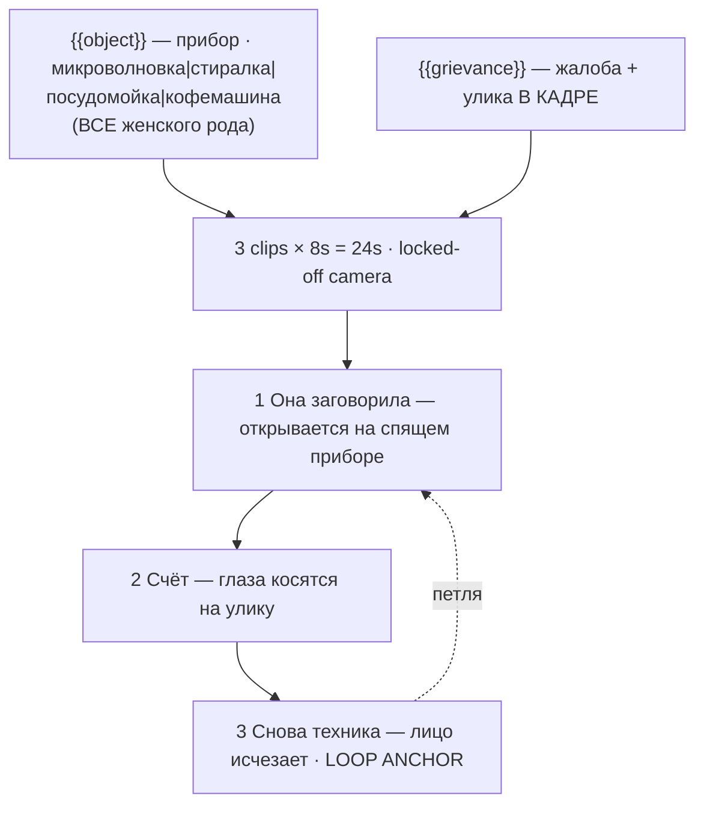

# shorts-talking-object.ts — AI component doc

> AI-facing sidecar for `shorts-talking-object.ts`. Created 2026-08-20. Keep this in sync with the code on every change.

## Purpose

«Говорящий предмет» — one photoreal household appliance with a grievance, shot on a fixed
camera. Catalog DATA, not logic: three generated 8s clips (24s, no title cards), two knobs,
three Russian spoken lines. The appliance branch of the talking-object genre whose produce
branch the catalog already carries («Говорящие фрукты»).
ADR: `docs/wiki/decisions/shorts-studio.md`.

## What it does (for an AI reader)

- Responsibilities: hold the prompts, presets, tier models, voice lines and knob definitions of
  one shorts template. No behaviour — `service.ts` reads it.
- Public API / exports: `shortsTalkingObject: Template` (`id: 'shorts-talking-object'`,
  category `shorts`, 9:16, `defaultStyleId: 'cinematic'`).
- Inputs → Outputs: `{{object}}` / `{{grievance}}` values → three substituted English prompts,
  three Russian lines and the film title («Микроволновка недовольна»).
- Side effects (I/O, network, state): none — a module-level constant.

## Dependencies

- Imports / depends on: `../types` (`Template`).
- Used by: `catalog/index.ts` (registered in `TEMPLATES`, fourth of the shorts shelf).

## Diagram

## Key decisions / gotchas

- **GIVING IT ARMS AND LEGS IS THE ONE FATAL MISTAKE.** A model asked for a talking microwave
  will grow it stubby limbs, tilt it, hop it along the counter and float a cartoon face on its
  front panel. The moment that happens it is no longer a microwave that talks — it is a generic
  3D cartoon character shaped like a microwave, a different and far more crowded product. The
  `RIGID` constant is pasted into **every** shot for that reason: no arms, no legs, no body, no
  leaning, no hopping, no gesturing; only the mouth and the eyes move. One statement of it is
  not enough.
- **THE MOUTH IS NOT DRAWN ON — it is geometry the appliance already has.** The microwave's
  hinged glass door IS the mouth; the washing machine's drum hatch IS the mouth; the espresso
  machine's pressure-gauge needles ARE the pupils. Nothing is added to the object, its existing
  parts are re-read as a face. A mouth painted onto a flat panel reads as a sticker.
- **GRAMMAR IS LOAD-BEARING** (same discipline as `brick-heist.ts.md`): every `object` option
  is **feminine nominative** — микроволновка, стиральная машина, посудомойка, кофемашина —
  which is what lets the title «{{object}} недовольна» and the closing line «Я ничего не
  говорила» agree for every combination without a grammar engine. That is also why the option
  set is hinged-door appliances rather than «чайник» or «холодильник»: a masculine option
  silently breaks the agreement. **Do not add one.**
- **`grievance` is not merely a spoken line** — each option also puts its EVIDENCE in the frame
  (the leaning stack of dishes, the new appliance still in factory plastic), so turning it
  changes the picture as well as the complaint. Both knobs are on-screen knobs (ADR §9).
- **Beat 1 opens dormant on purpose.** The loop depends on that frame existing, and so does the
  gag: the beat has to spend a moment being an ordinary kitchen before the face appears in it.
  Beat 3 does not fade out artistically — the face *stops being a face*, which is both the
  funnier ending and exactly the frame beat 1 opened on.
- **Disclosure tier: `description`** (ADR §12) — photoreal kitchen, deadpan domestic register.
- **Loopable: yes**, and almost free: the camera never moves, so the loop only needs the face
  to go back where it came from. 24s, 168 / 405 / 420 credits.
- **`loopable` and `disclosureTier` are now REAL FIELDS on `Template`, not header prose**
  (2026-08-20). This card declares **`loopable: true`** and **`disclosureTier: 'description'`**,
  and both travel on `TemplateSummary` — the gallery filters on the first, the export will
  stamp the label from the second. The loop claim is **enforced**: `templates.test.ts`
  asserts that a template with `loopable: true` actually asks for the return to the opening
  frame in its FINAL clip beat's prompt, because a model never infers that on its own and a
  card that claims the loop without asking for it ships a visible jump at the seam.
- **Draft tier is `seedance-1-5-pro`, not `pixverse-v6`** (changed 2026-08-20). Deployment
  reality, not craft: none of the original triple could generate on production, because
  `assertTemplatesValid` checks ratio and duration but not whether a provider is reachable.
  `seedance-1-5-pro` runs on kie.ai (verified working) and costs the same 56 credits at 8s,
  so the price is unchanged. **Standard and premium still point at providers this deployment
  cannot reach**, deliberately — pointing all three tiers at one working model would make the
  tier picker a lie — so all three `tierNotes` now lead with which tiers work today. The
  argument in full is in `index.ts.md`.

## Commits

- _no commit yet_
