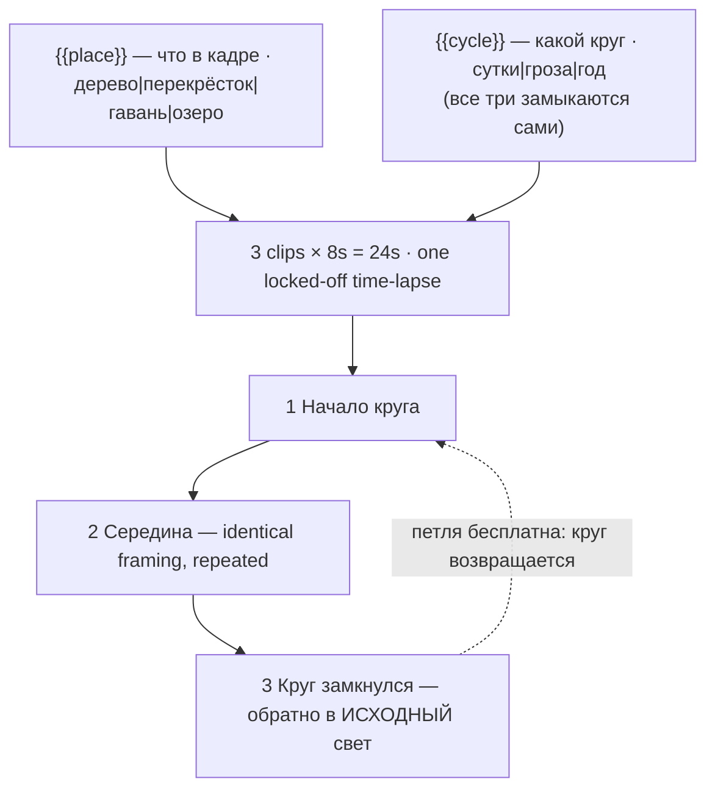

# shorts-timelapse-cycle.ts — AI component doc

> AI-facing sidecar for `shorts-timelapse-cycle.ts`. Created 2026-08-20. Keep this in sync with the code on every change.

## Purpose

«Круг в одном кадре» — one locked-off frame, one complete cycle of time, back to the light it
started on. Catalog DATA, not logic: three generated 8s clips (24s, no title cards), two knobs,
no voiceover. The shelf's twelfth card and the only one about TIME rather than about a subject.
ADR: `docs/wiki/decisions/shorts-studio.md`.

## What it does (for an AI reader)

- Responsibilities: hold the prompts, presets, tier models and knob definitions of one shorts
  template. No behaviour — `service.ts` reads it.
- Public API / exports: `shortsTimelapseCycle: Template` (`id: 'shorts-timelapse-cycle'`,
  category `shorts`, 9:16, `defaultStyleId: 'cinematic'`, `loopable: true`,
  `disclosureTier: 'description'`).
- Inputs → Outputs: `{{place}}` / `{{cycle}}` values → three substituted English prompts and the
  film title («Одинокое дерево в поле: сутки»).
- Side effects (I/O, network, state): none — a module-level constant.

## Dependencies

- Imports / depends on: `../types` (`Template`).
- Used by: `catalog/index.ts` (registered in `TEMPLATES`, third of the shorts shelf).

## Diagram

## Key decisions / gotchas

- **WHY THIS CARD EXISTS (the wave-2 pick).** After eleven cards the shelf covered many
  subjects and exactly three relationships between camera and time: the camera is still and
  nothing changes (`shorts-lofi-loop`), the camera moves through a place (`shorts-b-roll`,
  `shorts-pov-immersion`), or something happens in front of it (everything else). Nothing was
  about **time itself** — and the time-lapse is both the most durable face-free format in short
  form and the one whose loop is structurally *free*, because a cycle returns. Ten loopable
  cards buy their loop with a carefully written frame match; this one gets it from the fact
  that a day ends where it began, which makes it the most robust loop on the shelf.
- **IT IS THE EXACT COMPLEMENT OF `shorts-lofi-loop`, and the two headers should be read
  together.** That card *bans* any motion with a direction of progress, because a candle
  burning down is shorter at the end of the loop than at the start. This card is built
  *entirely* out of progress and closes anyway, because its progress is circular. Between them
  they state the whole rule about what may and may not loop.
- **THE MODEL MOVES THE CAMERA — the failure this card is most likely to suffer.** A time-lapse
  is *defined* by the camera not moving while everything else does; that is the grammar that
  makes a viewer read compressed time. But "a day passing over a valley" is a sweeping idea,
  and a model handed a sweeping idea drifts, pushes in, or reframes to feel cinematic. The
  moment the camera moves it is no longer a time-lapse — it is an ordinary shot with an
  aggressive colour change in it. Every prompt locks the camera off in the same words the
  lo-fi card uses, and repeats them on beat 2.
- **IT RENDERS SLOW MOTION INSTEAD OF COMPRESSED TIME.** Asked for "a day", a model often
  returns eight real-time seconds under a warm grade. What actually produces a time-lapse is
  the language of what one *looks like*: clouds streaking into ribbons, shadows sweeping
  visibly across the ground, and no individual person or vehicle legible as a person or
  vehicle — only smears of motion. That last clause does double duty: it is also what keeps
  the disclosure tier down.
- **IT ENDS LATE.** Told "a day passes", a model ends at night, because that is where a day
  ends. A cycle only loops if it returns to its **start**, so every `cycle` fragment names the
  return outright ("and back to exactly the same cold blue dawn") and beat 3 says it again as
  a frame match.
- **The `cycle` knob is unusually load-bearing** — on a card with no subject, the passage of
  time *is* the subject, so this is not a light/mood knob the way `hour` is elsewhere.
- **Disclosure tier `description`, NOT `in-player`** (ADR §12), for the reason the b-roll card
  documents: photoreal, but no person and no identifiable place. **Anyone adding a `place`
  option: keep it anonymous.**
- **Loopable: true, by construction.** 24s, 168 / 405 / 420 credits.
- **Draft tier is `seedance-1-5-pro`, not `pixverse-v6`** (changed 2026-08-20). Deployment
  reality, not craft: none of the original triple could generate on production, because
  `assertTemplatesValid` checks ratio and duration but not whether a provider is reachable.
  `seedance-1-5-pro` runs on kie.ai (verified working) and costs the same 56 credits at 8s,
  so the price is unchanged. **Standard and premium still point at providers this deployment
  cannot reach**, deliberately — pointing all three tiers at one working model would make the
  tier picker a lie — so all three `tierNotes` now lead with which tiers work today. The
  argument in full is in `index.ts.md`.

## Commits

- _no commit yet_
