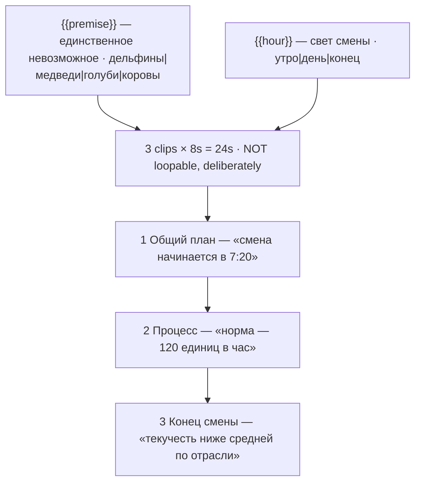

# shorts-what-if-doc.ts — AI component doc

> AI-facing sidecar for `shorts-what-if-doc.ts`. Created 2026-08-20. Keep this in sync with the code on every change.

## Purpose

«Псевдодокументалка» — an absurd premise shot as the most boring possible workplace report.
Catalog DATA, not logic: three generated 8s clips (24s, no title cards), two knobs, three
Russian narration lines written as flat trade journalism.
ADR: `docs/wiki/decisions/shorts-studio.md`.

## What it does (for an AI reader)

- Responsibilities: hold the prompts, presets, tier models, narration and knob definitions of
  one shorts template. No behaviour — `service.ts` reads it.
- Public API / exports: `shortsWhatIfDoc: Template` (`id: 'shorts-what-if-doc'`, category
  `shorts`, 9:16, `defaultStyleId: 'cinematic'`).
- Inputs → Outputs: `{{premise}}` / `{{hour}}` values → three substituted English prompts,
  three Russian lines and the film title («Дельфины в опенспейсе»).
- Side effects (I/O, network, state): none — a module-level constant.

## Dependencies

- Imports / depends on: `../types` (`Template`).
- Used by: `catalog/index.ts` (registered in `TEMPLATES`, seventh of the shorts shelf).

## Diagram

## Key decisions / gotchas

- **NEVER PROMPT FOR "FUNNY". The deadpan IS the joke.** A prompt containing "funny",
  "comical", "cartoonish", "whimsical" or "absurd" gets a model that *performs* the absurdity —
  a dolphin mugging at the lens, a bear doing a take, exaggerated proportions, a bouncy palette
  — and the moment anything in frame knows it is a joke, there is no joke. The prompts read
  like a dull corporate B-roll brief: available light, locked-off camera, ordinary business
  continuing, nobody reacting. The premise is the only unusual thing in frame and it is never
  pointed at.
- **The narration obeys the same rule and never mentions the animals.** It is written as boring
  trade journalism about shift start times, output quotas and staff turnover. The flattest line
  is last, on purpose: the funniest possible thing a documentary can say about a room full of
  cows at a bus stop is that turnover there is below the industry average.
- **`musicPrompt` explicitly asks for "no comedy cues"** — a slide whistle under this footage
  does the same damage a "funny" prompt does, one layer later.
- **Beat 2 spells out "does not look up, does not react, does not acknowledge the camera"**
  rather than leaning on the register clause in `FRAME`. It is the detail beat, and it is where
  a model most wants to add a reaction shot.
- **NOT loopable, and this is the honest call rather than a gap.** The narration is a
  three-line escalation (shift → quota → retention) and a loop would restate the setup over the
  payoff. Forcing a frame match onto beat 3 would buy a replay and spend the joke to do it. One
  of the two non-loopable cards on the shelf, with `shorts-ai-slop`.
- **`hour` is openly cosmetic** — it moves the light and the shadows and nothing else. It earns
  its place only because it multiplies twelve batch rows out of four premises without repeating
  a shot; `premise` is the on-screen knob ADR §9 requires.
- **Disclosure tier: `description`** (ADR §12). Photoreal documentary execution over an
  impossible premise — the register is what the disclosure rule cares about.
- 24s, 168 / 405 / 420 credits.
- **`loopable` and `disclosureTier` are now REAL FIELDS on `Template`, not header prose**
  (2026-08-20). This card declares **`loopable: false`** and **`disclosureTier: 'description'`**,
  and both travel on `TemplateSummary` — the gallery filters on the first, the export will
  stamp the label from the second. The loop claim is **enforced**: `templates.test.ts`
  asserts that a template with `loopable: true` actually asks for the return to the opening
  frame in its FINAL clip beat's prompt, because a model never infers that on its own and a
  card that claims the loop without asking for it ships a visible jump at the seam.
- **Draft tier is `seedance-1-5-pro`, not `pixverse-v6`** (changed 2026-08-20). Deployment
  reality, not craft: none of the original triple could generate on production, because
  `assertTemplatesValid` checks ratio and duration but not whether a provider is reachable.
  `seedance-1-5-pro` runs on kie.ai (verified working) and costs the same 56 credits at 8s,
  so the price is unchanged. **Standard and premium still point at providers this deployment
  cannot reach**, deliberately — pointing all three tiers at one working model would make the
  tier picker a lie — so all three `tierNotes` now lead with which tiers work today. The
  argument in full is in `index.ts.md`.

## Commits

- _no commit yet_
