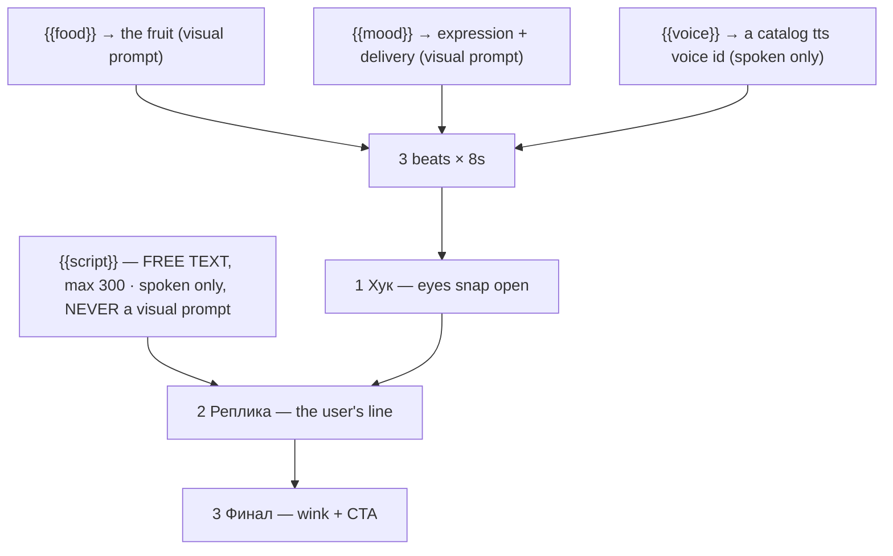

# talking-food.ts — AI component doc

> AI-facing sidecar for `talking-food.ts`. Created 2026-07-11. Keep this in sync with the code on every change.

## Purpose

«Говорящие фрукты» — the talking-produce short, and the cheap way into the catalog. Three
generated 8s beats (hook → the user's line → CTA) of a whole, intact photoreal fruit
talking straight to camera. ADR: `docs/wiki/decisions/template-catalog.md`.

## What it does (for an AI reader)

- Responsibilities: hold the prompts, presets, tier models and knob definitions of one
  template. No behaviour — `service.ts` reads it.
- Public API / exports: `talkingFood: Template` (`id: 'talking-food'`, category
  `brainrot`, 9:16, `defaultStyleId: 'cinematic'`).
- Inputs → Outputs: `{{food}}` / `{{mood}}` / `{{voice}}` / `{{script}}` → the substituted
  prompts, the film title («Говорящая клубника»), and three spoken lines — beat 2's being
  the user's own `{{script}}`.
- Side effects (I/O, network, state): none — a module-level constant.

## Dependencies

- Imports / depends on: `../types` (`Template`).
- Used by: `catalog/index.ts` (registered in `TEMPLATES`, LAST — cheapest/simplest last is
  deliberate).

## Diagram

## Key decisions / gotchas

- **THE ONE THING that separates this from `fruit-drama`: the fruit stays a WHOLE, INTACT,
  PHOTOREAL FRUIT.** No arms. No legs. No clothes. Two glossy cartoon eyes sit ON the skin
  in the upper third, a mouth is cut into the middle opening into the flesh (teeth, tongue,
  interior colour), and the skin stretches as it talks. White seamless studio or a cutting
  board. **Giving it a body turns it into the drama template, which is a different
  product.**
- **THE FORMAT** descends visually from Annoying Orange (2009 — real fruit, a composited
  human mouth, a kitchen counter), reborn in late 2025 as an AI format once lip-sync tooling
  made "make any object talk" one-click. Live sub-formats: nutrition facts, two fruits
  arguing over who is healthier, fruit roasts, whispered ASMR. `fruit-drama` is actually
  this format's mutated descendant — the same characters, given a plot.
- **THREE beats, not eight, because this format does not serialize.** It is a single 8–20s
  clip with a hook, a payload and a CTA; any longer and it stops being the format. That is
  also why it is the cheap entry point — 168 credits on the draft tier against a drama's
  448.
- **It has the catalog's only free-text knob, and the dramas don't.** The dramas ARE their
  script (the plot is the product; letting the user rewrite it is letting them break it).
  Here the script is the ONLY thing that varies — the whole format is "a fruit says a
  thing" — so `script` is a `kind: 'text'` variable, capped at 300 chars. It is substituted
  into beat 2's spoken line and **NEVER into a visual prompt**, per the rule in `types.ts`
  (asserted in `templates.test.ts`).
- **`{{voice}}` is a select whose `spoken` value is the literal catalog voice id**
  ('Svetlana', 'Dmitry', …) while `label` is the human description; its `prompt` fragment is
  empty because a voice has no visual. `service.ts` validates the resolved id against the
  live catalog's voice list, so a voice retired by the provider fails loudly at
  instantiation instead of producing a wrong-sounding track later.
- **No `musicPrompt`, deliberately**: this format is music-free by convention (the voice and
  the foley ARE the audio, and the ASMR variant depends on it). A template with no opinion
  should say nothing rather than invent one — `toSummary` maps the absence to `null` and the
  editor's audio panel simply opens empty.

## Commits

- _no commit yet_
