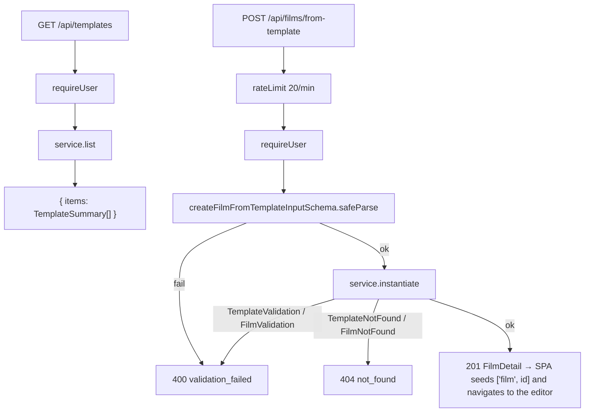

# routes.ts — AI component doc

> AI-facing sidecar for `routes.ts`. Created 2026-07-11. Keep this in sync with the code on every change.

## Purpose

HTTP layer for the template catalog — thin, mirroring `modules/films/routes.ts`: parse
with the SHARED contracts schema, delegate to the service, map domain errors to status
codes. ADR: `docs/wiki/decisions/template-catalog.md`.

## What it does (for an AI reader)

- Responsibilities: expose the gallery and the one-call instantiate endpoint;
  session-gate both; rate-limit the write; map template + film domain errors.
- Public API / exports / endpoints:
  - `GET /api/templates` → `{ items: TemplateSummary[] }`. Session-gated.
  - `POST /api/films/from-template` → **201** `FilmDetail`. Body parsed with
    `createFilmFromTemplateInputSchema`. Rate limit **20/min**.
  - Export: `registerTemplateRoutes(app, service)`.
- Inputs → Outputs: `CreateFilmFromTemplateInput` → the full `FilmDetail` of the film
  just built (film + N draft shots).
- Side effects (I/O, network, state): the POST writes a film plus N shot rows in one
  transaction (via the film service). **It charges zero credits.**

## Dependencies

- Imports / depends on: `fastify` types, `@opencreate/contracts`
  (`createFilmFromTemplateInputSchema`), `../films/service` (`FilmNotFoundError`,
  `FilmValidationError`), `./service` (`TemplateService`, `TemplateNotFoundError`,
  `TemplateValidationError`).
- Used by: `app.ts` — `registerTemplateRoutes(app, createTemplateService({ films }))`,
  registered right after the film routes.

## Diagram

## Key decisions / gotchas

- **The 201 body is the full `FilmDetail`, not just an id.** The SPA seeds
  `['film', id]` from it and navigates straight into the editor, so the user never sees
  a loading state between "Создать" and a built timeline.
- **The POST charges NOTHING.** Every shot lands as a draft; credits are spent later,
  per shot, by a user who has seen what they are paying for.
- **The 20/min rate limit is the backstop the ledger cannot be.** Instantiation writes a
  film plus ~9 rows and costs no credits, so nothing else stops a script from filling
  someone's library with a thousand films. Generous enough that a user comparing
  templates never hits it.
- **The gallery is session-gated** like every other authoring surface. The pitch is free
  to read, but there is nothing for a logged-out visitor to do with it, and the landing
  page is where we sell the product. (Contrast `/api/catalog`, which IS public — pricing
  must render before sign-in.)
- **No cache headers on the list**: it is computed from two in-process constants (the
  template registry × the model catalog), so it is already as cheap as a response gets,
  and the SPA holds it with `staleTime: Infinity` anyway.
- `mapDomainError` folds the FILM errors in too, because `instantiate` calls through to
  the film service and its `FilmValidationError` is just as much a 400 as ours.

## Commits

- _no commit yet_

## Update 2026-08-20 - `POST /api/films/from-template/batch` (ADR: `docs/wiki/decisions/shorts-studio.md`)

- `POST /api/films/from-template/batch` -> **201** `{ batchId, films: FilmDetail[] }`.
  Body parsed with `createFilmsFromTemplateBatchInputSchema` (1-20 rows). Rate limit
  **10/min** (`FROM_TEMPLATE_BATCH_RATE_LIMIT`).
- **10/min is half the single route's bucket because one call is up to twenty times the
  work** - twenty films and around a hundred shot rows in one transaction. Nobody sets
  up ten batches a minute by hand, so ordinary use is untouched. Still not a money guard:
  this path spends nothing, it is the same "keep a script from filling a library"
  backstop, scaled to a heavier call.
- **It charges NOTHING**, exactly like its single-film sibling. Every shot lands as a
  draft; the credits are spent later, per beat, by the client-side runner behind the
  itemised confirm.
- **There is no partial success.** A bad row anywhere is a 400 for the WHOLE request with
  nothing written - the service validates every row before it writes the first. Worth
  stating on the route because it is what a caller would otherwise have to guess at:
  there is no per-row error list to reconcile.
- Errors map through the same `mapDomainError`/`guard` pair as the single route: unknown
  template -> 404 `not_found`, unknown knob or illegal option -> 400 `validation_failed`.
