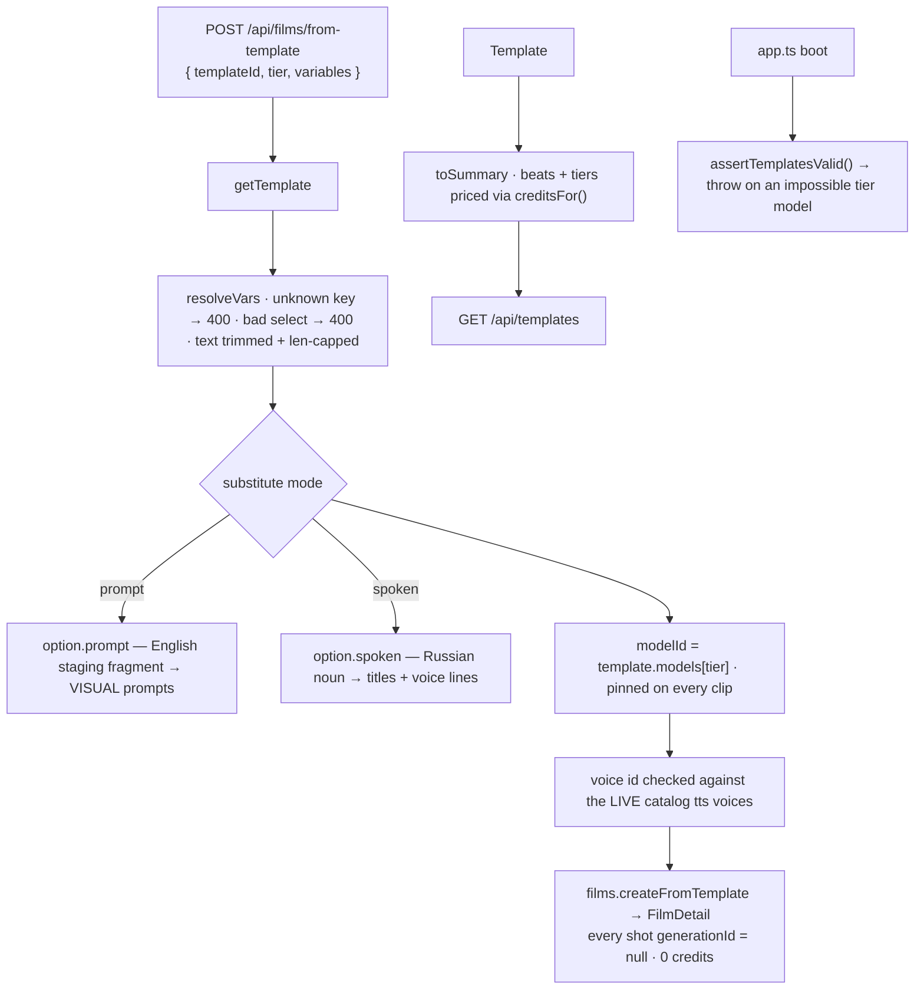

# service.ts — AI component doc

> AI-facing sidecar for `service.ts`. Created 2026-07-11. Keep this in sync with the code on every change.

## Purpose

Turns a `Template` (server-side prose + structure) into the two things the product
needs: a `TemplateSummary` — the pitch the gallery renders, priced from the LIVE model
catalog — and a film: the project row plus every shot, with `{{variables}}`
substituted, the tier's model pinned, and **nothing generated**.
ADR: `docs/wiki/decisions/template-catalog.md`.

## What it does (for an AI reader)

- Responsibilities: summarise + price templates for the gallery; validate the knob
  values a client posts; substitute them into prompts / titles / voice lines; hand the
  resulting `CreateShotInput[]` to `films.createFromTemplate`; assert the whole catalog
  is coherent at boot.
- Public API / exports: `createTemplateService({ films })` → `{ list, instantiate }`;
  `toSummary(template)`; `listTemplates()`; `assertTemplatesValid(templates?)`; errors
  `TemplateNotFoundError` (404 `not_found`), `TemplateValidationError` (400
  `validation_failed`).
- Inputs → Outputs: `CreateFilmFromTemplateInput` (`{ templateId, tier, variables,
  title? }`) → `FilmDetail` (film + N draft shots). `Template[]` → `TemplateSummary[]`.
- Side effects (I/O, network, state): writes via `FilmService.createFromTemplate` (one
  transaction). **No credit-ledger entry — instantiating is free.** No provider calls.

## Dependencies

- Imports / depends on: `@opencreate/contracts` (`TEMPLATE_TIERS` + DTO types),
  `../catalog/catalog` (`CATALOG`, `creditsFor`, `getModel`), `../films/service`
  (`FilmService` type), `./catalog` (`TEMPLATES`, `getTemplate`), `./types`.
- Used by: `./routes.ts`; `app.ts` (constructs it, and calls `assertTemplatesValid()` at
  boot); `templates.test.ts`.

## Diagram

## Key decisions / gotchas

- **THE RULE THAT SHAPES THIS FILE: applying a template is free.** Every shot lands
  with `generationId = null`. Prompts, presets, model, durations, titles and spoken
  lines are all filled in — the credits are spent later, per shot, by a user who has
  now actually SEEN the shots. A one-click "spend 1120 credits" button would be a trap,
  and a lie: the first thing anyone does with a template is change one beat.
- **Substitution has two modes and picking the wrong one is a silent bug.**
  `substitute(text, vars, 'prompt')` → the option's English fragment (visual prompts
  only); `substitute(text, vars, 'spoken')` → the Russian noun, or the literal voice id
  (film title, shot titles, voiceover `text` + `voice`). A Russian noun in a Veo prompt
  does not error — it just makes worse footage.
- **An unknown `{{key}}` is left verbatim, not blanked.** Blanking would produce a
  subtly broken prompt that still generates (and still charges); leaving the braces in
  makes the mistake visible in the shot the user is about to read. It cannot happen at
  runtime anyway — `templates.test.ts` asserts the placeholder set against the variable
  set.
- **`resolveVars` is a trust boundary.** `variables` arrives as an untyped string map
  and its values end up inside a prompt we pay a provider to render: unknown keys are
  rejected outright (silently ignoring a key the client thought mattered gives the user
  a film that doesn't match what they picked, with no way to tell why), select values
  must name a declared option, free text is trimmed, non-empty and length-capped.
- **Pricing is computed, never authored.** `priceTiers` multiplies `creditsFor(model,
  duration)` over the CLIP beats only (title cards cost nothing — ffmpeg draws them over
  black), so the number on the card cannot drift from what the generation endpoint will
  actually charge. A hardcoded price on a template would go stale the first time a
  provider changes its rate.
- **`previewUrl` is hardcoded `null`** until we have actually rendered an example of a
  template. The gallery draws a typographic card instead — a fake thumbnail is worse
  than none.
- **Voices are read from the live catalog** (`catalogVoices()`), never frozen in a
  template: a provider retiring a voice must fail loudly HERE, at instantiation, rather
  than silently producing a wrong-sounding track (or a provider 400) eight credits
  later. Validation is skipped when the catalog offers no tts model at all.
- **`assertTemplatesValid()` runs at BOOT, not per request** (wired in `app.ts`): a tier
  model that cannot do the template's aspect ratio or one of its clips' durations would
  be silently re-snapped by `composeShotClipInput`, changing the cut AND the price
  behind the user's back. That has to be a failed deploy, not a 500 the first user
  finds. It also makes `priceTiers`'s "unknown model" throw unreachable in practice.

## Commits

- _no commit yet_
