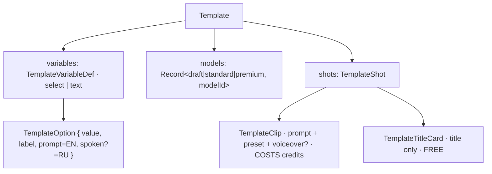

# types.ts — AI component doc

> AI-facing sidecar for `types.ts`. Created 2026-07-11. Keep this in sync with the code on every change.

## Purpose

The SERVER-SIDE shape of a template — the half of the template catalog the wire
contract (`packages/contracts/src/templates.ts`) deliberately does not carry. A
Template is a pre-authored film: N beats, each with a finished prompt, a
camera/style preset, a duration, an on-screen title and a spoken line. The user
turns two or three knobs and lands in the Cinema editor with a timeline already
built and nothing generated.

## What it does (for an AI reader)

- Responsibilities: type the catalog data (`catalog/*.ts`) that `service.ts` reads.
  No runtime behaviour beyond the `isClip` narrowing guard.
- Public API / exports: `Template`, `TemplateShot` (= `TemplateClip | TemplateTitleCard`),
  `TemplateClip`, `TemplateTitleCard`, `TemplateOption`, `TemplateVariableDef`,
  `isClip(s): s is TemplateClip`.
- Inputs → Outputs: types only.
- Side effects: none.

## Dependencies

- Imports / depends on: `@opencreate/contracts` (`AspectRatio`, `PromptPreset`,
  `StyleId`, `TemplateCategory`, `TemplateTier`, `TitlePosition`, `Transition`).
- Used by: `catalog/*.ts` (every template is typed `Template`), `catalog/index.ts`,
  `service.ts`, `templates.test.ts`.

## Diagram

## Key decisions / gotchas
- **`defaultStyleId` is `BuiltinStyleId | null`, narrower than the wire** (ADR style-studio D1,
  2026-07-31). A template is authored in code, shipped to every user and instantiated on their behalf,
  so it cannot cite a style that lives in ONE user's `style` table. Keeping the enum here turns a typo
  in a catalog file into a compile error instead of a film that 400s at generate time. The film it
  creates stores the value in the open `film.defaultStyleId` column — narrower type, same data.

- **These types are NOT in `packages/contracts`, on purpose.** None of this travels.
  The client receives a `TemplateSummary` (name, beat sheet, prices, knobs) and posts
  back knob VALUES; the prompt text — and the English fragment each option expands to
  — stays server-side. That keeps the SPA bundle flat as the catalog grows, keeps the
  prompts (which are the actual product) off a public endpoint, and preserves the
  composition law from `presets.ts`: the client sends structured ids, the server
  builds what the model sees.
- **A `TemplateOption` carries THREE strings, not one label.** `prompt` is the English
  staging fragment ("a sly red fox in a tailored suit"); `spoken` is the Russian noun
  the characters actually say ("лис"); `label` is what the picker shows. They are
  separate because the same choice lands in two places that want different languages —
  video models stage markedly better from English, but the TTS line and the burned-in
  title are Russian. `spoken` falls back to `label` when the label is already the right
  spoken form. See `substitute()` in `service.ts`.
- **A free-text (`kind: 'text'`) variable is NEVER substituted into a visual prompt** —
  only into spoken lines and titles. Asserted in `templates.test.ts`, because the
  failure is silent: a Russian sentence pasted into a Veo prompt does not error, it just
  quietly produces worse footage (and an unbounded user string reaching a prompt is a
  hole in itself).
- **The clip/title union is explicit** rather than "a clip is a shot with a prompt",
  because the distinction drives the price: only `isClip` beats are multiplied by the
  tier's per-clip cost, which is what lets a card honestly say "9 битов, 8 из них
  платные".
- **THE INVARIANT on `models`**: every tier model must natively support the template's
  `aspectRatio` AND every clip's `durationSeconds`. Otherwise `composeShotClipInput`
  snaps the duration to the nearest legal value, silently changing both the cut and the
  price. Enforced at boot by `assertTemplatesValid()` and in `templates.test.ts` — the
  type system cannot see catalog data, so a runtime check has to.
- `musicPrompt` is the one piece of authored prose that DOES go on the wire
  (`TemplateSummary.musicPrompt`) — it is one line, and pre-filling the editor's audio
  panel with it is the whole point.

## Commits

- _no commit yet_
